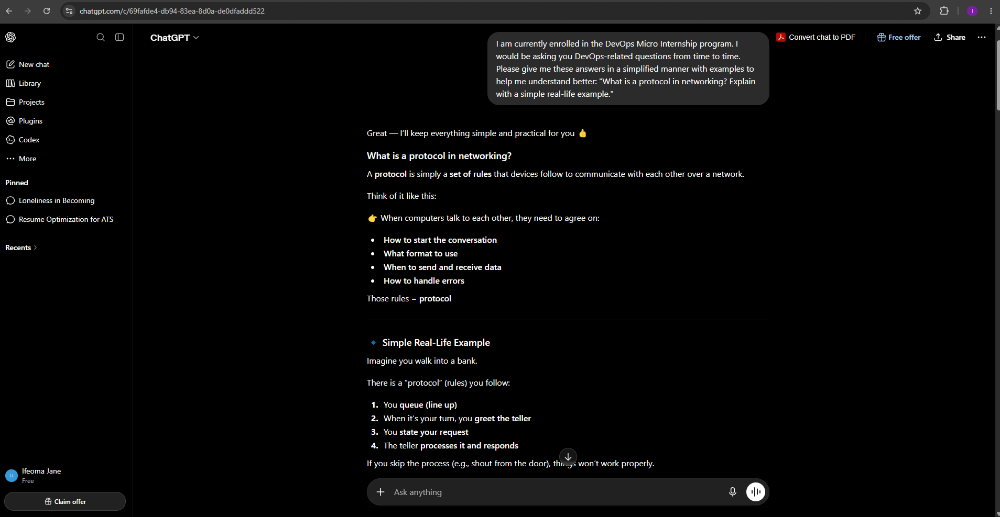
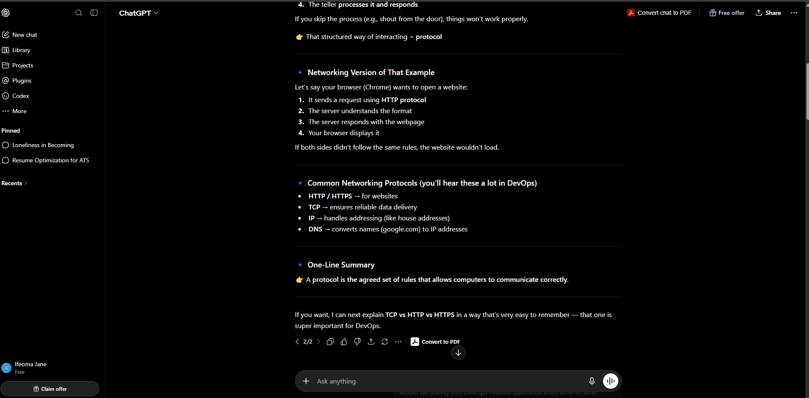
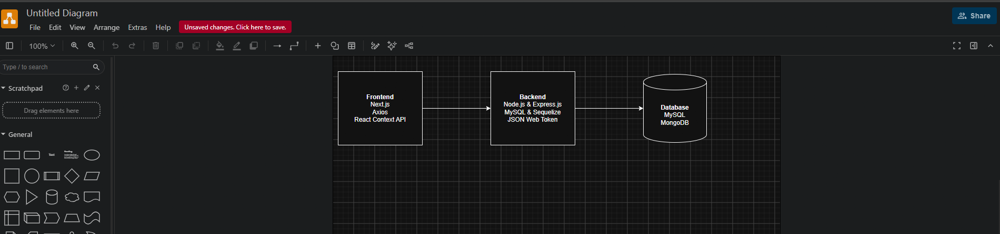
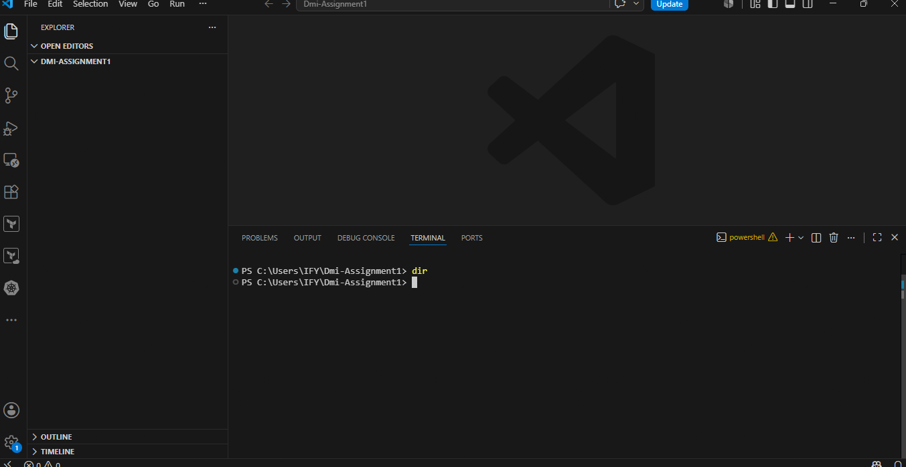

# Week 00 - Internet and Networking

Part of the DevOps Micro Internship (DMI) Cohort 3 with Agentic AI

---

# 🧑‍💻 Task 1: Using ChatGPT as Your Learning Assistant

## Scenario

You're new to DevOps and will frequently encounter technical questions. ChatGPT can be your learning companion.

## Your Task

Write a clear ChatGPT prompt to help you understand:

> "What is a protocol in networking? Explain with a simple real-life example."

Take a screenshot of your interaction showing:

* Your detailed prompt (with clear expectations)
* 


## Screenshot

Save your screenshot in the `screenshots` folder and update the file name below.


---

## What I Learned (2–3 lines)

Devices can communicate with each other.
Without protocols, the internet simply wouldn't work and computers connected to the internet wouldn't be able to communicate.
---

# 🌐 Task 2: Internet and Networking

## Scenario

Your friend is launching an online bookstore named **EpicReads**.

He asked you to explain how users globally can access his website hosted in Finland.

## Your Task

Write a short explanation (**100–150 words**) that includes:

* Packet Switching
* IP Address
* TCP/IP
* HTTP/HTTPS

💡 **Tip:** You may use ChatGPT (as demonstrated in Task 1) to refine your explanation.

## Answer

When a user anywhere in the world visits EpicReads, the request travels across the internet using packet switching. Packet switching breaks the data into small pieces called packets, allowing them to travel through different routes and then be reassembled when they reach their destination. The website is hosted on a server in Finland, which has a unique IP address. This IP address acts like the server's home address, helping the internet know exactly where to send the user's request. The communication between the user's device and the server is managed by the TCP/IP protocol suite. TCP (Transmission Control Protocol) ensures that all packets arrive correctly and in the right order, while IP (Internet Protocol) routes the packets to the correct destination. Finally, the user's browser uses HTTP or the more secure HTTPS protocol to request and receive the website. HTTPS encrypts the data, protecting sensitive information such as login details and payment information during transmission.

---

# 🏗️ Task 3: Application Architecture & Stack

## Scenario

EpicReads bookstore has two application versions:

### Two-Tier Application

* Frontend
* Database

### Three-Tier Application

* Frontend
* Backend
* Database

## Your Task

* Draw simple diagrams (hand-drawn or tool-based such as draw.io)
* Label each layer clearly
* List at least two common technologies or tools used for each layer
* Submit a screenshot or photo clearly showing your own drawing

## Diagram Screenshot / Photo

Save your diagram image in the `screenshots` folder and update the file name below.




---

## Technologies Used

### Frontend

Next.js
Axios
React Context API

### Backend

Node.js and Express.js
MySQL and Sequelize
JSON Web Token

### Database

MySQL
MongoDB

---

# 🌍 Task 4: Domain Name & DNS (Basic Concepts)

## Scenario

Your friend's bookstore **EpicReads** is currently accessible through:

```text
52.172.142.222:3000
```

He purchased the domain:

```text
epicreads.com
```

## Your Task

In **50–100 words**, explain in your own words:

1. What is DNS (Domain Name System)?
2. Which DNS record type should be used to connect the domain to the given IP, and why?

## Answer

DNS (Domain Name System) is a service that works like the internet's phonebook. It translates human-friendly domain names, such as epicreads.com, into IP addresses that computers use to find and communicate with servers. Without DNS, users would have to remember numeric IP addresses like 52.172.142.222 to visit websites. To connect epicreads.com to this server, an A (Address) record should be used because it maps a domain name directly to an IPv4 address. When someone types epicreads.com into their browser, the DNS A record directs the request to 52.172.142.222, making the website easy to access using its domain name instead of its IP address.

---

# 💻 Task 5: Visual Studio Code Setup (Hands-on)

## Your Task

Install Visual Studio Code (if not already installed).

Take a screenshot of your VS Code environment showing:

* Terminal open inside VS Code
* Running a basic command:

### Windows

```powershell
dir
```

### Linux / macOS

```bash
pwd
ls
```

* Your selected VS Code theme clearly visible

⚠️ **Important:** The screenshot must show your username or another identifiable detail to confirm it is your environment.

## Screenshot

Save your screenshot in the `screenshots` folder and update the file name below.




---

# 🔗 Task 6: Publish Your Assignment as a LinkedIn Post

## Objective

Publishing on LinkedIn helps you:

* Build your professional online presence
* Reinforce your learning
* Document your DevOps journey publicly

## Your Task

Summarize your answers from Tasks 1–5 into a LinkedIn post.

Clearly structure your post into the following sections:

* ChatGPT
* Internet & Networking
* App Architecture
* DNS
* VS Code Setup

Add the following credit note at the end of your post:

> **P.S. This post is part of the DevOps Micro Internship (DMI) with Agentic AI — Cohort 3 — by Pravin Mishra. My graded progress is public: https://dmi.pravinmishra.com/s/YOUR-GITHUB-USERNAME.html · Start your DevOps journey: https://dmi.pravinmishra.com/?utm_source=student&utm_medium=ps-linkedin&utm_campaign=cohort3**

---

## LinkedIn Post URL

Paste your LinkedIn post URL here:

https://www.linkedin.com/posts/ifeoma-akabueze_flowchart-maker-and-online-diagram-software-activity-7457765358230364160-RFIu?
```

---

## LinkedIn Post Backup Copy

Paste the full text of your LinkedIn post here:

DevOps Micro Internship Week 0 Summary

ChatGPT
In completing this task, I learnt to use ChatGPT as a Learning Assistant
I learned to use ChatGPT as a learning assistant by improving my question prompts.
Instead of asking vague questions, I learned to:
Ask clear, simplified, and specific questions
Request simple explanations with examples
Break complex topics into smaller parts.

Internet & Networking Fundamentals
I was introduced to core networking concepts such as:
Packet Switching
IP Addressing
TCP/IP Protocol
HTTP vs HTTPS
I learned that data is broken into packets and sent across networks, while protocols like TCP/IP ensure reliable communication between systems over the internet.

Application Architecture (3-Tier Design)
I practiced drawing and labeling a 3-tier architecture using draw.io.
The architecture includes:
Presentation Layer (Frontend)
Application Layer (Backend logic)
Data Layer (Database)
This helped me understand how modern applications are structured for scalability and separation of concerns.

Domain Name System (DNS)
I learned how DNS works as the “phonebook of the internet.”
It translates domain names (like google.com) into IP addresses so computers can locate servers.
I also explored DNS record types such as:
A Record
CNAME
MX Record
TXT Record

Development Environment Setup (VS Code)
I installed and configured Visual Studio Code as my development environment.
This included:
Downloading VS Code
Setting up extensions
Preparing it for development tasks
This setup is essential for writing and managing code efficiently in DevOps workflows, and it will be helpful in this program

This internship will help me build a strong foundation in networking, system design, and development tools—key areas in DevOps engineering. 
P.S. This post is part of the FREE DevOps Micro Internship Cohort run by Pravin Mishra. You can start your DevOps journey for free from his YouTube Playlist.
**P.S. This post is part of the DevOps Micro Internship (DMI) with Agentic AI — Cohort 3 — by Pravin Mishra. My graded progress is public: https://lnkd.in/e_PrgHqw · Start your DevOps journey: https://lnkd.in/eGJ6GrbA

---

# Reflection – Week 0

### What did you find easy?

The explanation by ChatGPT was simplified and my understanding of Protocol in Networking was made easier to understand

---

### What was difficult?

Truly I didn't have any difficulty around this task

---

### What will you improve next week?

I will try to get simplified version of any question i have difficulty understanding

---

## 📌 About DMI & CloudAdvisory

DevOps Micro Internship (DMI) is a project-based DevOps program run by Pravin Mishra (The CloudAdvisory) focused on real-world execution, systems thinking, and career readiness.

It helps learners build strong DevOps foundations with hands-on experience.


## 📌 Resources

- 🌐 **DMI Official Website:** https://pravinmishra.com/dmi  
- 🎓 **DevOps for Beginners (Udemy):** https://www.udemy.com/course/devops-for-beginners-docker-k8s-cloud-cicd-4-projects/  
- 🎓 **Ultimate Agentic AI DevOps with Clude Code** https://www.udemy.com/course/ultimate-agentic-ai-devops-with-claude-code/?referralCode=448389767BC96284087B
- 🎓 **DevOps with Claude Code: Terraform, EKS, ArgoCD & Helm** https://www.udemy.com/course/devops-with-claude-code-terraform-eks-argocd-helm/?referralCode=1C5B734505D65A010FA3
- ▶️ **YouTube Playlist (DMI Cohort 3):** https://www.youtube.com/playlist?list=PLFeSNDtI4Cho  
- 🔗 **Pravin Mishra (LinkedIn):** https://www.linkedin.com/in/pravin-mishra-aws-trainer/  
- 🏢 **CloudAdvisory (LinkedIn):** https://www.linkedin.com/company/thecloudadvisory/

---

*This submission is part of DevOps Micro Internship (DMI) Cohort 3 — Agentic AI Track*