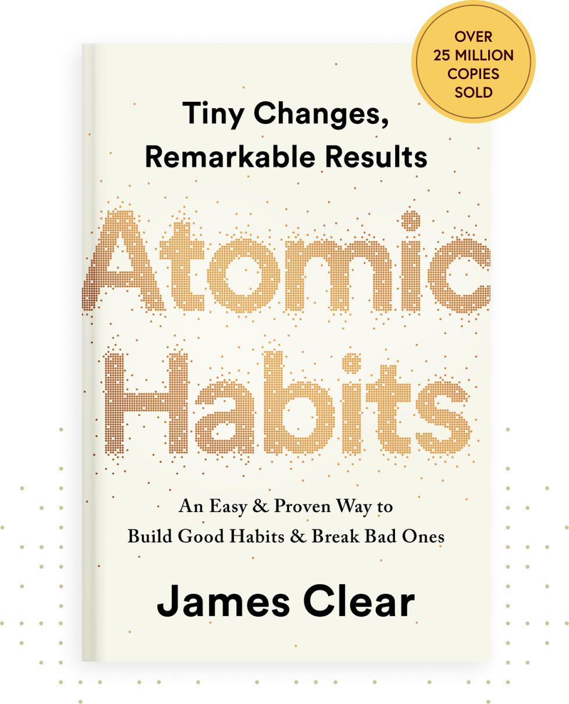
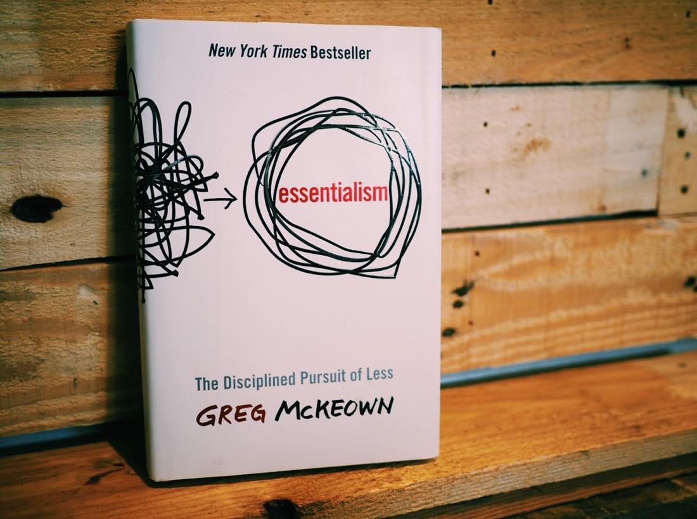

# Week 01 — Success Mindset (Mindset OS)

Part of the DevOps Micro Internship (DMI) Cohort 3 with Agentic AI

---

## Purpose (Read This First)

This week is not motivation homework.

This is you building your **Mindset OS** — the system you will use for the next 5 months (and honestly, for years).

### Expectations

* Be honest.
* Be specific.
* Be practical.
* Write like an adult professional: clear sentences, no one-liners.

You will reuse this in later weeks. So do it properly once.

---

# Assignment 1. What is something you believe to be true that most people around you would disagree with?

### Rules

* No "safe" answers.
* Must be your real belief (not copied from internet).
* Minimum 50 words.

**Hint:** What do you believe about career, money, learning, discipline, relationships, health, success, life, tech industry, etc. that most people don't agree with?

Your environment plays a huge role in your journey, growth and success in life. Certain environments and energy around can subdue good news and repress growth till you move out.

Presenting a strong personality first will save you from unnecessary disrespect that people give when they assume you can take anything. I realised that when people know you to be a no-nonsense person, they behave better and treat things concerning you better.

The spiritual controls the physical and life is more spiritual than it is physical

---

# Assignment 2. What are the top 3 objective truths you discovered through experimentation and results?

Objective truths do not depend on opinions. They hold true regardless of how people feel.

Write each truth in this format:

### Truth
Results and Success are the only truth of hardwork.

### Evidence from my life
I have worked hard to be here but i rarely proudly mention my career because i do not have any evidence to back up my journey and hardwork. 

---
### Truth

I believe what people do and say when they are angry/joking, that reveals a lot about how they feel and see you.

### Evidence from my life

I had taken such masked joke lightly before till i was openly called stupid for not reading the room that i was no longer beneficial to the relationship

### Truth
The journey to becoming is a very lonely path

### Evidence from my life

God took away relationships i thought meant something when he started building me for growth(physical and spiritual growth). It was lonely, i cried and thought about returning but what happened between us was something that could not be taken back. Even in that crying situation, i would still do what caused the fight the exact way i did it. I guess its because i thought the relationship was perfect. Growth happened and i saw thoughts no longer aligned
---

# Assignment 3. What does your 2.0 version look like?

### Instructions

Write as if a journalist is writing about you **3 to 7 years from now** (not 20 years).

**Minimum 300 words.**

### Rules

* Write in past tense, like it already happened.
* Don't use "likes to / wants to / hopes to."
* Use specifics:

  * built
  * shipped
  * led
  * published
  * earned
  * relocated
  * contributed
* Include skills proof:

  * projects
  * portfolios
  * GitHub
  * blogs
  * certifications
  * job role
  * leadership
  * community contribution
* Add 1–3 images if you can (optional but powerful).

### Publish It Publicly On Any ONE

* LinkedIn
* Medium
* WordPress
* Blogspot
* Personal blog
* Portfolio page

Include this line:

> **P.S. This post is part of the DevOps Micro Internship (DMI) with Agentic AI — Cohort 3 — by [Pravin Mishra](https://www.linkedin.com/in/pravin-mishra-aws-trainer/). My graded progress is public: https://dmi.pravinmishra.com/s/YOUR-GITHUB-USERNAME.html · Start your DevOps journey: https://dmi.pravinmishra.com/?utm_source=student&utm_medium=ps-blog&utm_campaign=cohort3**

## Your Article

# The Woman Who Prepared Before the Opportunity Arrived

By every measure, she became a testament to what intentional preparation can produce.

What once looked like a long season of waiting turned out to be the foundation for an extraordinary chapter. Years earlier, while others saw delays, she quietly invested in herself—refining her skills, expanding her knowledge, and refusing to let uncertainty define her future.

Her commitment paid off.

She had sharpened her DevOps expertise to an exceptional level and secured a Senior DevOps Engineer position with a respected European technology firm. Her technical excellence, leadership, and problem-solving abilities made her a valued contributor to high-impact engineering teams across international projects.

Academically, she fulfilled one of her greatest dreams by earning a Master's degree in Information Technology in Canada. Even more meaningful was the fact that she had successfully relocated her family before graduation, allowing them to begin building a new life together while celebrating the achievement as one family.

Her commitment to continuous learning never faded. Just before her AWS Solutions Architect Professional certification was due to expire, she earned the AWS DevOps Engineer certification, further strengthening her expertise and demonstrating her belief that excellence requires continuous growth.

Her success extended beyond career milestones. Together with her family, she intentionally created beautiful memories, checking three dream holiday destinations off their bucket list. Those trips became treasured reminders that hard work and sacrifice could coexist with joy, rest, and togetherness.

At home, life was even richer. Her twins had just celebrated their second birthday, filling every room with laughter, curiosity, and the beautiful chaos that had once existed only in her prayers. They became one of her greatest reminders that some of life's best gifts arrive after seasons of patient waiting.

One of the victories closest to her heart involved her father. After years of living with the effects of a stroke, his health improved significantly through the care of outstanding physiotherapists and neurologists in India. Watching him regain strength and independence became one of the family's most cherished testimonies and a reminder that hope should never be abandoned.

Yet perhaps her greatest legacy was not found in her résumé, but in the lives she touched.

Through her platform, she consistently spoke to girls and young women about the limitless possibilities that come through preparedness, intentional effort, and refusing to settle for mediocrity. She became a voice of encouragement, teaching that opportunities often meet those who have quietly prepared long before anyone notices.

Her influence eventually grew into a thriving NGO dedicated to empowering girls through education and opportunity. Each year, she sponsored exceptionally high-performing girls, removing financial barriers and opening doors for them to pursue their dreams. What had begun as gratitude for her own journey became a lifelong commitment to creating opportunities for others.

Looking back, it became clear that success had never been accidental. It was built one disciplined day at a time, one difficult decision at a time, one prayer at a time, and one act of faith at a time.

Her story ultimately became proof that becoming is often a lonely journey—but it is never a wasted one.

### Public Link

Paste your link here:
https://medium.com/@ifeomaohachosim/the-woman-who-prepared-before-the-opportunity-arrived-0382de924903

---

# Assignment 4. Have you ever cut corners (unethical / dishonest / shortcut behavior — not necessarily illegal)? If yes, how did it make you feel?

### Important

You don't need to write the full story.

Focus on the feeling:

* guilt
* fear
* shame
* stress
* regret
* numbness
* etc.

This is about self-awareness, not judgment.

### Answer Format

**Yes / No**
Yes
If Yes:

**What emotion did you feel?** (minimum 50–100 words)

I once pushed through a DevOps program even though I knew I wasn't keeping up. As a new mom with a full-time job, late-night classes, and another pregnancy, I was overwhelmed but too afraid to quit because I didn't want to disappoint my husband. I finished the course, but deep down I knew I hadn't learned enough. An interview later exposed my gaps, leaving me ashamed, stressed, and afraid of future interviews. That experience taught me that growth takes time, and hard things can't be rushed. Looking back, I realize I wasn't lazy or unwilling to learn—I was stretched beyond my limits.

---

# Assignment 5. What are 10 non-fiction books you plan to read in the next 1 year?

### Rules

* Mention **Title + Author**
* Any language allowed
* No fiction novels

### Tip

Choose books that improve:

* mindset
* communication
* productivity
* health
* money
* career
* leadership

## Book List

1. The 5 am Club by James Clear

2. Atomic Habits by Morgan Housel

3. Deep Work by Cal Newport

4. The 7 Habits of Highly Effective People by Stephen R. Covey

5. Mindset by Carol S. Dweck

6. Essentialism by Greg McKeown

7. The First 90 Days by Michael D. Watkins

8. The Courage to Be Disliked by Ichiro Kishimi and Fumitake Koga

9. The Psychology of Money by Morgan Housel

10. So Good They Can't Ignore You by Cal Newport

---

# Assignment 6. What are the things you will measure regularly in your life and career?

### Rules

List topics only. No need to share numbers.

### Must Include

* Learning / skill
* Output / proof
* Health / energy
* Time / focus
* Money / finance (personal or business)

### Example

* Learning hours per week
* Deep work sessions per week
* Projects shipped / documented
* Steps / workouts
* Sleep hours
* Spending tracker

## My Metrics

Confidence in speaking about my DevOps tools monthly
Focus and actual learning time frame weekly
Completed Projects monthly
Sleep and rest time frame
Sleep hours although i have no problem with my sleep hours

---

# Assignment 7. Brain Dump + 5-Month System Plan

## Step 1: Brain Dump (Private)

Do a brain dump of everything in your mind into a notebook.

Examples:

* Bills
* Tasks
* Worries
* Goals
* Pending messages
* Ideas
* Responsibilities

### Did You Do It?

**Yes / No**

Answer:

Yes

---

## Step 2: Your 5-Month Routine + Focus Blocks

Create a simple plan you can realistically follow for the next 5 months.

### Weekly Routine

Example:

* Mon–Thu: 60 min deep work
* Sat: DMI session
* Sun: Weekly review

#### My Weekly Routine

Mon-Thurs: 5 hours daily. 2hrs in the morning and the remaining 3hrs any time of the day(aftrenoon/night)
Fri: 2 hours
Sat: DMI and rest
Sun: Church and family time

---

### Focus Blocks

#### When Will You Do DMI Work? (Days + Time)
Monday - Wednesday

#### How Many Sessions Per Week?

3 Sessions per week

---

### Distraction Rules

Examples:

* Phone rules
* Social media rules
* Environment setup

#### My Distraction Rules

Phones are not allowed during study time
I deleted my Facebook and Instagram applications before this program so Its usually not my problem as i barely visit there or engage

---

# Reflection – Week 1

### Biggest insight I got about myself this week

I can push beyond my comfort zone and i will not faint. The 8 hours DMI session scared me. I kept asking if i could do it without dosing off in class but by the grace of God, I did the first DMI without sleeping of or feeling lost or tired.

### My biggest weakness/loop I noticed

I am a last minute persion. I procastinate a lot and end up rushing the task because i didn't manage time properly. 

### One system I will implement from this week (exact habit + time)

Time management

### LinkedIn Post

Paste your LinkedIn post link here:

I was asked to write about my life in 3-7 years from now. Like a version 2.0 by my mentor, Pravin Mishra. I was also instructed to write like its being written by a journalist. At first, everything felt unorganized, with every point flying around in my head. The pictures have always been vivid, but the path to achieving them was unclear. This took deep thought and reflection, and I know it's not the whole picture, but I plan to revisit it soon to remind myself of the path I walked through.

"What once felt like a long season of waiting became the foundation for an extraordinary life. While others saw delays, she chose to prepare by building her skills, expanding her knowledge, and refusing to let uncertainty define her future.
That preparation paid off. She became a Senior DevOps and AI Engineer at an international technology company, where her expertise and leadership made a meaningful impact. She also fulfilled a lifelong dream by earning a Master's degree in Information Technology and continued to invest in herself by earning the AWS DevOps Engineer certification.
She also dedicated herself to giving back. Through her platform, she encouraged girls and young women to believe in the power of preparation and perseverance. That passion eventually grew into an NGO that provides scholarships and opportunities for high-achieving girls, helping them pursue their dreams without financial barriers.
Looking back, her journey proved that success is rarely an overnight event. It is built through consistent effort, difficult choices, faith, and the courage to keep preparing even when no one is watching. Her story became a reminder that the journey of becoming may be lonely, but it is never wasted."

---

## 10. Proof of Work

- LinkedIn Post URL: https://www.linkedin.com/posts/ifeoma-akabueze_i-was-asked-to-write-about-my-life-in-3-7-share-7478849190475829250-Frx6/?  

- Blog / Medium : https://medium.com/@ifeomaohachosim/the-woman-who-prepared-before-the-opportunity-arrived-0382de924903?postPublishedType=initial  

---

## 📌 About DMI & CloudAdvisory

DevOps Micro Internship (DMI) is a project-based DevOps program run by Pravin Mishra (The CloudAdvisory) focused on real-world execution, systems thinking, and career readiness.

It helps learners build strong DevOps foundations with hands-on experience.

## 📌 Resources

- 🌐 **DMI Official Website:** https://pravinmishra.com/dmi  
- 🎓 **DevOps for Beginners (Udemy):** https://www.udemy.com/course/devops-for-beginners-docker-k8s-cloud-cicd-4-projects/  
- 🎓 **Ultimate Agentic AI DevOps with Clude Code** https://www.udemy.com/course/ultimate-agentic-ai-devops-with-claude-code/?referralCode=448389767BC96284087B
- 🎓 **DevOps with Claude Code: Terraform, EKS, ArgoCD & Helm** https://www.udemy.com/course/devops-with-claude-code-terraform-eks-argocd-helm/?referralCode=1C5B734505D65A010FA3
- ▶️ **YouTube Playlist (DMI Cohort 3):** https://www.youtube.com/playlist?list=PLFeSNDtI4Cho  
- 🔗 **Pravin Mishra (LinkedIn):** https://www.linkedin.com/in/pravin-mishra-aws-trainer/  
- 🏢 **CloudAdvisory (LinkedIn):** https://www.linkedin.com/company/thecloudadvisory/

---

*This submission is part of DevOps Micro Internship (DMI) Cohort 3 — Agentic AI Track*