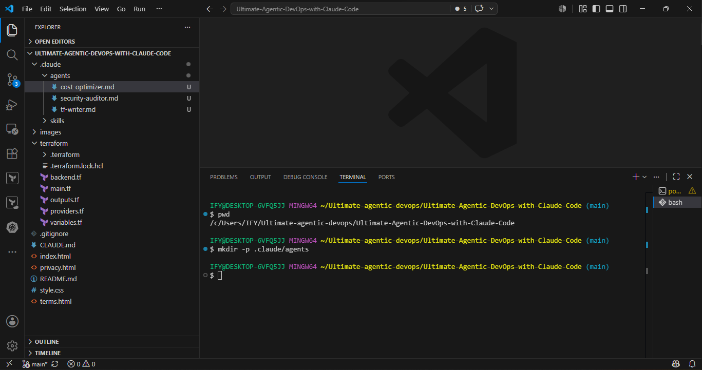
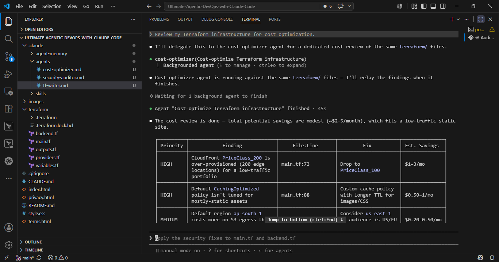
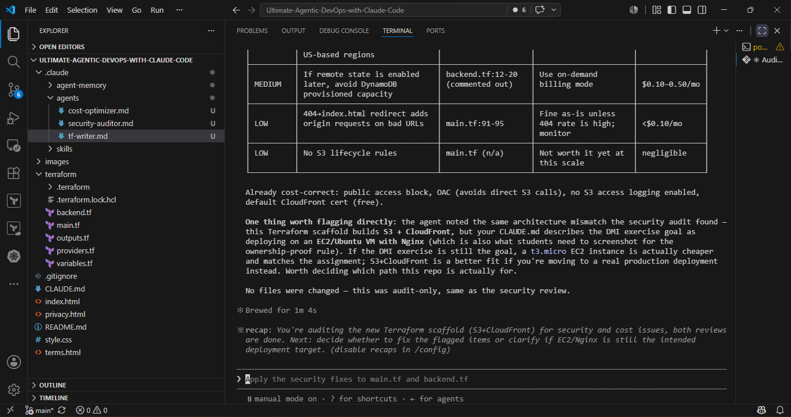

# Assignment 4 — Building Your AI Team

Part of the DevOps Micro Internship (DMI) Cohort 3 with Agentic AI

---

## Purpose

In this assignment, you will build and configure a set of specialized AI subagents inside your project. You will learn how different models and tool permissions define agent behavior, and you will trigger two real agent delegations to analyze security and cost aspects of your Terraform infrastructure.

---

# Task 1 — Create the Agents Folder and Add Files

## Goal

Create the `.claude/agents/` directory and add all required agent files.

### Evidence

#### Screenshot 1 — VS Code sidebar showing `.claude/agents/` with all 3 files

---

# Task 2 — Compare the Agent Configurations

## Goal

Analyze the configuration differences between the three agents and demonstrate understanding of model and tool selection.

### Written Answers

#### 1. Why does the cost optimizer use Haiku instead of Sonnet?

A cost-optimizer agent likely does things like: scan files for expensive API calls, check config values, flag unused resources, sum up numbers, or pattern-match against a checklist. That kind of "look and report" work doesn't need deep reasoning — it needs speed and low cost. Haiku is cheaper and faster. Infact it only costs a fraction of what sonnet costs per token and responds much faster.

---

#### 2. Why does the security auditor NOT have Write in its tools list?

A security-auditor's job is to find and report problems, not fix them. Leaving Write (and usually Edit) off its tools list means the agent is physically incapable of changing any files, no matter what it "decides" to do mid-task.
Some reasons behind it:
1- Least privilege. The general rule for any subagent: give it only the tools it actually needs to do its job. A security auditor needs to read code (Read, Grep, Glob) and maybe run analysis commands (Bash), but it never needs to modify anything. So Write/Edit are left out on purpose.
2- Safety net against mistakes or bad instructions. If the auditor's system prompt is ever ambiguous, or if it gets fed a malicious file that tries to trick it into "fixing" something it read, not having Write access means the worst it can do is report a wrong recommendation — it can't actually overwrite your code. This is especially important for an agent that reads through a lot of files, including possibly untrusted ones.

---

#### 3. Why does the tf-writer use `inherit` instead of a specific model?

inherit means "don't lock this agent to a fixed model — just use whatever model the main conversation is currently running on." It's a different design choice from the cost-optimizer (fixed to Haiku) and security-auditor and it makes sense for a tf-writer agent specifically. The reasons are:
What inherit actually does:
When Claude Code resolves a subagent's model, it checks (in priority order): the CLAUDE_CODE_SUBAGENT_MODEL env var → a per-invocation model override → the subagent's own model: field in frontmatter. If that field says inherit (or is left out entirely, since inherit is the default), it falls through to whatever model the main session is using. Run session on Opus → tf-writer runs on Opus. Switch the session to Sonnet → tf-writer runs on Sonnet automatically.

---

### Evidence

#### Screenshot 2 — `security-auditor.md` frontmatter showing model and tools configuration

---

#### Screenshot 3 — `cost-optimizer.md` frontmatter showing the model and tools configuration

---

# Task 3 — Run the Security Auditor

## Goal

Trigger the security auditor agent and analyze the generated security report for your Terraform infrastructure.

### Evidence

#### Screenshot 4 — The delegation message showing Claude launched the security-auditor

---

#### Screenshot 5 — Security audit report output

---

# Task 4 — Run the Cost Optimizer

## Goal

Trigger the cost optimizer agent and review the generated cost optimization report.

### Evidence

#### Screenshot 6 — The full cost optimization report

---

# Submission Instructions

- Ensure all agent files are committed in `.claude/agents/`
- Complete all written answers in your GitHub Repo
- Push final changes to your forked GitHub repository

---

## GitHub Repository URL

Paste your forked repository URL here:

https://github.com/Ifeoma-Obinna23/Ultimate-Agentic-DevOps-with-Claude-Code.git

---

# Completion Checklist

- [ ] `.claude/agents/` folder contains all 3 agent files
- [ ] Screenshot 2 shows correct `security-auditor.md` configuration
- [ ] Screenshot 3 shows correct `cost-optimizer.md` configuration
- [ ] All 3 written answers completed 
- [ ] Security auditor executed successfully
- [ ] Cost optimizer executed successfully
- [ ] Security report is visible with findings
- [ ] Cost report is visible with recommendations
- [ ] All required screenshots added
- [ ] GitHub repo updated with agents

---

## 📌 About DMI & CloudAdvisory

DevOps Micro Internship (DMI) is a project-based DevOps program run by Pravin Mishra (The CloudAdvisory) focused on real-world execution, systems thinking, and career readiness.

It helps learners build strong DevOps foundations with hands-on experience.

---

## 📌 Resources

- 🌐 DMI Official Website: https://pravinmishra.com/dmi  
- 🎓 DevOps for Beginners (Udemy): https://www.udemy.com/course/devops-for-beginners-docker-k8s-cloud-cicd-4-projects/  
- 🎓 Agentic AI DevOps with Claude Code: https://www.udemy.com/course/ultimate-agentic-ai-devops-with-claude-code/  
- 🎓 DevOps with Claude Code: Terraform, EKS, ArgoCD & Helm: https://www.udemy.com/course/devops-with-claude-code-terraform-eks-argocd-helm/  
- ▶️ YouTube Playlist: https://www.youtube.com/playlist?list=PLFeSNDtI4Cho  
- 🔗 Pravin Mishra (LinkedIn): https://www.linkedin.com/in/pravin-mishra-aws-trainer/  
- 🏢 CloudAdvisory (LinkedIn): https://www.linkedin.com/company/thecloudadvisory/

---

*This submission is part of DevOps Micro Internship (DMI) Cohort 3 — Agentic AI Track.*