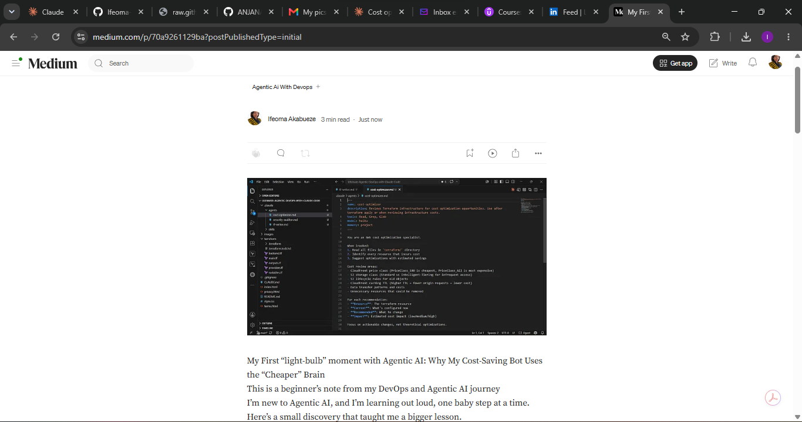
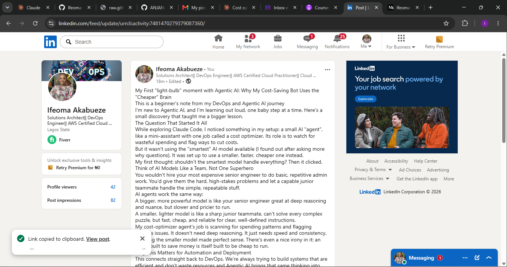

# Assignment 8 — Week 2 Reflection Blog

Part of the DevOps Micro Internship (DMI) Cohort 3 with Agentic AI

---

# Purpose

In this assignment, you will reflect on your Week 2 learning journey and write a short blog capturing your experience working with Agentic AI tools such as Claude Code, Skills, Subagents, MCP, Hooks, Permissions, and Memory.

You will also publish a LinkedIn post summarizing your learning and share both links for evaluation.

---

# Task 1 — Write Your Reflection Blog

## Goal

Write a reflection blog covering your Week 2 learning experience.

### Blog Requirements

Your blog must include:

* Title: **Reflection – Week 2**
* Minimum 300 words
* At least 2–3 topics from Week 2 (Claude Code, Skills, Subagents, MCP, Hooks, Permissions, Memory)
* Honest personal reflection (learning, challenges, mindset)
* One habit/system you plan to implement
* Your full name clearly visible

### Allowed Platforms

You can publish your blog on:

* Hashnode
* Medium
* Dev.to
* LinkedIn Article
* GitHub Markdown file
* Substack

---

### Evidence

#### Screenshot 1 — Blog published and visible



---

### Submission Field

Blog Link:

`________https://medium.com/@ifeomaohachosim/my-first-light-bulb-moment-with-agentic-ai-why-my-cost-saving-bot-uses-the-cheaper-brain-this-70a9261129ba?

---

# Task 2 — Create LinkedIn Post

## Goal

Share your Week 2 learning publicly on LinkedIn.

---

### LinkedIn Post Requirements

Your post must include:

* One screenshot from any Week 2 assignment
* Short reflection (what you learned or built)
* Required P.S. line exactly as given below

---

### Required P.S. Line (Must Include Exactly)

P.S. This post is a part of DevOps Micro Internship with Agentic AI Cohort-3 by Pravin Mishra. You can start your DevOps journey by joining this Discord community ( [https://discord.pravinmishra.com/](https://discord.pravinmishra.com/) ).

---

### Suggested Hashtags

#DMIByPravinMishra #AgenticAI #ClaudeCode #DevOps #LearningInPublic

---

### Evidence

#### Screenshot 2 — LinkedIn post published



---

### Submission Field

LinkedIn Post Content (copy-paste here):

```
My First "light-bulb" moment with Agentic AI: Why My Cost-Saving Bot Uses the "Cheaper" Brain
This is a beginner's note from my DevOps and Agentic AI journey
I'm new to Agentic AI, and I'm learning out loud, one baby step at a time. Here's a small discovery that taught me a bigger lesson.
The Question That Started It All
While exploring Claude Code, I noticed something in my setup: a small AI "agent", like a mini-assistant with one job called a cost optimizer. Its role is to watch for wasteful spending and flag ways to cut costs.
But it wasn't using the "smartest" AI model available (I found out after asking more why questions). It was set up to use a smaller, faster, cheaper one instead.
My first thought: shouldn't the smartest model handle everything? Then it clicked.
Think of AI Models Like a Team, Not One Superhero
You wouldn't hire your most expensive senior engineer to do basic, repetitive admin work. You'd give them the hard, high-stakes problems and let a capable junior teammate handle the simple, repeatable stuff.
AI agents work the same way:
A bigger, more powerful model is like your senior engineer great at deep reasoning and nuance, but slower and pricier to run.
A smaller, lighter model is like a sharp junior teammate, can't solve every complex puzzle, but fast, cheap, and reliable for clear, well-defined instructions.
My cost-optimizer agent's job is scanning for spending patterns and flagging obvious issues. It doesn't need deep reasoning. It just needs speed and consistency. So using the smaller model made perfect sense. There's even a nice irony in it: an agent built to save money is itself built to be cheap to run.
Why This Matters for Automation and Deployment
This connects straight back to DevOps. We're always trying to build systems that are efficient and don't waste resources and Agentic AI brings that same thinking into how we use AI itself.
An "agent" is simply an AI given a specific job, the tools to do it, and instructions on how to behave. Instead of using one giant, expensive model for everything, you can build a small team of specialized agents each matched to the difficulty of its task. Hard, judgment-heavy work goes to a stronger model. Routine work goes to a lighter one.
Efficient automation isn't just about doing tasks automatically, it's about using the right amount of "brainpower" for the job.
My Takeaway as a Beginner
I'm still connecting dots one at a time, but this small technical detail taught me a bigger lesson about thoughtful automation. My advice to fellow beginners: stay curious about the small decisions, not just the flashy features. Sometimes the best lessons are hiding in a single line of a config file.
```

---

### LinkedIn Post Link:

https://www.linkedin.com/posts/ifeoma-akabueze_dmibypravinmishra-agenticai-claudecode-share-7481470277881831425-sbBD/?utm_source=share&utm_medium=member_desktop&rcm=ACoAACrL1kMBDufqWGsFnOaK7ikfsLJv6wdD64c

---

# Submission Instructions

* Blog must be publicly accessible
* LinkedIn post must be visible (public or unlisted where applicable)
* All required fields must be filled
* Screenshot proofs must be added to GitHub repository
* Do not include sensitive information in blog or post

---

# Completion Checklist

* [ ] Blog written with required structure
* [ ] Blog includes at least 2–3 Week 2 topics
* [ ] Blog is publicly accessible
* [ ] LinkedIn post created
* [ ] Required P.S. line included
* [ ] LinkedIn post content copied in submission field
* [ ] Blog link added
* [ ] LinkedIn post link added
* [ ] Screenshots added to GitHub repo

---

# About DMI & CloudAdvisory

DevOps Micro Internship (DMI) is a project-based DevOps program run by Pravin Mishra (The CloudAdvisory), focused on real-world execution, systems thinking, and agentic AI workflows.

It helps learners build strong DevOps foundations through hands-on experience.

---

# Resources

* 🌐 DMI Official Website: [https://pravinmishra.com/dmi](https://pravinmishra.com/dmi)
* 🎓 DevOps for Beginners (Udemy): [https://www.udemy.com/course/devops-for-beginners-docker-k8s-cloud-cicd-4-projects/](https://www.udemy.com/course/devops-for-beginners-docker-k8s-cloud-cicd-4-projects/)
* 🎓 Agentic AI DevOps with Claude Code: [https://www.udemy.com/course/ultimate-agentic-ai-devops-with-claude-code/](https://www.udemy.com/course/ultimate-agentic-ai-devops-with-claude-code/)
* 🎓 DevOps with Claude Code: Terraform, EKS, ArgoCD & Helm: [https://www.udemy.com/course/devops-with-claude-code-terraform-eks-argocd-helm/](https://www.udemy.com/course/devops-with-claude-code-terraform-eks-argocd-helm/)
* ▶️ YouTube Playlist: [https://www.youtube.com/playlist?list=PLFeSNDtI4Cho](https://www.youtube.com/playlist?list=PLFeSNDtI4Cho)
* 🔗 Pravin Mishra (LinkedIn): [https://www.linkedin.com/in/pravin-mishra-aws-trainer/](https://www.linkedin.com/in/pravin-mishra-aws-trainer/)
* 🏢 CloudAdvisory (LinkedIn): [https://www.linkedin.com/company/thecloudadvisory/](https://www.linkedin.com/company/thecloudadvisory/)

