# Assignment 3 — Production Maintenance Drill (OPS Checklist)

Part of the DevOps Micro Internship (DMI) Cohort 3 with Agentic AI

---

## Purpose

In this assignment, you will treat your already deployed React application (on Ubuntu VM with Nginx) as a live production system. You will perform structured operational checks covering network validation, service health, log analysis, resource monitoring, configuration verification, and incident simulation with recovery — mirroring real on-call DevOps responsibilities.

---

# Task 1 — Server Access & Networking Validation

## Goal

Verify that the deployed React application is reachable from the browser and confirm basic network connectivity of the Ubuntu VM.

### Evidence

#### Screenshot 1 — Browser showing the React app with your Full Name visible on the UI

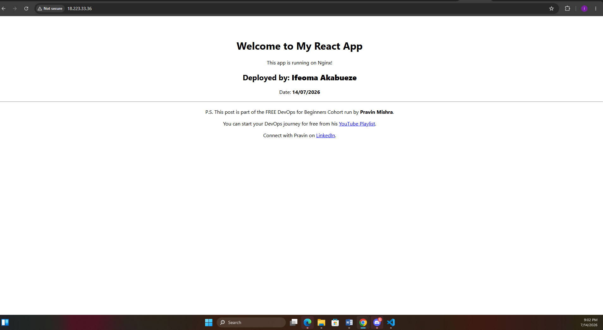

---

#### Screenshot 2 — Output of `ip a`

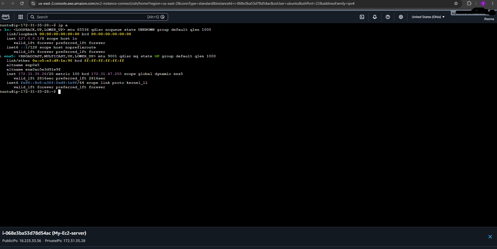

---

#### Screenshot 3 — Output of `sudo ss -tulpen`

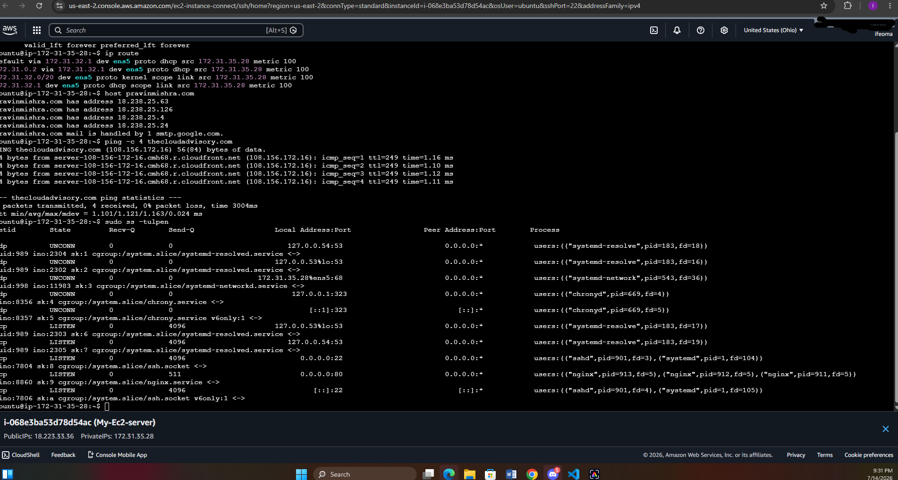

---

#### Screenshot 4 — Output of `sudo ufw status`

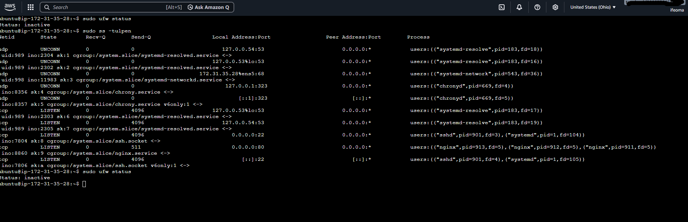
---

### Notes

Answer the following in your own words:

**1. What proves Nginx is listening on 0.0.0.0:80?**

localaddress = 0.0.0.0.0 = this means listen to every network interface on this machine
The local address 0.0.0.0.0 is the proof. The local network listens to every network interface on the machine not just local host and :80 is the HTTP port

**2. What proves SSH is active on port 22?**

Local Address:Port = 0.0.0.0:22 (and [::]:22 for IPv6) — 0.0.0.0 means listening on all IPv4 interfaces, [::] means listening on all IPv6 interfaces. Port 22 is the standard SSH port.
State = LISTEN — actively accepting incoming connections.
Process = sshd — the users:() column names sshd (the SSH daemon) as the process bound to the socket, with PID 901.

---

**3. Did you find any unexpected open ports? Explain briefly.**

No
---

# Task 2 — Service Health & Systemd Validation (Nginx)

## Goal

Verify that Nginx is properly installed, running, enabled at boot, and safely configured.

### Evidence

#### Screenshot 1 — Output of `systemctl status nginx --no-pager`

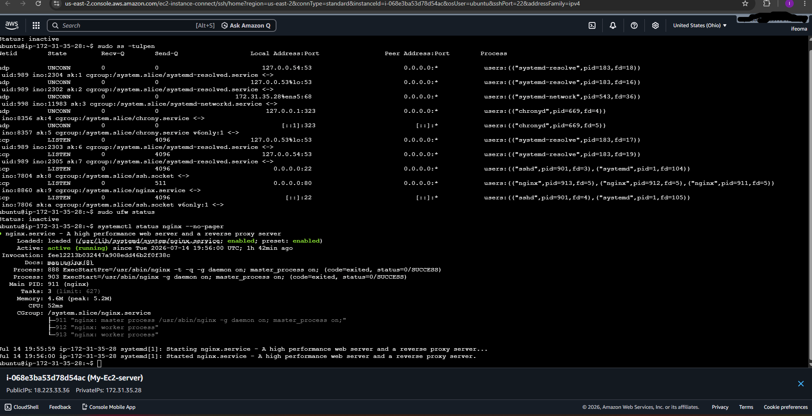

---

#### Screenshot 2 — Output of `sudo nginx -t`

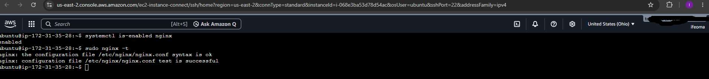

---

#### Screenshot 3 — Output of `sudo ss -lptn '( sport = :80 )'`

---

### Notes

Answer the following in your own words:

**1. What happens if Nginx fails to restart in production?**

 if I restart nginx using the 'systemctl restart nginx' command and the new config has an error, nginx will stop the old process first, then fails to start the new one. The effect will be that the entire site goes down — no server listening on port 80 at all. Visitors of the web page will get "connection refused" or a service timeout.

---

**2. What's your basic rollback plan?**

sudo cp /etc/nginx/sites-available/default /etc/nginx/sites-available/default.bak : this command backsup before I make any changes. it Is a safety net, saves the existing file while the config is known-good.
sudo nginx -t : This command tests my nginx configuration file for syntax errors after editing, before applying it. it catches mistakes before they can break the live site.
sudo systemctl restart nginx: If the test passes, the this command will apply the change by restarting Nginx
Again, If the test fails, or the site breaks after restarting, i will restore the backup using the command: sudo cp /etc/nginx/sites-available/default.bak /etc/nginx/sites-available/default
   sudo nginx -t
   sudo systemctl restart nginx
   Then verify the recovery using the command "sudo systemctl status nginx"

# Task 3 — Logs & Request Trace

## Goal

Verify real traffic flow and analyze logs to understand system behavior and errors.

### Evidence

#### Screenshot 1 — Output of `sudo tail -n 30 /var/log/nginx/access.log`

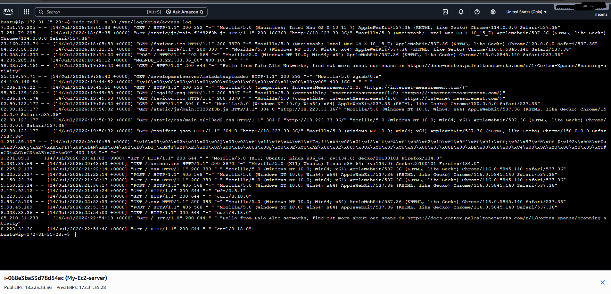

---

#### Screenshot 2 — Output of `sudo tail -n 30 /var/log/nginx/error.log`

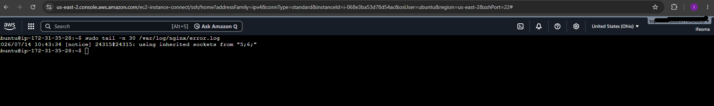

---

#### Screenshot 3 — Output of `sudo journalctl -u nginx --no-pager -n 50`

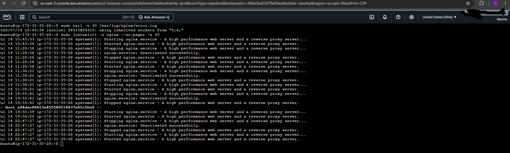

---

### Notes

Answer the following in your own words:

**1. Were there any errors in the logs?**

No.
An empty or error-free Nginx error log indicates the web server has been operating without any operational problems during the period covered by the log,
No configuration failures: Nginx hasn't encountered any invalid directives, missing files, or broken syntax when starting or reloading.

No request-handling failures — the server hasn't hit issues like permission errors reading files, missing upstream resources, or failed attempts to bind to a port
No resource exhaustion — no out-of-memory conditions, too-many-open-files errors, or worker process crashes

---

**2. If there were no errors, what does that indicate about the system?**

It indicates the system is in a healthy, stable, and correctly configured state.

Nginx started and ran successfully every time it was started, restarted, or recovered from a reboot. No crashes and no failed startups

**3. Based on the access logs, were your curl requests visible in the log entries? What does that prove about traffic flow?**

Yes! My curl requests are clearly visible in the log.

This confirms the full request path works end-to-end. And importantly, from outside the local machine perspective, over the actual public internet path (request went out from my instance, through AWS networking, back in through the security group, hit Nginx, got logged, and returned the response) rather than just a local loopback test. The access log is Nginx's own record of having received and served the request, which is stronger proof than just seeing HTML print to my terminal — it shows the whole chain (security group → Nginx → response → logged) functioned correctly.

---

# Task 4 — System Resource Health Check (Capacity Red Flags)

## Goal

Assess server capacity and detect potential performance or failure risks.

### Evidence

#### Screenshot 1 — Output of `uptime`

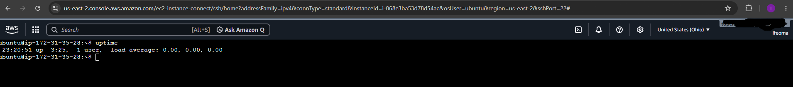

---

#### Screenshot 2 — Output of `free -h`

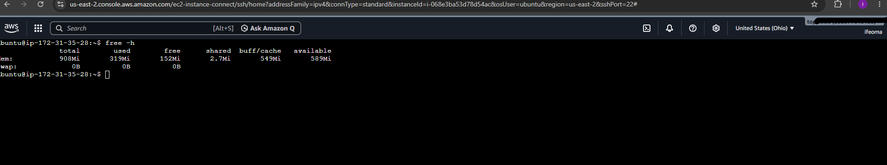

---

#### Screenshot 3 — Output of `df -h`

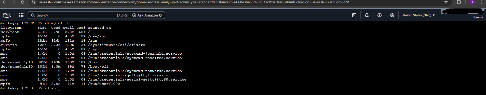

---

#### Screenshot 4 — Output of `sudo du -sh /var/* | sort -h`

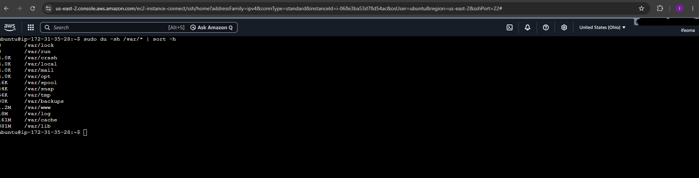

---

### Notes

Answer the following in your own words:

**1. Which resource looks most critical right now? (CPU/load, memory, or disk) Explain why.**

Memory is the answer. A look at the usage and current space:

Memory → 908Mi total, only 132Mi truly free (583Mi "available" but a chunk of that is reclaimable cache, not free space) → the smallest headroom relative to its own capacity

---

**2. What happens if disk becomes 100% full in a production server?**

If disk fills to 100% on a production server, it causes a lot of failures
Logging stops working — services like Nginx, syslog, and journald can no longer write log entries, so you lose visibility into what's happening right as things start breaking
Applications crash or hang — anything that needs to write temp files, session data, or cache (databases especially) will start throwing errors or freezing
---

# Task 5 — Configuration & Deployment Verification

## Goal

Ensure the correct React build is deployed and Nginx is serving it properly.

### Evidence

#### Screenshot 1 — Output of `ls -lah /var/www/html | head -n 20`

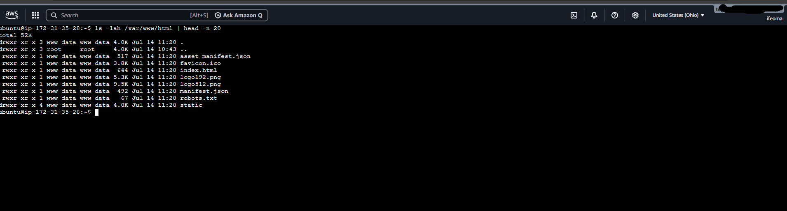

---

#### Screenshot 2 — Output of `grep -R "Deployed by" -n /var/www/html 2>/dev/null | head`

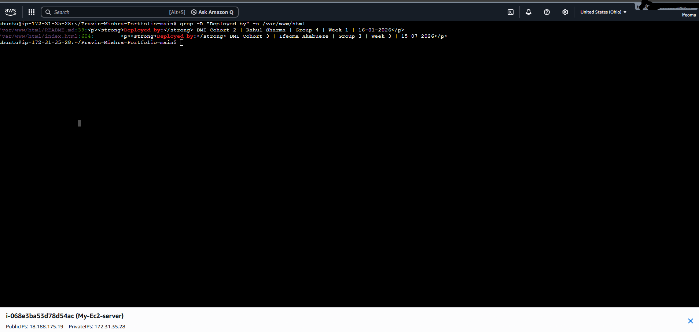

---

#### Screenshot 3 — Output of `grep -n "try_files" /etc/nginx/sites-available/default`

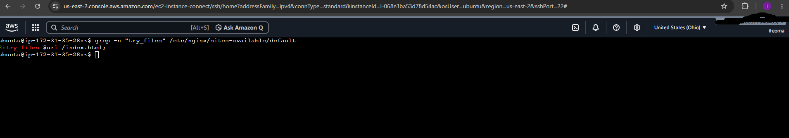
---

### Notes

Answer the following in your own words:

**1. How do you confirm that the correct version of the application is deployed?**

I ran ls -lah /var/www/html and confirmed the deployed files matched a React production build rather than a plain hand-written HTML site. Specifically, I saw index.html, a static/ folder (containing compiled JS and CSS), and asset-manifest.json — files that are only generated by React's build process, not something you'd write by hand.
To confirm it was specifically my build and not just any generic React deployment, I ran grep -R "Deployed by" -n /var/www/html, which showed my "Deployed by: Ifeoma Akabueze" line inside the deployed files. I also confirmed this visually by loading the site in the browser and seeing my name, cohort, and deployment date displayed on the page.
Finally, I ran curl -I http://localhost (and curl -I http://18.188.175.19) and confirmed nginx returned HTTP/1.1 200 OK, showing the web server was correctly serving the deployed files from /var/www/html.

---

# Task 6 — Nginx Configuration Failure Simulation

## Goal

Simulate a real-world Nginx misconfiguration and recover the service safely.

### Evidence

#### Screenshot 1 — Output of `sudo nginx -t` showing the syntax error (broken config)

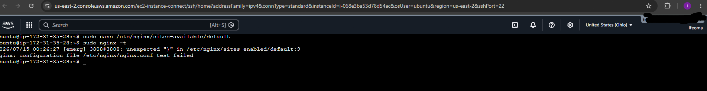

---

#### Screenshot 2 — Output of `sudo nginx -t` showing syntax ok (fixed config)

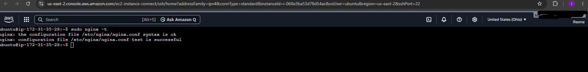

---

#### Screenshot 3 — Output of `curl -I http://<public-ip>` confirming recovery (200 OK)

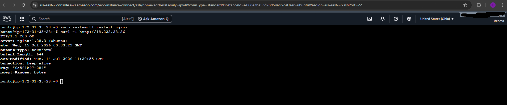

---

### Notes

Answer the following in your own words:

**1. What caused the configuration failure?**

The configuration failure was caused by a missing semicolon (;) at the end of the try_files

---

**2. How did you fix the issue?**

I reopened the configuration file using sudo nano /etc/nginx/sites-available/default and restored the missing semicolon at the end of the try_files

---

**3. How can you avoid this kind of issue in real production systems?**

I wil always test before applying, I will inbibe the habit of never restarting/reloading after editing a config without testing first(sudo nginx -t). This alone catches the vast majority of syntax errors before they cause downtime.

# Task 7 — Web Application Failure Simulation

## Goal

Simulate missing deployment content and recover the application safely.

### Evidence

#### Screenshot 1 — Output of `curl -I http://<public-ip>` showing failure (non-200 response)

---

#### Screenshot 2 — Output of `curl -I http://<public-ip>` confirming recovery (200 OK)

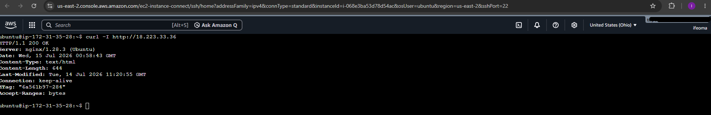

---

### Notes

Answer the following in your own words:

**1. What caused the application to break in this scenario?**

The application broke because the deployment directory (/var/www/html) was emptied of its actual content. Then the original files (index.html, and the static/js and static/css folders containing the built React app) were moved out and replaced with a blank directory.

---

**2. How did you fix the issue and restore the application?**

Removed the empty placeholder directory that had replaced the real deployment folder (sudo rm -rf /var/www/html) and restored the original files from the backup created before the simulated failure (sudo mv /var/www/html_backup /var/www/html). This moved the intact React build (including index.html and the static/js and static/css assets) back to the exact path Nginx expects (root /var/www/html;)

---

**3. What steps would you take to prevent this kind of issue in real production systems?**

I will never deploy by overwriting the live directory directly.
Instead of replacing files in-place, I would deploy to a new versioned directory (e.g., /var/www/releases/2026-07-15-1420/) and use a symlink (/var/www/html → current release) that I will switch automically. If a deployment fails partway through, the live symlink still points to the last working release so that the site never sees a broken or empty state.

---

# Task 8 — Security & Reliability Review

## Goal

Review and reflect on the security and reliability practices applied during this assignment.

### Security & Reliability Notes

Answer the following in your own words:

**1. Why is SSH key-based authentication more secure than sharing passwords?**

Passwords are relatively easy to guess, brute-force, or steal through phishing, and if a password is shared across multiple people or services, there's no way to know who actually used it. SSH key-based authentication uses a cryptographic key pair instead. A private key that never leaves your machine, and a public key placed on the server. Since the private key is never transmitted over the network, it can't be intercepted the way a password can during login. It's also effectively impossible to brute-force compared to a password, and each key can be tied to a specific person or machine, making access easier to track and revoke individually without affecting anyone else.

---

**2. Why should only required ports be open on a production server?**

Every open port is a potential entry point for an attacker. Servers connected to the internet are constantly scanned by automated bots looking for open ports and known vulnerabilities. This was directly visible in my access logs, where scanners probed for exposed files within hours of the server going live. Keeping only the ports actually needed (in this case, 22 for SSH and 80 for HTTP) minimizes the "attack surface". The fewer services exposed, the fewer opportunities there are for something to be exploited, misconfigured, or left vulnerable without anyone noticing..

---

**3. Why is it important for Nginx to be enabled on boot?**

If Nginx isn't set to start automatically, any event that causes the server to restart, a reboot, a crash, or a scheduled maintenance action from AWS would leave the web application completely down until someone manually logs in and starts the service again. In a real production environment, this could mean extended downtime, especially if the restart happens when no one is actively monitoring the server. Enabling it on boot (systemctl enable nginx) ensures the service recovers automatically and the application stays available with minimal manual intervention.

---

**4. What are the risks of sharing secrets, keys, or credentials publicly?**

If credentials such as SSH private keys, API keys, database passwords, or .env files are exposed for example, committed to a public GitHub repo or left accessible on a public-facing server, anyone who finds them can impersonate a legitimate user or service. This could lead to unauthorized access to servers, data theft, resource abuse (like an attacker running up cloud costs on your account), or a complete compromise of the system. I saw evidence of this risk directly in my access logs, where bots specifically searched for an exposed .env file, which commonly contains sensitive credentials. Once a secret is exposed publicly, it should be treated as compromised and rotated immediately, since it can be copied and reused instantly.

---

**5. Why should cloud resources be stopped or terminated when they are no longer needed?**

Write your answer here.

Cloud providers like AWS charge for resources based on usage time, so an EC2 instance left running unnecessarily continues to consume compute hours, storage, and potentially data transfer — costs that add up even if the instance isn't doing anything useful. Beyond cost, an idle but still-running server also remains a live security exposure — it's still reachable, still being scanned by bots, and still a potential target, even if no one is actively using it. Stopping or terminating resources that are no longer needed reduces both unnecessary spending and unnecessary risk.

# LinkedIn Post (Required)

## Evidence

#### LinkedIn Post URL

Paste your LinkedIn post URL here:

https://www.linkedin.com/posts/ifeoma-akabueze_dmibypravinmishra-agenticai-claudecode-ugcPost-7483600565470633984-Kx_d/?

---

#### Screenshot — Published LinkedIn post

---

# Submission Instructions

- Add all required screenshots in your submission
- Full name must be visible in required screenshots
- Do not expose sensitive information (keys, passwords, account IDs)

---

# Completion Checklist

- [ ] Task 1: Screenshots (browser, ip a, ss -tulpen, ufw status) + Notes answered
- [ ] Task 2: Screenshots (nginx status, nginx -t, ss port 80) + Notes answered
- [ ] Task 3: Screenshots (access log, error log, journalctl) + Notes answered
- [ ] Task 4: Screenshots (uptime, free -h, df -h, du -sh) + Notes answered
- [ ] Task 5: Screenshots (ls html, grep deployed by, grep try_files) + Notes answered
- [ ] Task 6: Screenshots (nginx -t fail, nginx -t pass, curl recovery) + Notes answered
- [ ] Task 7: Screenshots (curl failure, curl recovery) + Notes answered
- [ ] Task 8: Security & Reliability Notes answered
- [ ] LinkedIn post published and URL submitted
- [ ] Full Name visible in all required screenshots
- [ ] No sensitive data exposed

---

## 📌 About DMI & CloudAdvisory

DevOps Micro Internship (DMI) is a project-based DevOps program run by Pravin Mishra (The CloudAdvisory) focused on real-world execution, systems thinking, and career readiness.

It helps learners build strong DevOps foundations with hands-on experience.

---

## 📌 Resources

- 🌐 DMI Official Website: https://pravinmishra.com/dmi  
- 🎓 DevOps for Beginners (Udemy): https://www.udemy.com/course/devops-for-beginners-docker-k8s-cloud-cicd-4-projects/  
- 🎓 Agentic AI DevOps with Claude Code: https://www.udemy.com/course/ultimate-agentic-ai-devops-with-claude-code/  
- 🎓 DevOps with Claude Code: Terraform, EKS, ArgoCD & Helm: https://www.udemy.com/course/devops-with-claude-code-terraform-eks-argocd-helm/  
- ▶️ YouTube Playlist: https://www.youtube.com/playlist?list=PLFeSNDtI4Cho  
- 🔗 Pravin Mishra (LinkedIn): https://www.linkedin.com/in/pravin-mishra-aws-trainer/  
- 🏢 CloudAdvisory (LinkedIn): https://www.linkedin.com/company/thecloudadvisory/

---

*This submission is part of DevOps Micro Internship (DMI) Cohort 3 — Agentic AI Track.*