# Assignment 5 — Bash Script Automation Drill (OPS Checklist)

Part of the DevOps Micro Internship (DMI) Cohort 3 with Agentic AI

---

## Purpose

In this assignment, you will practice Bash scripting by building a series of small automation scripts covering environment setup, variables, arrays, loops, file conditionals, if-else logic, and functions. These scripts form the foundation of real-world Linux automation used in DevOps, cloud, and production support environments.

---

# Task 1 — Bash Environment & Workspace Setup

## Goal

Verify that Bash is available on your system and create a clean workspace for this assignment.

### Evidence

#### Screenshot 1 — Output of `echo $SHELL` and `bash --version`

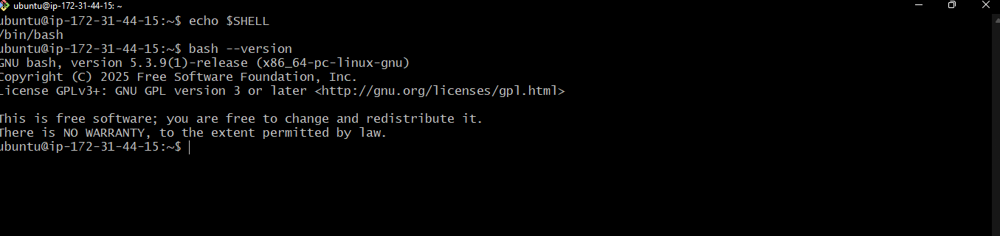

---

#### Screenshot 2 — Output of `pwd` and `ls -lah` showing the scripts directory

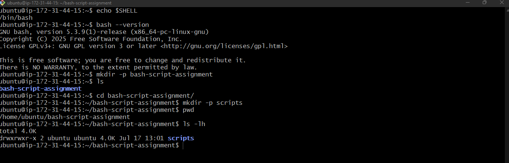

---

### Notes

Answer the following in your own words:

**1. What is Bash?**

Bash (Born Again SHell) is a command-line shell and scripting language used mainly on Linux and Unix-like systems. It's the program that reads the commands one types and tells the operating system what to do.
A few key things about it:
As a shell, it's the interface I am typing into right now in Git Bash. When I run commands like cd, ls, or pwd Bash is the program interpreting those commands and executing them.
As a scripting or programming language, one can string commands together into a .sh file to automate tasks. That file is called Bash script or shell script. 

---

**2. What is the difference between shell and Bash?**

Bash is one specific shell(because we have different shells like zsh,) types the most common one on Linux systems. It's an enhanced, backward-compatible replacement for the original sh, with extra features like command history, tab completion, better scripting syntax, arrays, etc while shell is a general concept: any program that provides a command-line (or sometimes graphical) interface between a user and the operating system's kernel. It reads what is typed, interprets it, and asks the OS to carry it out. "Shell" is the category, not one specific program like bash.

---

**3. Why is it important to confirm the Bash version before writing scripts?**

Bash has evolved a lot over the years, and features that work fine in one version can silently fail or not exist at all in another. A few concrete reasons this matters:
Newer features aren't available in older Bash
Some commonly used features only exist from certain versions onward:

Associative arrays (declare -A) — need Bash 4.0+
mapfile/readarray — need Bash 4.0+
Case conversion like ${var,,} (lowercase) or ${var^^} (uppercase) — need Bash 4.0+
Coprocesses (coproc) — need Bash 4.0+ 

---

# Task 2 — Your First Bash Script

## Goal

Create your first Bash script, make it executable, and run it from the terminal.

### Evidence

#### Screenshot 1 — Content of `first-script.sh`

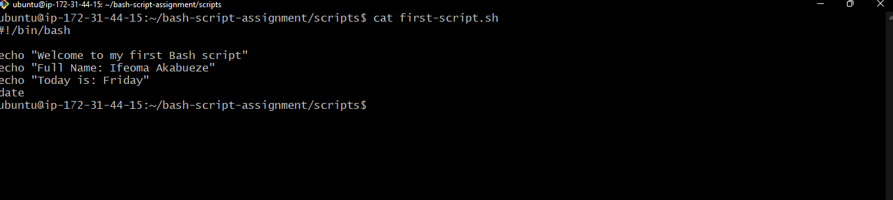
---

#### Screenshot 2 — Output of `./first-script.sh`

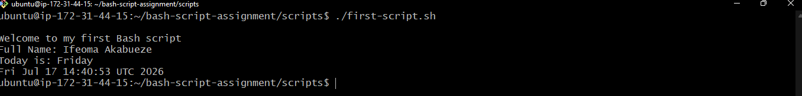

---

#### Screenshot 3 — Output of `ls -l first-script.sh` showing executable permission

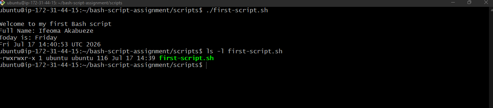

---

### Notes

Answer the following in your own words:

**1. What is the purpose of `#!/bin/bash`?**

It's purpose is to tell the operating system which interpreter should be used to run the script. When you make a file executable and run it directly (for example ./myscript.sh), the Operating System reads that first line to figure out what program should process the rest of the file.
In this case, #!/bin/bash says: "run everything below this line using the Bash shell located at /bin/bash."
Why it matters:
Without a shebang, the system doesn't automatically know how to interpret your script. It might fail to run at all if you try ./script.sh or get executed by whatever your current shell happens to be (which might not be Bash) — leading to unexpected behavior if the script uses Bash-specific syntax

---

**2. Why do we use `chmod +x` before running a script?**

chmod +x gives a file execute permission, which is required before you can run it directly as a program 

---

**3. What is the difference between running a script using `./script.sh` and `bash script.sh`?**

./script.sh
This tells the shell: "execute this file directly, as a program".
The file must have execute permission (chmod +x script.sh), or you'll get Permission denied
The file must have a valid shebang (#!/bin/bash) on the first line, so the OS knows which interpreter to hand it off to

The ./ part just specifies the path (current directory), since Linux doesn't search the current directory by default for security reasons — running plain script.sh won't work unless . is in your PATH.

bash script.sh
This tells the shell: "run the bash program, and pass this file to it as an argument to interpret."
For this to work:

Execute permission is not required — you're not running the file as a program, you're just having Bash read it like a text input
The shebang line is ignored entirely — it doesn't matter what interpreter the shebang specifies, because you've already explicitly chosen Bash
---

# Task 3 — Variables: User Information Script

## Goal

Use variables to store and display user-related information.

### Evidence

#### Screenshot 1 — Content of `user-info.sh`

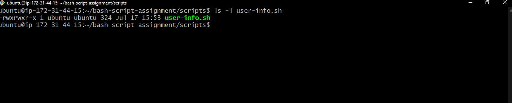

---

#### Screenshot 2 — Output of `./user-info.sh`

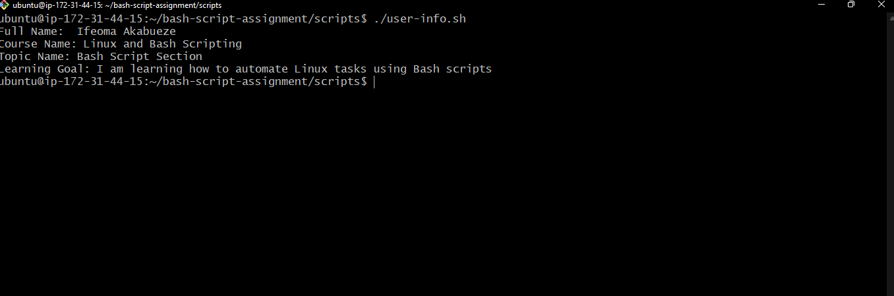

---

### Notes

Answer the following in your own words:

**1. What is a variable in Bash?**

Variable is a name that holds value when it is defined so that when the name(variable) is called or edited, it fetches or changes everyother place/places where its value is. If the value changes, just update one line and the rest of the script adjusts automatically. The idea is so you can reuse or refer to it later in your script instead of typing the value over and over.

---

**2. Why should we avoid spaces around the `=` sign when creating variables?**

When we add spaces around the equal sign, bash does not see an assignment, it tries to run SERNAME_NAME as a command and then sees = as an argument, then the value

---

**3. How do you access the value stored inside a Bash variable?**

To access the value stored in a variable, put a $ in front of its name.

---

# Task 4 — Arrays & Loops: Tools Checklist Script

## Goal

Use arrays and loops to print a checklist of tools used in Bash scripting.

### Evidence

#### Screenshot 1 — Content of `tools-checklist.sh`

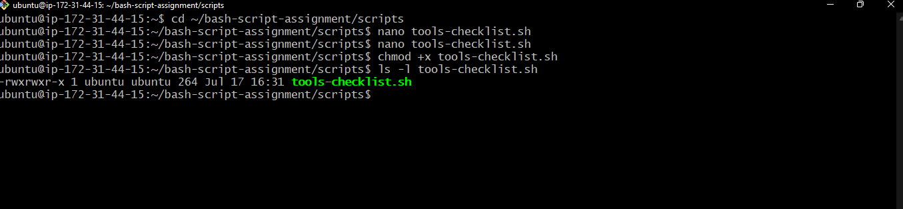

#### Screenshot 2 — Output of `./tools-checklist.sh`

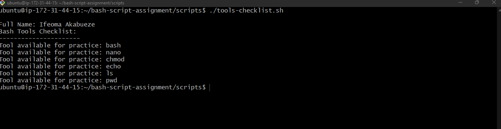

---

### Notes

Answer the following in your own words:

**1. What is an array in Bash?**

An array in Bash is a variable that can hold multiple values at once, instead of just a single value like a regular variable does. An array holds a list of values all under one name.

---

**2. Why are arrays useful in scripts?**

Arrays let you store a collection of related values under one name, so you can process them together instead of writing repetitive code for each individual item.

---

**3. What does `"${tools[@]}"` mean?**

This expands to every element in the tools array as separate, individually-quoted words — it's the safest, most correct way to reference all elements of an array in Bash.

---

**4. What is the purpose of the `for` loop in this script?**

The purpose of this for loop is to repeat the same action a fixed number of times (5 times), printing a step counter each time, without writing the echo line out manually five separate times.

---

# Task 5 — Loops: Number Counter Script

## Goal

Use loops to repeat a task multiple times.

### Evidence

#### Screenshot 1 — Content of `counter.sh`

---

#### Screenshot 2 — Output of `./counter.sh`

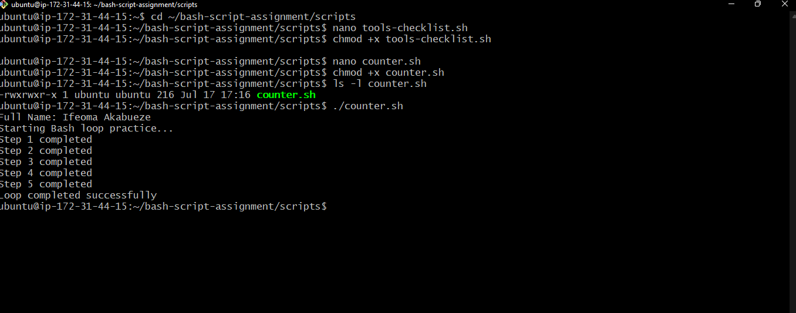

---

### Notes

Answer the following in your own words:

**1. What is a loop?**

A loop is a programming construct that lets you repeat a block of code multiple times without having to write that same code out over and over manually.

---

**2. Why do we use loops in Bash scripting?**

We use loops in Bash to automate repetition, so we can perform the same action across many items or many times without writing duplicate code for each one.

---

**3. How many times did the loop run in your script?**

The loop run in my script ran 5 times?

---

**4. What would you change if you wanted the loop to run 10 times?**

To make the loop run 10 times, I'd extend the list of values after in to include ten numbers instead of five.

---

# Task 6 — Files & Conditionals: File Validation Script

## Goal

Use file checks and conditionals to verify whether files and directories exist.

### Evidence

#### Screenshot 1 — Output of `ls -lah ../test-folder`

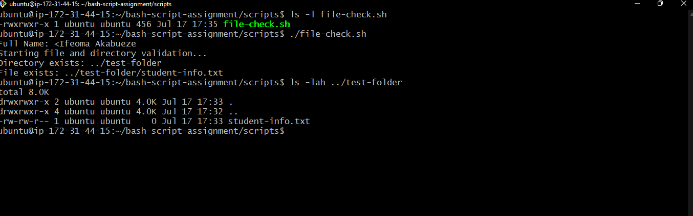
---

#### Screenshot 2 — Content of `file-check.sh`

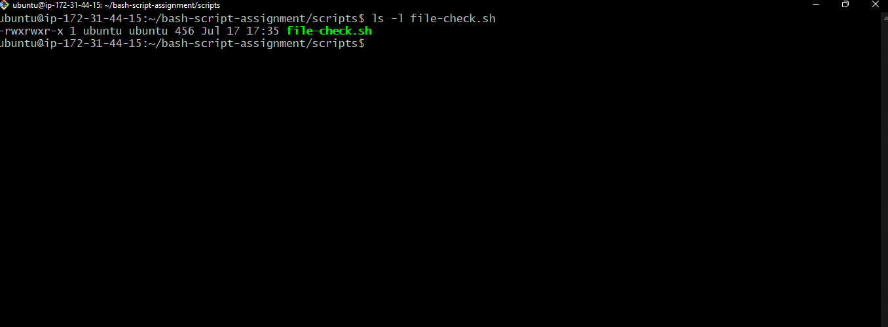

---

#### Screenshot 3 — Output of `./file-check.sh`

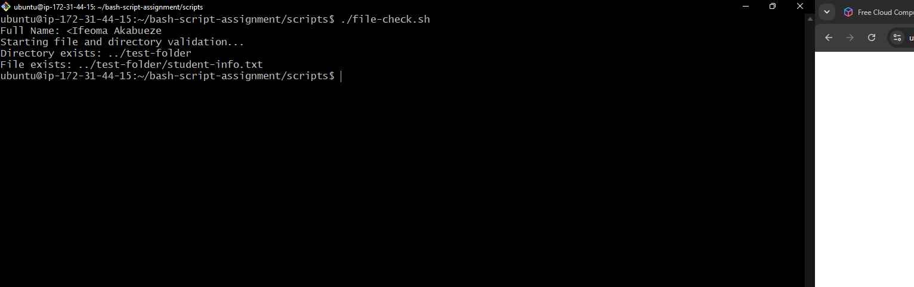

---

### Notes

Answer the following in your own words:

**1. What does `-d` check in Bash?**

-d is a file test operator in Bash used inside conditional expressions ([ ] or [[ ]]) to check whether something is a directory

---

**2. What does `-f` check in Bash?**

-f is a file test operator that checks whether a path exists and is a regular file (as opposed to a directory, symlink, or other special file type).

---

**3. Why should file and directory paths be stored in variables?**

Storing paths in variables makes scripts easier to maintain, reuse, and avoid errors — instead of hardcoding the same path in multiple places throughout the script.v

---

**4. What happens if the file does not exist?**

if the file doesn't exist, the -f check returns false, so the if block is skipped and the else block runs instead

---

# Task 7 — Conditionals: Pass or Retry Script

## Goal

Use if-else conditionals to make decisions based on a variable value.

### Evidence

#### Screenshot 1 — Content of `score-check.sh` with `score=85`

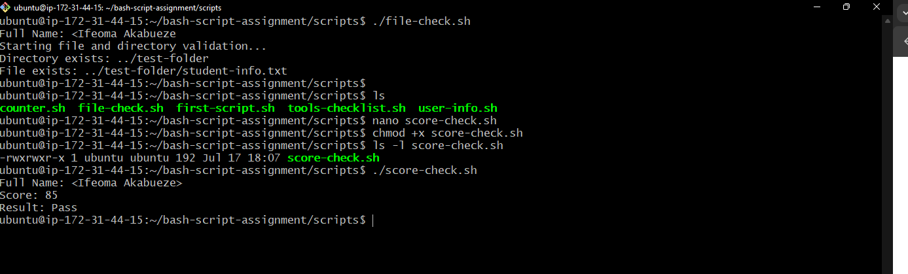

---

#### Screenshot 2 — Output showing `Result: Pass`

---

#### Screenshot 3 — Content of `score-check.sh` with `score=55`

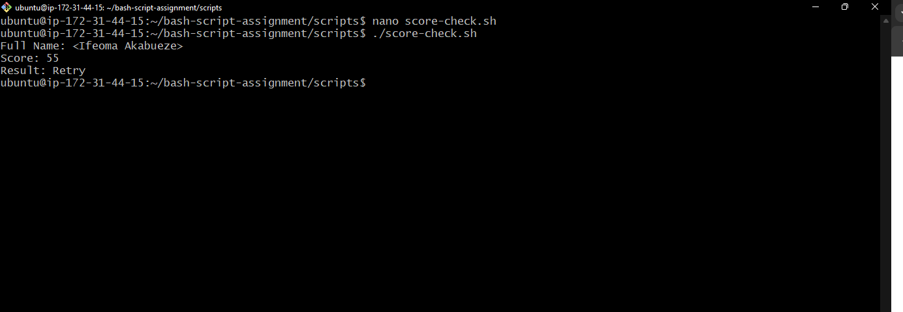

---

#### Screenshot 4 — Output showing `Result: Retry`

---

### Notes

Answer the following in your own words:

**1. What is the purpose of if-else in Bash?**

An if-else statement lets a script make decisions — running one set of commands if a condition is true, and a different set if it's false — instead of always executing the same fixed sequence of commands no matter what.

---

**2. What does `-ge` mean?**

-ge means "greater than or equal to" — it's a numeric comparison operator used inside [ ] or [[ ]] conditionals in Bash.

---

**3. Why should conditions be tested with different values?**

Testing conditions with different values matters because a condition might work correctly for one case but fail (or behave unexpectedly) for others — you don't actually know your logic is correct until you've checked it against the edge cases, not just the "obvious" case

---

**4. How can conditionals help in automation scripts?**

Conditionals let automation scripts make decisions on their own and respond appropriately to different situations — without conditionals, a script just blindly runs the same commands every time, regardless of whether that's actually the right thing to do given the current state of the system.

---

# Task 8 — Functions: Final Bash Automation Script

## Goal

Create a final Bash script using functions to organize reusable code.

### Evidence

#### Screenshot 1 — Content of `final-automation.sh`

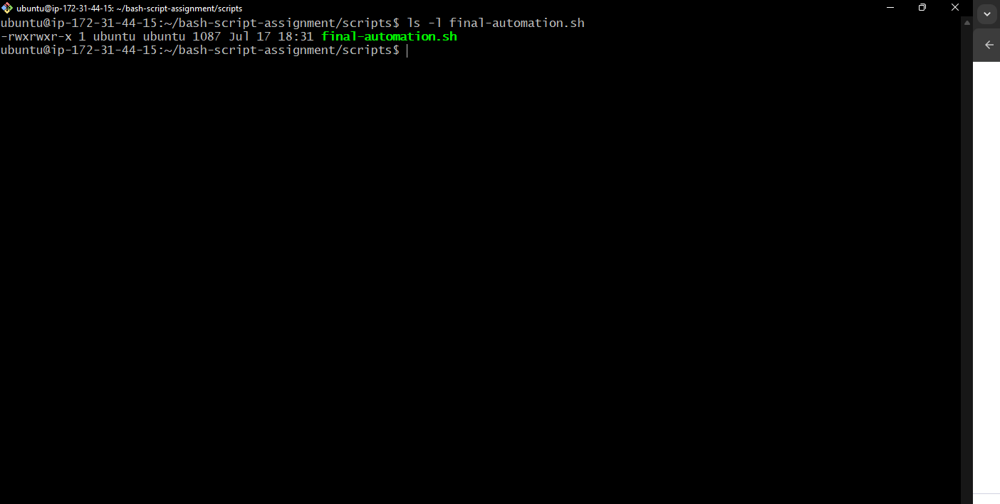.

---

#### Screenshot 2 — Output of `./final-automation.sh`

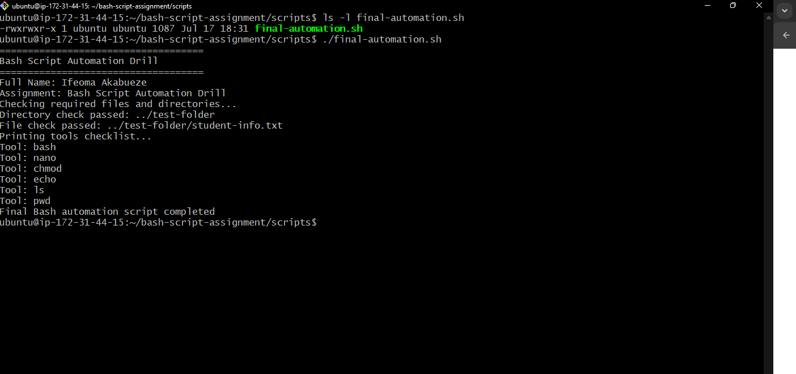

---

#### Screenshot 3 — Output of `ls -lah` showing all created scripts

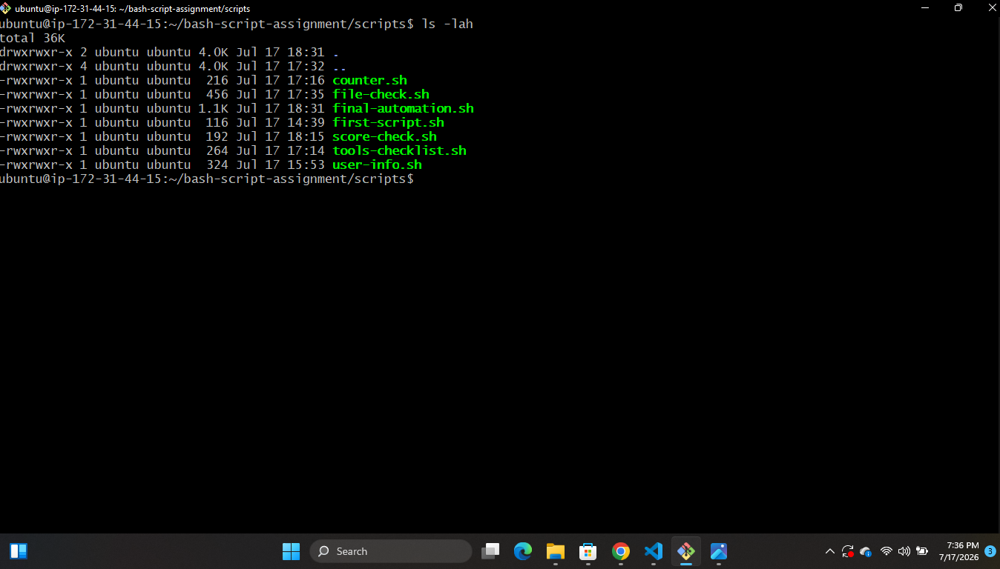

---

### Notes

Answer the following in your own words:

**1. What is a function in Bash?**

A function in Bash is a named, reusable block of code that you define once and can call (run) multiple times throughout your script — instead of copying and pasting the same commands everywhere you need them.

---

**2. Why are functions useful in scripts?**

Why are functions useful in scripts?Functions let you write a piece of logic once and reuse it anywhere in your script, which keeps scripts shorter, easier to read, and much easier to fix or update later.

---

**3. Which functions did you create in this script?**

 print_header() (lines 9–13)
Prints a formatted title block using the assignment_name variable
print_header() {
    echo "===================================="
    echo "$assignment_name"
    echo "===================================="
}

print_user_details() (lines 15–18)
Prints your name and the assignment name
print_user_details() {
    echo "Full Name: $full_name"
    echo "Assignment: $assignment_name"
}

check_files() (lines 20–36)
Checks whether a specific directory and file exist, using -d and -f:

check_files() {
    echo "Checking required files and directories..."
    if [ -d "$directory_path" ]
    then
        echo "Directory check passed: $directory_path"
    else
        echo "Directory check failed: $directory_path"
    fi

    if [ -f "$file_path" ]
    then
        echo "File check passed: $file_path"
    else
        echo "File check failed: $file_path"
    fi
}

print_tools() (lines 38–45)
Loops through the tools array and prints each one:

print_tools() {
    echo "Printing tools checklist..."
    for tool in "${tools[@]}"
    do
        echo "Tool: $tool"
    done
}
---

**4. How does this final script combine variables, arrays, loops, conditionals, files, and functions?**

This script is a nice example of all six concepts working together, each playing a distinct role. Let's go through it piece by piece.
1. Variables — store data used throughout the script
bashfull_name="<Your Full Name>"
assignment_name="Bash Script Automation Drill"
directory_path="../test-folder"
file_path="../test-folder/student-info.txt"
These hold single values that get reused in multiple places (inside functions, inside conditionals) instead of being hardcoded repeatedly.
2. Arrays — store a list of related values
bashtools=("bash" "nano" "chmod" "echo" "ls" "pwd")
Instead of six separate variables for six tools, one array holds them all together, ready to be looped over.
3. Functions — organize the script into reusable, named blocks
bashprint_header() { ... }
print_user_details() { ... }
check_files() { ... }
print_tools() { ... }
Each function wraps a specific piece of logic. Instead of one long, flat script, the work is broken into labeled sections — easier to read, and each part could be reused or called again if needed.
4. Conditionals — make decisions based on the system's actual state
Inside check_files():
bashif [ -d "$directory_path" ]
then
    echo "Directory check passed: $directory_path"
else
    echo "Directory check failed: $directory_path"
fi

if [ -f "$file_path" ]
then
    echo "File check passed: $file_path"
else
    echo "File check failed: $file_path"
fi
The script doesn't just assume the folder/file exist — it checks first, using variables ($directory_path, $file_path) as the values being tested, and responds differently depending on the result.
5. File/directory tests — verify the real environment
-d and -f connect the script to what's actually on disk, rather than the script blindly trusting that everything is set up correctly. This is the same defensive pattern discussed earlier — catching a missing file with a clear message instead of a confusing downstream error.
6. Loops — process the array without repetition
Inside print_tools():
bashfor tool in "${tools[@]}"
do
    echo "Tool: $tool"
done
The loop iterates over the tools array (concept #2) and prints each one — one small block of code handles all six tools, and would handle sixty just as easily.
How it all fits together at the bottom
bashprint_header
print_user_details
check_files
print_tools
echo "Final Bash automation script completed"
This is the "control flow" of the script — each function (built from variables, conditionals, and loops internally) gets called in a clear, logical sequence. Reading just these five lines tells you exactly what the script does overall, without needing to read every implementation detail inside each function.

---

# LinkedIn Post (Required)

## Evidence

#### LinkedIn Post URL

Paste your LinkedIn post URL here:

https://www.linkedin.com/posts/ifeoma-akabueze_dmibypravinmishra-agenticai-claudecode-ugcPost-7483961301371801600-yDW7/?

---

#### Screenshot — Published LinkedIn post

---

# Submission Instructions

- Add all required screenshots in your submission
- Full name must be visible in required screenshots
- All script files must be created and run successfully
- Required notes must be answered clearly for every task
- Do not expose sensitive information (keys, passwords, credentials)

---

# Completion Checklist

- [ ] Task 1: Environment setup verified, workspace created (Screenshots 1–2, Notes answered)
- [ ] Task 2: First script created, executed, permissions verified (Screenshots 1–3, Notes answered)
- [ ] Task 3: Variables script created and run (Screenshots 1–2, Notes answered)
- [ ] Task 4: Arrays and loops script created and run (Screenshots 1–2, Notes answered)
- [ ] Task 5: Counter loop script created and run (Screenshots 1–2, Notes answered)
- [ ] Task 6: File validation script created and run (Screenshots 1–3, Notes answered)
- [ ] Task 7: Pass/Retry conditional script tested with both values (Screenshots 1–4, Notes answered)
- [ ] Task 8: Final automation script created and run (Screenshots 1–3, Notes answered)
- [ ] All scripts run without errors
- [ ] Full Name visible in all required screenshots
- [ ] LinkedIn post published and URL submitted
- [ ] No sensitive data exposed

---

## 📌 About DMI & CloudAdvisory

DevOps Micro Internship (DMI) is a project-based DevOps program run by Pravin Mishra (The CloudAdvisory) focused on real-world execution, systems thinking, and career readiness.

It helps learners build strong DevOps foundations with hands-on experience.

---

## 📌 Resources

- 🌐 DMI Official Website: https://pravinmishra.com/dmi  
- 🎓 DevOps for Beginners (Udemy): https://www.udemy.com/course/devops-for-beginners-docker-k8s-cloud-cicd-4-projects/  
- 🎓 Agentic AI DevOps with Claude Code: https://www.udemy.com/course/ultimate-agentic-ai-devops-with-claude-code/  
- 🎓 DevOps with Claude Code: Terraform, EKS, ArgoCD & Helm: https://www.udemy.com/course/devops-with-claude-code-terraform-eks-argocd-helm/  
- ▶️ YouTube Playlist: https://www.youtube.com/playlist?list=PLFeSNDtI4Cho  
- 🔗 Pravin Mishra (LinkedIn): https://www.linkedin.com/in/pravin-mishra-aws-trainer/  
- 🏢 CloudAdvisory (LinkedIn): https://www.linkedin.com/company/thecloudadvisory/

---

*This submission is part of DevOps Micro Internship (DMI) Cohort 3 — Agentic AI Track.*