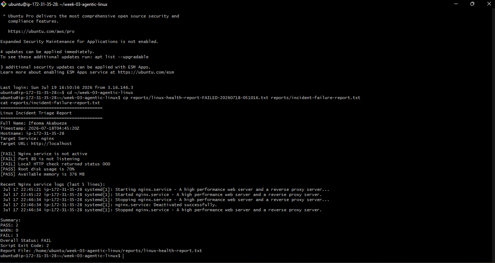
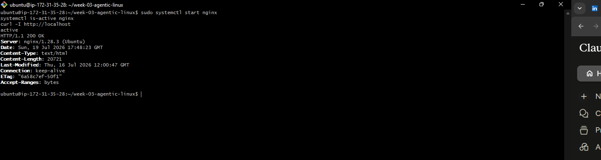
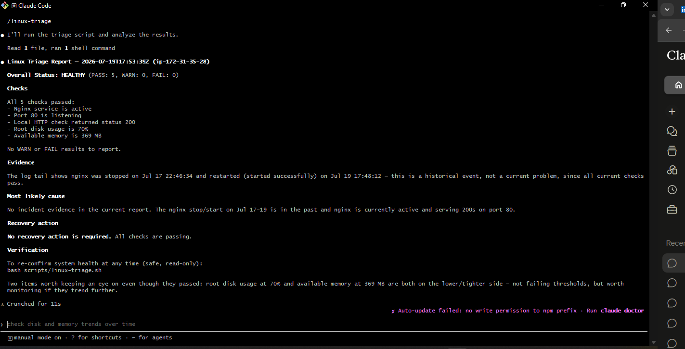
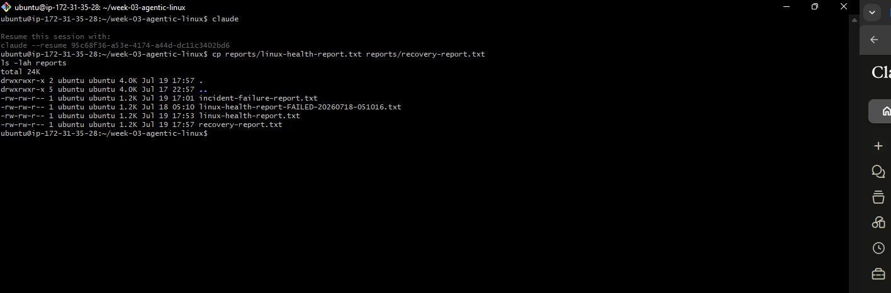
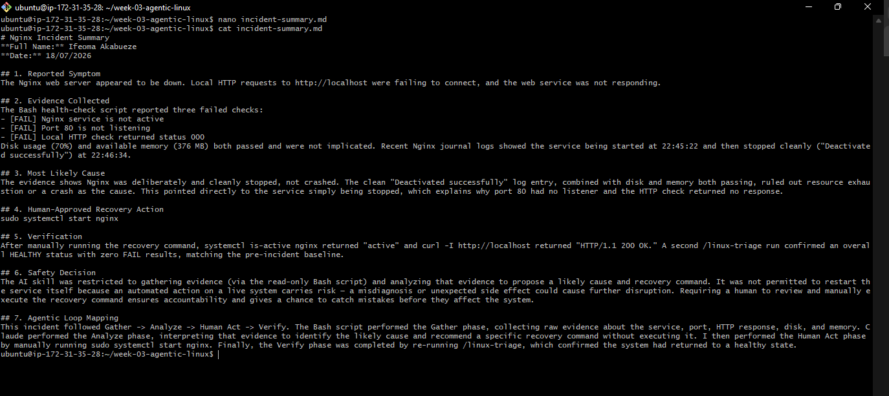
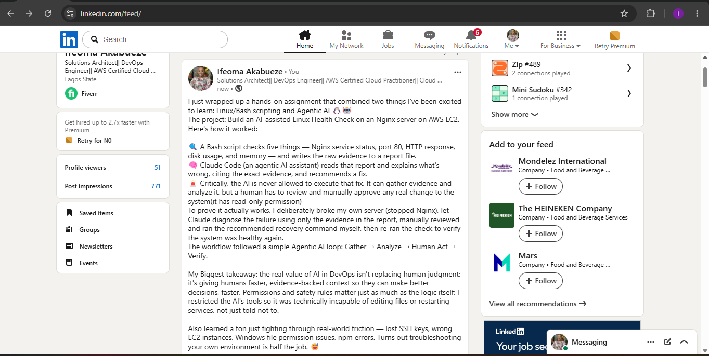

# Assignment 6 — Build an AI-Assisted Linux Health Check (AI-Assisted Linux Incident Triage)

Part of the DevOps Micro Internship (DMI) Cohort 3 with Agentic AI

---

## Purpose

In this assignment, you will build a read-only Bash triage script that checks the health of your Ubuntu server and Nginx application, connect it to Claude Code as a reusable `/linux-triage` skill, simulate a controlled Nginx incident, use the skill to gather and analyze evidence, recover the service manually, and verify recovery. The workflow follows the Agentic Loop: Gather → Analyze → Human Act → Verify.

---

# Task 1 — Confirm the Healthy Baseline and Create the Workspace

## Goal

Confirm that Nginx and the React application are healthy before building the automation.

### Evidence

#### Screenshot 1 — Output of `systemctl is-active nginx`, `ss -ltn | grep ':80'`, and `curl -I http://localhost`

---

#### Screenshot 2 — Output of `pwd` and `find . -maxdepth 4 -type d | sort` showing the workspace folder structure

---

### Notes

Answer the following in your own words:

**1. What proves that Nginx is running?**

 Service status using the command
systemctl is-active nginx and it returns active

systemctl status nginx
Confirm it's actually listening on a port

sudo ss -tulpn | grep nginx
This shows Nginx is bound to port 80 (or 443), proving it's ready to accept connections, not just "running" in the abstract.

Test it locally on the server itself
bashcurl -I http://localhost
A HTTP/1.1 200 OK response is strong proof the web server is actually serving content, not just alive as a process..

---

**2. What proves that the server is listening for HTTP traffic?**

systemctl status nginx
Confirm it's actually listening on a port

---

**3. Why must you capture a healthy baseline before simulating an incident?**

One should or must capture a healthy baseline before simulating an incident. If you simulate an incident (kill a process, fill up disk space, spike CPU, etc.) without first capturing what the system looked like before, you have no reference point. Every observation during the incident becomes a guess: "is this metric high because of the incident, or was it always like this?".
 Prevents chasing pre-existing issues
Sometimes a system already has a lingering problem (a warning in logs, a slow response time) that has nothing to do with the incident you're about to simulate. Without a baseline, you might waste time investigating something that was already there, mistakenly attributing it to your test.
Makes the results measurable, not just descriptive
"Response time increased" means little on its own. "Response time went from 50ms (baseline) to 4000ms (during incident)" is concrete, provable, and demonstrates the actual severity of what you simulated.

---

# Task 2 — Create Project Context and Safety Rules in CLAUDE.md

## Goal

Tell Claude exactly what this project does and what it is not allowed to do.

### Evidence

#### Screenshot 3 — CLAUDE.md open in VS Code showing all four sections (Project Overview, Incident Workflow, Safety Rules, Output Rules)

---

### Notes

Answer the following in your own words:

**1. Why should Claude receive project-specific operational rules?**

With explicit operational rules, Claude's role shifts from "autonomous fixer" to "evidence-based advisor":

Gather evidence → analyze it → recommend a fix → let the human decide

This is safer specifically because a human stays in control of anything that changes the system, while still getting the benefit of Claude's analysis speed.

---

**2. Why is the human required to execute the recovery command?**

Claude can analyze evidence and suggest what it believes is the right fix, but it can still be wrong — misreading a report, missing context about the environment, or recommending a command that's technically correct but has side effects it doesn't know about (like restarting Nginx during a moment when someone's mid-transaction, or on a server that's shared with other people/projects).
A human, who understands the broader context the AI doesn't have, needs to be the one who reviews that recommendation and decides whether it's actually safe to run right now, in this specific situation.

---

**3. Which rule prevents Claude from making an unsupported diagnosis?**

# Safety Rule: 
Do not claim a root cause unless the report contains supporting evidence

---

# Task 3 — Use Agentic AI to Plan Before Writing the Script

## Goal

Use Claude Code to inspect the environment and produce a read-only plan before creating any Bash code.

### Evidence

#### Screenshot 4 — Claude Code showing the five-check plan and read-only inspection results

---

### Notes

Answer the following in your own words:

**1. Which part of this task represents the Gather phase?**

1. Nginx service status
systemctl is-active nginx
- Healthy: prints active, exit code 0
- Failed: prints inactive, failed, or Nginx is not running

2. Port 80 listening state
ss -ltn | grep ':80 '
- Healthy: a line showing LISTEN with local address *:80 or 0.0.0.0:80
- Failed: no output — nothing is bound to accept HTTP connections even if Nginx claims to be active

3. Localhost HTTP response
curl -I http://localhost
- Healthy: first line HTTP/1.1 200 OK
- Failed: connection refused/timed out, or a 5xx status — the server process isn't answering requests even if the OS-level port check passes

4. Root disk usage
df -h /
- Healthy: Use% comfortably below a warning threshold (e.g. under ~80%)
- Failed/Warn: Use% at or above threshold — a full disk can block Nginx from writing logs, PID files, or serving app assets

5. Available memory
free -h
- Healthy: available column shows a healthy amount (e.g. well above ~10–15% free)
- Failed/Warn: available very low and/or swap heavily used — memory pressure can cause Nginx or the app to be OOM-killed

---

**2. Did Claude follow the instruction not to create files? How did you verify this?**

Yes, Claude followed the instruction. Here's how you can verify it from the output itself:
Evidence in the transcript
The explicit closing statement
No files were created or edited.
Claude states this directly at the end — a clear self-report confirming compliance.

---

**3. Why is planning before coding useful in DevOps automation?**

Planning before coding is useful because it lets you catch mistakes, missing context, and risky assumptions before they can cause actual harm to a live system — which is a much higher-stakes situation than a typical coding bug.

---

# Task 4 — Build the Linux Triage Bash Script

## Goal

Create one Bash script that gathers consistent Linux and Nginx health evidence.

### Evidence

#### Screenshot 5 — Top section of `linux-triage.sh` showing variables, thresholds, and the checks array

---

#### Screenshot 6 — Middle section showing check functions and conditionals

---

#### Screenshot 7 — Bottom section showing the loop, summary function, and exit behavior

---

#### Screenshot 8 — Output of `bash -n scripts/linux-triage.sh` (no syntax errors) and `ls -l scripts/linux-triage.sh` showing executable permission

---

### Notes

Answer the following in your own words:

**1. What is stored in the checks array?**

The checks array stores the names of five functions 

---

**2. How does the `for` loop use that array?**

The for loop takes each function name stored in the checks array and runs it as an actual command, one at a time — this is what actually executes all five health checks in your script

---

**3. Why are the health checks separated into functions?**

Separating each health check into its own function keeps the script organized, reusable, and easy to modify — the same core benefits of functions.

---

**4. What is the purpose of `$(...)` in this script?**

$(...) is called command substitution — it runs the command inside the parentheses, and replaces $(...) with whatever that command outputs (its printed result), so the output can be stored in a variable or used inline.
---

**5. Why does the script use different exit codes for HEALTHY, WARN, and FAIL?**

Different exit codes let anything calling this script — another script, a cron job, a CI/CD pipeline, or a human checking $? — know the outcome without having to read or parse the actual report text. The exit code alone tells you the severity of the result.

---

# Task 5 — Run and Understand the Healthy-State Report

## Goal

Run the Bash script against the healthy server and verify that it creates a report.

### Evidence

#### Screenshot 9 — Output of `./scripts/linux-triage.sh` showing your Full Name and all five check results

---

#### Screenshot 10 — Output showing the captured exit code and final summary

---

### Notes

Answer the following in your own words:

**1. What is the overall status of your healthy baseline?**

The overall status is HEALTHY, confirmed by multiple consistent signals in the report.
The direct answer
Summary:
PASS: 5
WARN: 0
FAIL: 0
Overall Status: HEALTHY
Script Exit Code: 0

---

**2. Which exact Linux evidence proves the application is serving traffic?**

The exact line is:
[PASS] Local HTTP check returned status 200

---

**3. Did your script return exit code 0 or 1? Explain why.**

My script returned exit code 0, confirmed directly in your terminal output:
Captured Exit Code: 0
and echoed again inside the report itself:
Script Exit Code: 0

---

**4. What is the difference between a warning and a failure in this script?**

The difference comes down to severity — a warning means something is trending toward a problem but isn't broken yet, while a failure means something is actually broken right now. The script encodes this distinction through separate thresholds, separate counters, and separate exit codes.

---

# Task 6 — Create and Run the /linux-triage Skill

## Goal

Turn the Bash script into a reusable, manually invoked Agentic AI workflow.

### Evidence

#### Screenshot 11 — `SKILL.md` showing the frontmatter, allowed tool restrictions, and safety rules

---

#### Screenshot 12 — `/linux-triage` output for the healthy server

Add your screenshot here.

---

### Notes

Answer the following in your own words:

**1. Why does this skill have Bash, Read, and Grep, but not Write?**

The skill only needs to run the script and read/search the resulting report; leaving out Write makes it technically impossible for the skill to modify or create files, enforcing the read-only rule at the permission level.

---

**2. Why is `disable-model-invocation: true` useful for this skill?**

It stops Claude from deciding to run this skill on its own; it only runs when you explicitly type /linux-triage, keeping a human in control of when the investigation happens.

---

**3. What part is performed by Bash, and what part is performed by Claude?**

Bash does the Gather phase (running commands, writing raw evidence to the report). Claude does the Analyze phase (reading the report, interpreting it, identifying a likely cause, suggesting a recovery step).

---

**4. Why is this better than asking Claude "Is my server healthy?" without giving it evidence?**

Without evidence, Claude would be guessing from general knowledge with no real visibility into your server; with the Bash report as grounding, every claim is tied to actual current data instead of assumption.

---

# Task 7 — Simulate an Nginx Incident and Let the Skill Diagnose It

## Goal

Create a controlled service failure, gather evidence through Bash, and let Claude analyze the evidence without taking recovery action.

### Evidence

#### Screenshot 13 — Output showing Nginx is inactive and the HTTP request fails

---

#### Screenshot 14 — `/linux-triage` output showing failed evidence, most likely cause, and a suggested recovery command

---

#### Screenshot 15 — `incident-failure-report.txt` showing the failed checks and your Full Name

---

### Notes

Answer the following in your own words:

**1. Which three checks failed?**

Nginx service status.
Port 80 listening.
And the local HTTP check.

---

**2. What evidence supports the conclusion that Nginx is unavailable?**

The report shows [FAIL] Nginx service is not active, [FAIL] Port 80 is not listening, and [FAIL] Local HTTP check returned status 000. The journal logs confirm Nginx was cleanly stopped ("Deactivated successfully") at 22:46:34, one minute after starting — a deliberate stop, not a crash.

---

**3. Did Claude execute the recovery command? Why is that important?**

No! Claude recommended sudo systemctl start nginx but stated no action was taken, asking me (the human) to review and run it manually. This keeps a person in control of any real change to the system, avoiding risk from an AI acting on a diagnosis that could be incomplete or wrong.

**4. Which phase of the Agentic Loop is represented by the Bash report?**

The Gather phase — raw evidence collection with no interpretation

---

**5. Which phase is represented by Claude's explanation?**

The Analyze phase: By interpreting the gathered evidence to identify a likely cause and propose next steps.

---

# Task 8 — Recover Manually, Verify Again, and Write the Incident Summary

## Goal

Recover the service as the human operator and prove that the system is healthy again.

### Evidence

#### Screenshot 16 — Output showing Nginx is active and `curl -I http://localhost` returns 200 OK

---

#### Screenshot 17 — Second `/linux-triage` output showing successful recovery with no FAIL results

---

#### Screenshot 18 — Output of `ls -lah reports` showing both `incident-failure-report.txt` and `recovery-report.txt`

---

#### Screenshot 19 — `incident-summary.md` showing all required sections and your Full Name

---

### Notes

Answer the following in your own words:

**1. What action did you execute manually?**

I ran sudo systemctl start nginx to restart the Nginx service after reviewing Claude's recommendation.

---

**2. What evidence proves that the service recovered?**

systemctl is-active nginx returned active, curl -I http://localhost returned HTTP/1.1 200 OK, and the second /linux-triage run showed an overall HEALTHY status with zero FAIL results.

---

**3. Why is the second triage run necessary?**

It provides independent, evidence-based confirmation that the recovery action actually worked, rather than just assuming it worked because the command ran without error. This closes the loop by verifying the actual system state, not just the action taken.

---

**4. What could go wrong if an AI agent automatically restarted every failed service?**

It could mask or worsen the real problem — for example, restarting a service repeatedly without understanding a root cause like a full disk or bad config could hide the underlying issue, cause data loss mid-operation, or create a restart loop. It also removes human oversight from decisions that could affect a live production system, and could take an incorrect action based on an incomplete or wrong diagnosis.

---

**5. In one sentence, explain the difference between using AI as a chatbot and using AI in this agentic workflow.**

A chatbot only answers questions from what it already knows or is told, while this agentic workflow lets AI actively gather real, current evidence from a live system and reason over it before recommending action, though still stopping short of taking that action itself.

---

# Incident Summary

Fill in all seven sections below in your own words.

**Full Name:** Ifeoma Akabueze

**Date:** 19/07/2026

---

**1. Reported Symptom**

The Nginx web server appeared to be down. Attempting to reach the application via http://localhost failed to connect, indicating the web service was unavailable.

---

**2. Evidence Collected**

The Bash health-chec script reported three failed checks:
[FAIL] Nginx service is not active.
[FAIL] Port 80 is not listening.
[FAIL] Local HTTP check returned status 000

Disk usage (70%) and available memory (376 MB) both passed and were not implicated. The recent Nginx journal logs showed the service being started at 22:45:22 and then stopped cleanly ("Deactivated successfully") at 22:46:34.
---

**3. Most Likely Cause**

The evidence shows Nginx was deliberately and cleanly stopped, not crashed. The "Deactivated successfully" log entry rules out a crash or error exit. Since disk and memory both passed, resource exhaustion was also ruled out. This points directly to the service simply being stopped, which explains why port 80 had no listener and HTTP check returned no response

---

**4. Human-Approved Recovery Action**

sudo sysmtemctl start nginx

---

**5. Verification**

After manually running the recovery command, "systemctl is-active nginx" returned "active", and "curl -l http://localhost" returned "HTTP/1.1 200 OK". A second "/linux-traige" run confirmed an overall "HEALTHY"
status with zero FAIL results, matching the original healthy baseline.
---

**6. Safety Decision**

The AI skill was restricted to gathering evidence (via the read-only Bash script) and analyzing that evidence to identify a likely cause and recommend a recovery command. It was not permitted to restart the service itself, because an automated action on a live system carries real risk — a misdiagnosis or unexpected side effect could cause further disruption. Requiring a human to review and manually execute the recovery command keeps a person accountable for any real change and provides a chance to catch mistakes before they affect the system.

---

**7. Agentic Loop Mapping**

This incident followed Gather → Analyze → Human Act → Verify. The Bash script performed the Gather phase, collecting raw evidence about the service, port, HTTP response, disk, and memory. Claude performed the Analyze phase, interpreting that evidence to identify the likely cause and recommend a specific recovery command without executing it. I then performed the Human Act phase by manually running sudo systemctl start nginx. Finally, the Verify phase was completed by re-running /linux-triage, which confirmed the system had returned to a healthy state.

---

# LinkedIn Post (Required)

## Evidence

#### LinkedIn Post URL

https://www.linkedin.com/posts/ifeoma-akabueze_dmibypravinmishra-agenticai-claudecode-ugcPost-7484718759702790144-rHd-/?

`Add your URL here`

---

#### Screenshot — Published LinkedIn post

---

# GitHub Repository URL

Paste the URL of your GitHub folder or repository containing the assignment files here:

https://github.com/Ifeoma-Obinna23/devops-micro-internship-pravinmishra.git

---

# Submission Instructions

- Add all required screenshots in your submission
- Full Name must be visible in required screenshots and the Bash report
- All written answers must be in your own words
- Do not expose sensitive information (keys, passwords, AWS account IDs, tokens)
- GitHub URL must be included in this document

---

# Completion Checklist

- [ ] Task 1: Healthy baseline confirmed, workspace created (Screenshots 1–2, Notes answered)
- [ ] Task 2: CLAUDE.md created with all four sections (Screenshot 3, Notes answered)
- [ ] Task 3: Five-check plan produced by Claude using read-only tools (Screenshot 4, Notes answered)
- [ ] Task 4: `linux-triage.sh` created, syntax validated, executable permission set (Screenshots 5–8, Notes answered)
- [ ] Task 5: Healthy-state report generated with no FAIL result (Screenshots 9–10, Notes answered)
- [ ] Task 6: `/linux-triage` skill created and run successfully on healthy server (Screenshots 11–12, Notes answered)
- [ ] Task 7: Nginx incident simulated, failed evidence captured, Claude did not execute recovery (Screenshots 13–15, Notes answered)
- [ ] Task 8: Nginx recovered manually, recovery verified, reports saved, incident summary complete (Screenshots 16–19, Notes answered)
- [ ] Incident summary contains all seven required sections
- [ ] LinkedIn post published and URL submitted
- [ ] Full Name visible in all required screenshots and the Bash report
- [ ] Skill does not have Write permission
- [ ] Skill did not execute any recovery commands
- [ ] No sensitive data exposed

---

## 📌 About DMI & CloudAdvisory

DevOps Micro Internship (DMI) is a project-based DevOps program run by Pravin Mishra (The CloudAdvisory) focused on real-world execution, systems thinking, and career readiness.

It helps learners build strong DevOps foundations with hands-on experience.

---

## 📌 Resources

- 🌐 DMI Official Website: https://pravinmishra.com/dmi  
- 🎓 DevOps for Beginners (Udemy): https://www.udemy.com/course/devops-for-beginners-docker-k8s-cloud-cicd-4-projects/  
- 🎓 Agentic AI DevOps with Claude Code: https://www.udemy.com/course/ultimate-agentic-ai-devops-with-claude-code/  
- 🎓 DevOps with Claude Code: Terraform, EKS, ArgoCD & Helm: https://www.udemy.com/course/devops-with-claude-code-terraform-eks-argocd-helm/  
- ▶️ YouTube Playlist: https://www.youtube.com/playlist?list=PLFeSNDtI4Cho  
- 🔗 Pravin Mishra (LinkedIn): https://www.linkedin.com/in/pravin-mishra-aws-trainer/  
- 🏢 CloudAdvisory (LinkedIn): https://www.linkedin.com/company/thecloudadvisory/

---

*This submission is part of DevOps Micro Internship (DMI) Cohort 3 — Agentic AI Track.*
