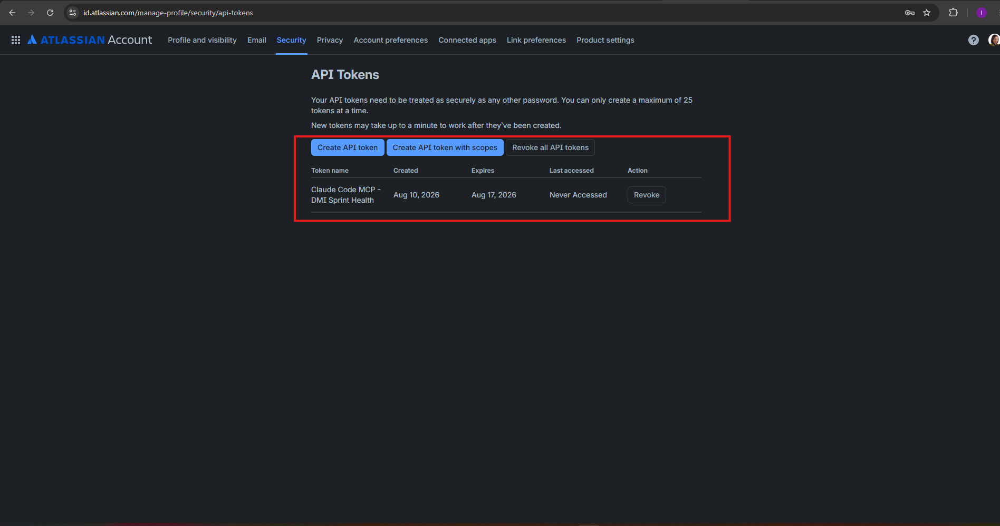
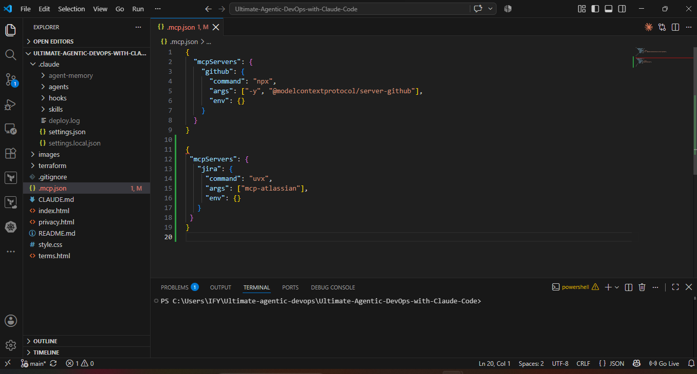
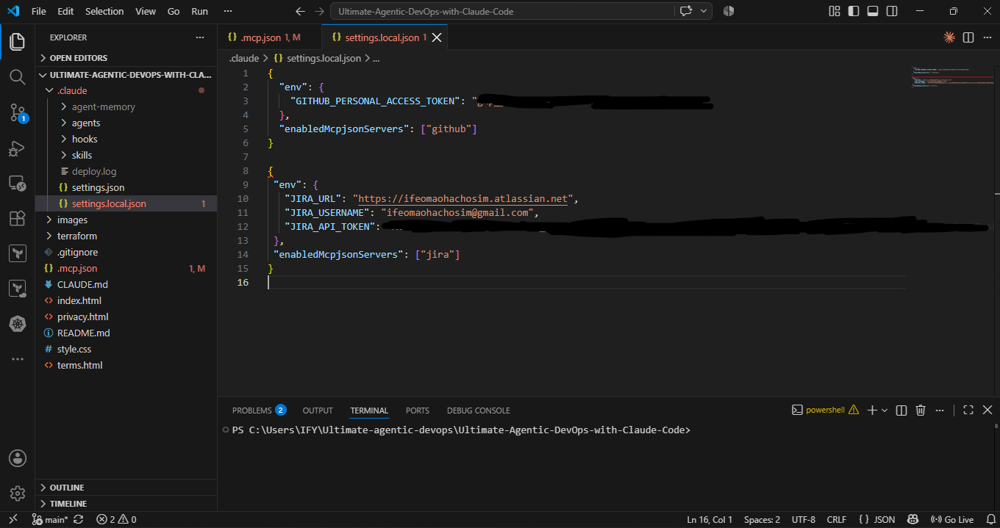
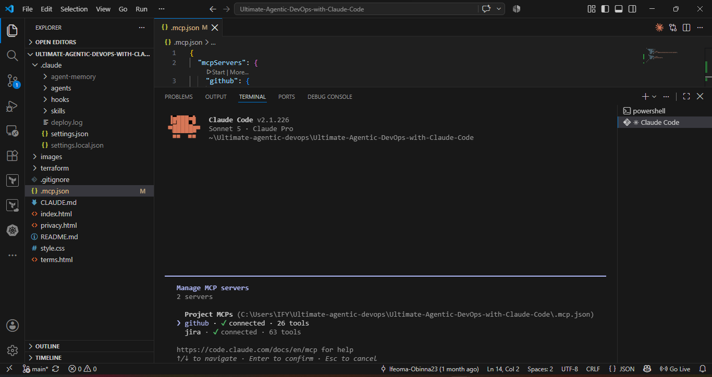
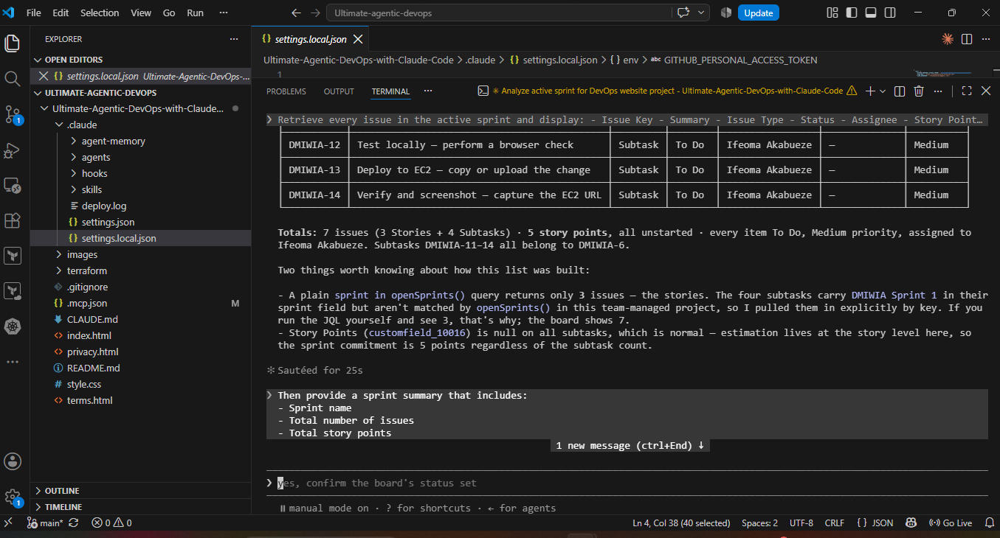
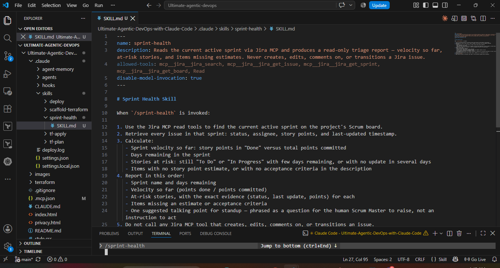
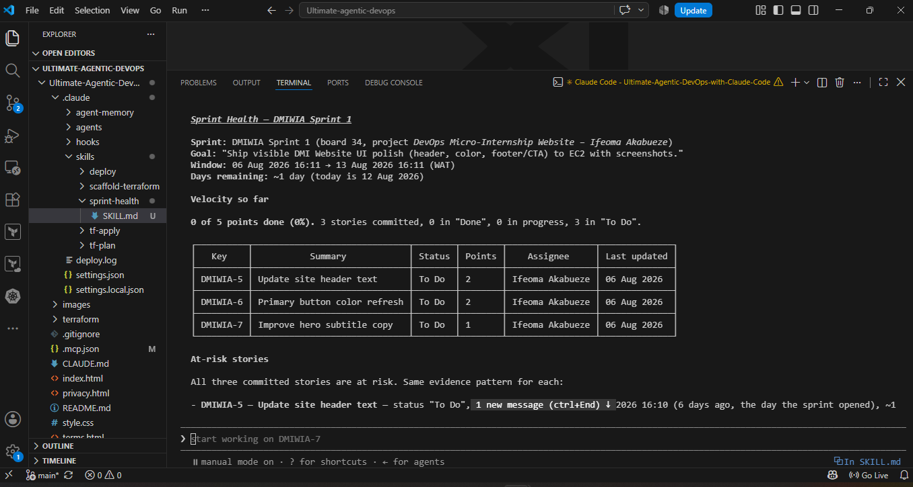
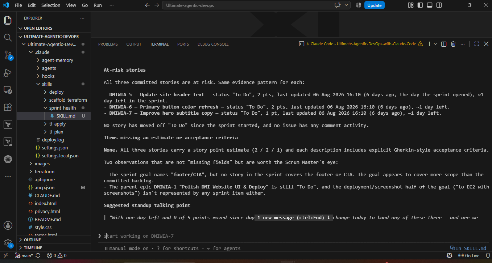
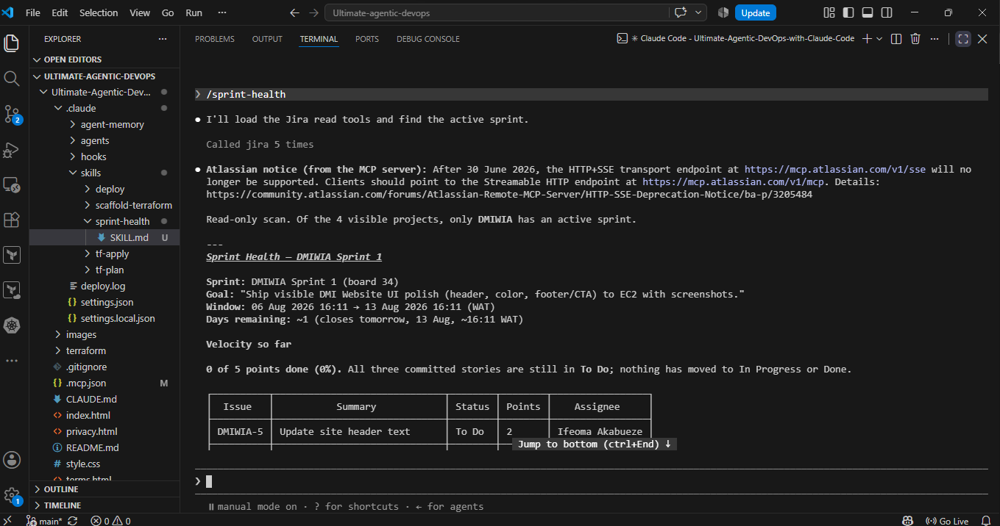

# Assignment 5 — AI-Assisted Sprint Health Report via Jira MCP

Part of the DevOps Micro Internship (DMI) Cohort 3 with Agentic AI

---

## Purpose

In this assignment, you will connect Claude Code to your Jira board through an MCP server, the same way you connected it to GitHub in Week 2, and build a read-only `/sprint-health` skill. The skill reads your current sprint through Jira's API and reports sprint velocity, stories at risk of missing the sprint, and items missing an estimate — but it must never create, edit, comment on, or transition a single ticket itself. You will prove that boundary holds by making a real change on the board yourself and confirming the skill only ever reports, never acts.

---

# Task 1 — Create a Jira API Token

## Goal

Generate an API token from your Atlassian account that the MCP server will use to authenticate with your Jira site. Do not screenshot the token value itself.

### Evidence

#### Screenshot 1 — Jira API token creation confirmation page showing the token name, with the token value not visible

### Notes You Must Write (Very Important):

Why does the MCP server need your site URL and account email in addition to the token?

Jira is multi-tenant — Atlassian hosts many separate companies' Jira instances, and your API token only has meaning within your specific site. The URL tells the MCP server which Jira instance to even talk to. Without it, there's no server to send requests to at all — the token alone doesn't identify where your data lives.

---

# Task 2 — Create .mcp.json at the Project Root

## Goal

Create or update `.mcp.json` at your project root with a Jira MCP server block, following the same shape as the GitHub MCP server you configured in Week 2.

### Evidence

#### Screenshot 2 — `.mcp.json` open in VS Code showing the Jira server configuration

### Notes You Must Write (Very Important):

Compare this jira block to the github block from Week 2 Assignment 5. The GitHub server ran via npx (a Node.js package); this one runs via uvx (a Python package) — what stays exactly the same shape despite that difference, and why doesn't Claude Code care which language a given MCP server is written in?

Both blocks follow the identical three-key structure:
command — the executable to launch
args — arguments passed to that executable
env — environment variables the process needs

Why Claude Code doesn't care about the language:
This is the whole point of MCP as a protocol: Claude Code isn't talking to Python or Node.js — it's talking to a process over stdin/stdout using a standardized message format (JSON-RPC).

When Claude Code launches an MCP server, all it does is:
Run the command with the given args as a subprocess
Send it JSON-RPC messages over stdin
Read JSON-RPC responses back over stdout

That's it. The server, internally, could be written in Python, Node.js, Go, Rust — literally anything — as long as it speaks the MCP protocol correctly on that stdin/stdout pipe. Claude Code has no visibility into what's happening inside the subprocess; it just cares about the messages crossing that boundary.

---

# Task 3 — Add Your Credentials to settings.local.json

## Goal

Add your Jira site URL, account email, and API token to `.claude/settings.local.json`, and confirm that file is listed in `.gitignore` so it is never committed.

### Evidence

#### Screenshot 3 — `settings.local.json` open in VS Code showing the `env` section, with the actual token value blurred or covered

### Notes You Must Write (Very Important):

Why must JIRA_API_TOKEN live in settings.local.json and never in .mcp.json?

.mcp.json is meant to be shared and committed. It defines which MCP servers a project uses — teammates need this file so their Claude Code setup matches yours. Because it's shared, it's normal for it to end up in version control (git), which means anything written in it can end up on GitHub, in PR diffs, in clone history — visible to anyone with repo access, potentially forever (git history doesn't forget, even if you delete the line later).

settings.local.json is explicitly local and gitignored. The .local in the name is a convention Claude Code (and many tools) use to signal "this file is machine-specific, not for sharing" — and it's excluded from git by default for exactly that reason. It's the designated place for secrets, personal paths, or anything tied to your environment rather than the project itself.

---

# Task 4 — Verify the Connection with /mcp

## Goal

Restart Claude Code and confirm the Jira MCP server shows as connected.

### Evidence

#### Screenshot 4 — `/mcp` output showing `jira: connected`

---

# Task 5 — Run a Live Query to Prove Real Board Data

## Goal

Ask Claude to list the issues in your current active sprint through the Jira MCP connection, and confirm the result matches what you see on your live board in the browser.

### Evidence

#### Screenshot 5 — Claude's response showing the live sprint issue list retrieved via Jira MCP

### Notes You Must Write (Very Important):

How did you confirm this was real board data and not something Claude guessed?

i confirmed in three ways, increasingly hard to fake.

First, I asked for facts that were not in the conversation and could not be inferred from it: the internal board id (34), the sprint start timestamp to the minute (2026-07-31 21:17 UTC), and the sub-task key ranges GOTTO-8 through GOTTO-19. A plausible guess can produce a story list. It cannot produce an internal board id or a timestamp accurate to the minute.

Second, I compared the output against the board in the browser side by side. Keys, statuses, point values and sub-task counts all matched.

Third, and this is the one that actually settles it: I changed something in the browser and ran the skill again. The second report detected the change without being told, named the resolution timestamp of 23:36 UTC, and recomputed completed points from 1 to 2. A model guessing from context cannot detect a change made outside that context.

---

# Task 6 — Build the /sprint-health Skill

## Goal

Create a `/sprint-health` skill restricted to read-only Jira tools plus `Read`, with no issue-mutating tools and no `Write`. Run it and confirm it produces a report covering sprint velocity, at-risk stories, and items missing an estimate.

### Evidence

#### Screenshot 6 — `SKILL.md` frontmatter showing `allowed-tools` limited to read-only Jira tools plus `Read`, with `disable-model-invocation: true`

#### Screenshot 7 — `/sprint-health` output showing the full triage report against your real sprint

### Notes You Must Write (Very Important):

1. Which Jira MCP tools does this skill's allowed-tools list include, and which mutating tools (create issue, update issue, transition issue, add comment) does it deliberately exclude?

The skill allows five Jira tools plus Read:
mcp__jira__jira_search — search/query issues
mcp__jira__jira_get_issue — fetch a single issue's details
mcp__jira__jira_get_sprint — fetch sprint metadata
mcp__jira__jira_get_board — fetch board info

Deliberately excluded (mutating) tools:
Anything that would create an issue (e.g. jira_create_issue)
Anything that would update/edit an issue (e.g. jira_update_issue)
Anything that would transition an issue's status (e.g. jira_transition_issue)
Anything that would add a comment (e.g. jira_add_comment)

None of those four appear in the allowed-tools list, and the file backs that up explicitly in two places — step 5 ("Do not call any Jira MCP tool that creates, edits, comments on, or transitions an issue") and step 7 ("Never take an action on the board. Only report."). It also excludes Write, so it can't even save files locally, reinforcing that this skill is strictly observational — it reports data for a human to act on, never acts itself.

Read — Claude Code's generic file-read tool (not Jira-specific, but included for reading local files if needed). 

2. Why does a Scrum Master need this restriction more than almost any other role in this course?

A Scrum Master's authority is process authority, not technical authority. Their job is to observe the team's work, surface risks, and facilitate decisions — not to unilaterally change what the team committed to, reassign work, or mark things done. If an AI assistant acting as a Scrum Master tool could silently create issues, edit story points, transition tickets, or add comments, it would be quietly making decisions that are supposed to stay with the humans on the team — the developers who own their tickets, and the Scrum Master who facilitates (not dictates) prioritization.

---

# Task 7 — Prove the Skill Never Mutates the Board

## Goal

Manually update one ticket on your board in the browser (for example, move a story to "Done" or add a missing estimate), then run `/sprint-health` again and confirm the new report reflects your change — proving the skill only ever reads live state and never wrote to the board itself.

### Evidence

#### Screenshot 8 — Second `/sprint-health` run showing the report now reflects your manual board change

### Notes You Must Write (Very Important):

Map this assignment to Gather → Analyze → Human Act → Verify from Week 3 Assignment 6. Which step did you perform manually in the browser, and why must that step stay human?

Map this assignment to Gather → Analyze → Human Act → Verify from Week 3 Assignment 6. Which step did you perform manually in the browser, and why must that step stay human?

Gather. The skill retrieved board metadata, the active sprint, its issues and their sub-tasks through four read-only tools. No interpretation, just collection.

Analyze. It computed elapsed time against completed points, evaluated four risk rules explicitly and reported each as triggered or not, and separated stories missing estimates from sub-tasks that conventionally have none. It also noticed something it was not asked to look for: SCRUM-5 and SCRUM-16 describe the same deliverable, so the sprint totals were misleading.

Human Act. I opened SCRUM-5 in the browser and set it to Done, along with its four sub-tasks. The skill could not have done this. It has no tool capable of it, by design.

Verify. The second run detected the change without being told, timestamped it at 23:36 UTC, moved completed points from 1 to 2, and revised its own analysis in light of the new state.

Why the act must stay human. The analysis was a judgement call dressed as an observation. The skill inferred that two stories were duplicates from the similarity of their summaries. It happened to be right. It could easily have been wrong, because two stories can carry near-identical names and genuinely different scope, and nothing in the data distinguishes those cases.

The asymmetry is the point. A wrong read produces a bad report, which a human discards in ten seconds. A wrong write produces a bad board state, which propagates into the burndown, into velocity, into next sprint's capacity planning, and nobody notices because the board is supposed to be the source of truth. Reading is cheap to get wrong.

---

# Submission Instructions

Complete all tasks in sequence.

Your submission must include:
- All 8 required screenshots
- All the required notes

---

# Completion Checklist

- [ ] Task 1: Jira API token created, value never screenshotted (Screenshot 1)
- [ ] Task 2: `.mcp.json` has the Jira server block (Screenshot 2)
- [ ] Task 3: Credentials stored in `settings.local.json`, token blurred, file gitignored (Screenshot 3)
- [ ] Task 4: `/mcp` shows the Jira server connected (Screenshot 4)
- [ ] Task 5: Live query returned real sprint data, verified against the browser (Screenshot 5)
- [ ] Task 6: `/sprint-health` skill created with correct read-only `allowed-tools`, and produced a full report (Screenshots 6–7)
- [ ] Task 7: A manual board change was reflected in a second `/sprint-health` run (Screenshot 8)
- [ ] Skill never created, edited, transitioned, or commented on any issue
- [ ] Reflection answered (Notes)
- [ ] No API token value exposed

---

## 📌 About DMI & CloudAdvisory

DevOps Micro Internship (DMI) is a project-based DevOps program run by Pravin Mishra (The CloudAdvisory) focused on real-world execution, systems thinking, and career readiness.

It helps learners build strong DevOps foundations with hands-on experience.

---

## 📌 Resources

- 🌐 DMI Official Website: https://dmi.pravinmishra.com?utm_source=github&utm_medium=readme  
- 🎓 University: https://university.pravinmishra.com?utm_source=github&utm_medium=readme  
- 💬 Discord Community: https://discord.pravinmishra.com?utm_source=github&utm_medium=readme  
- 📝 Blog: https://dmi.pravinmishra.com/blog?utm_source=github&utm_medium=readme  
- ▶️ YouTube Playlist: https://www.youtube.com/playlist?list=PLFeSNDtI4Cho  
- 🔗 Pravin Mishra (LinkedIn): https://www.linkedin.com/in/pravin-mishra-aws-trainer/  
- 🏢 CloudAdvisory (LinkedIn): https://www.linkedin.com/company/thecloudadvisory/

---

*This submission is part of DevOps Micro Internship (DMI) Cohort 3 — Agentic AI Track.*
