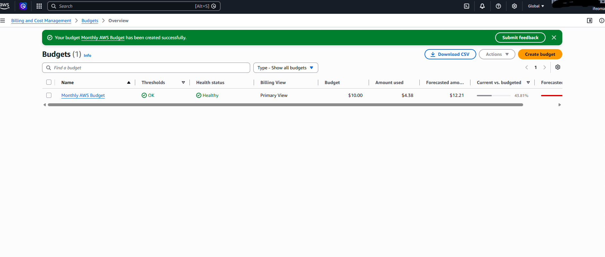

# Assignment 1 — Creating an AWS Free Tier Account & Setting Up Budget Management and Alerts

Part of the DevOps Micro Internship (DMI) Cohort 3 with Agentic AI

---

## Purpose

In this assignment, you will create your own AWS Free Tier account and configure budget management with cost alerts. This is an important first step: it lets you follow along with the rest of the course, and the alerts help ensure you do not exceed your budget.

---

# Task 1 — Sign Up for AWS and Access the Console

## Goal

Create your AWS Free Tier account, select the Basic Support Plan (Free), and log in to the AWS Management Console.

> No screenshot required for this task. Completion is verified through Task 2.

---

# Task 2 — Create a Monthly Cost Budget with Alerts

## Goal

In the Billing Dashboard, create a monthly Cost Budget with a name, amount, and start month, then configure alert thresholds (e.g. 50%, 80%, 100%) and a notification email address.

### Evidence

#### Screenshot 1 — AWS Budget setup page showing the budget name, budget amount, and alert thresholds

---

### Notes

Answer the following in your own words:

**1. Why is it important to set up budget alerts when using an AWS account?**

Setting up budget alerts on AWS is one of those small habits that saves people from very unpleasant surprises. A few reasons it matters:

Cost visibility in a pay-as-you-go model
AWS bills you for what you use, and usage can scale up silently — auto-scaling groups spinning up more instances, a Lambda function looping unexpectedly, or a forgotten test resource running for weeks. Without alerts, the first sign of trouble is often the invoice itself.

Catching mistakes fast
Common cost blowups come from things like:

Leaving large EC2 instances or RDS databases running when idle
Misconfigured infrastructure (e.g., an S3 bucket accidentally set to public and getting hammered with requests)
Data transfer costs from a poorly designed architecture
Runaway loops in serverless functions that trigger themselves repeatedly

Alerts let you catch these within hours instead of at the end of the billing cycle.

Protection against security incidents
If credentials or API keys leak, attackers sometimes spin up expensive resources (like GPU instances for crypto mining) on your account. Budget alerts can be an early warning sign of exactly this kind of abuse.

Financial predictability
For personal projects, students, or small teams, an unexpected several-hundred- or several-thousand-dollar bill can be a real financial hit. Alerts help you stay within what you planned to spend.

Encourages good habits
Even if you don't hit a limit, seeing regular alerts builds awareness of your actual cloud spend and nudges you toward cleaning up unused resources.

---

# Submission Instructions

- Add the required screenshot in your submission
- Do not expose sensitive billing, card, identity, or account information

---

# Completion Checklist

- [ ] AWS Free Tier account created and Basic Support Plan (Free) selected
- [ ] Logged in to the AWS Management Console
- [ ] Monthly Cost Budget created with name, amount, and start month
- [ ] Budget alert thresholds and notification email configured
- [ ] Screenshot captured showing budget name, amount, and thresholds (Screenshot 1)
- [ ] Notes question answered
- [ ] No sensitive billing or account information exposed

---

## 📌 About DMI & CloudAdvisory

DevOps Micro Internship (DMI) is a project-based DevOps program run by Pravin Mishra (The CloudAdvisory) focused on real-world execution, systems thinking, and career readiness.

It helps learners build strong DevOps foundations with hands-on experience.

---

## 📌 Resources

- 🌐 DMI Official Website: https://dmi.pravinmishra.com?utm_source=github&utm_medium=readme  
- 🎓 University: https://university.pravinmishra.com?utm_source=github&utm_medium=readme  
- 💬 Discord Community: https://discord.pravinmishra.com?utm_source=github&utm_medium=readme  
- 📝 Blog: https://dmi.pravinmishra.com/blog?utm_source=github&utm_medium=readme  
- ▶️ YouTube Playlist: https://www.youtube.com/playlist?list=PLFeSNDtI4Cho  
- 🔗 Pravin Mishra (LinkedIn): https://www.linkedin.com/in/pravin-mishra-aws-trainer/  
- 🏢 CloudAdvisory (LinkedIn): https://www.linkedin.com/company/thecloudadvisory/

---

*This submission is part of DevOps Micro Internship (DMI) Cohort 3 — Agentic AI Track.*
