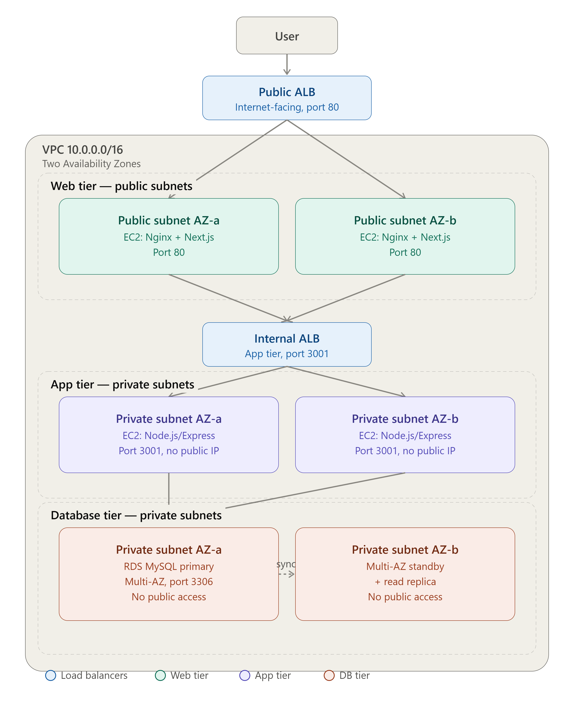
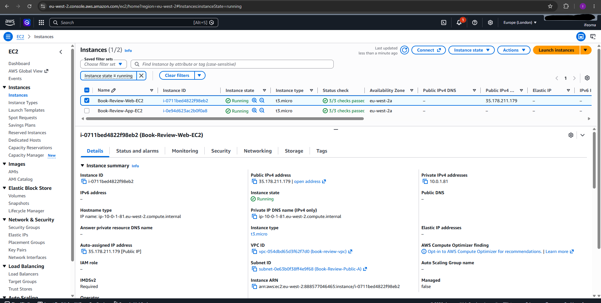
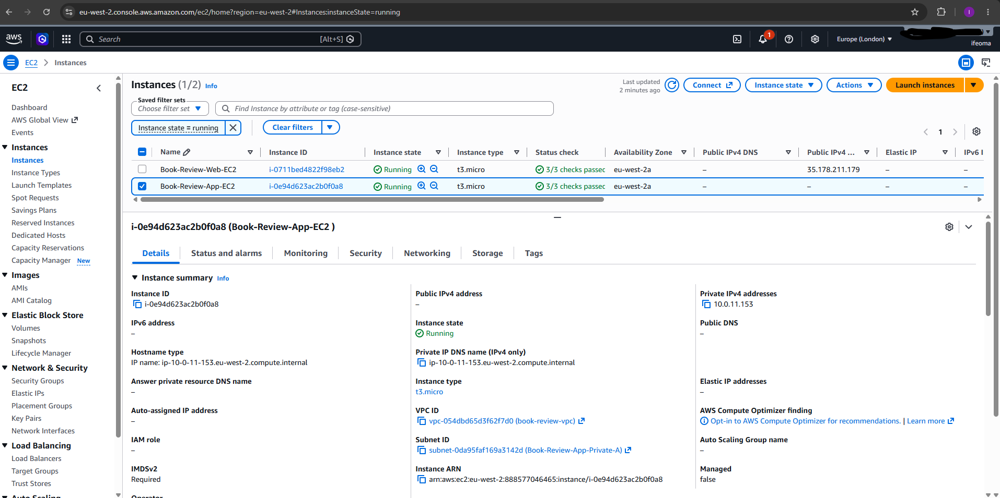
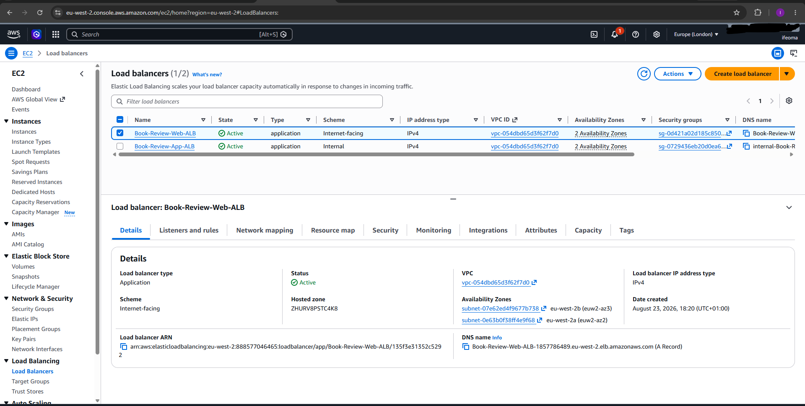
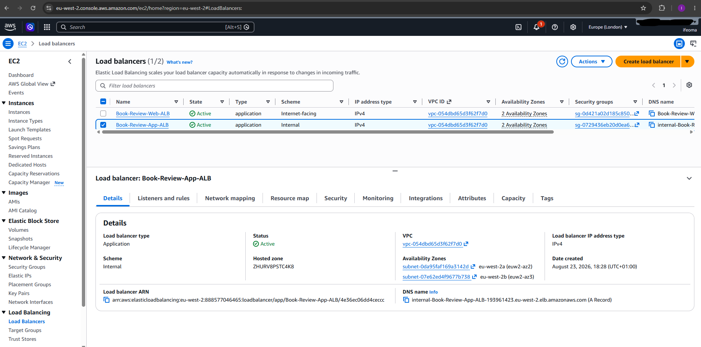
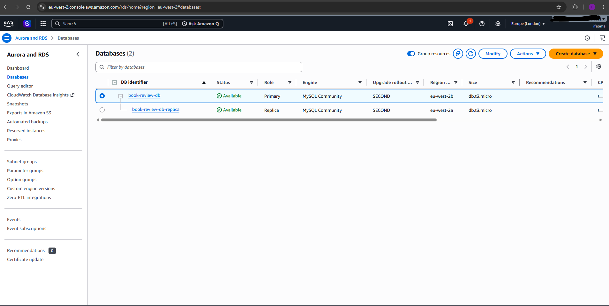
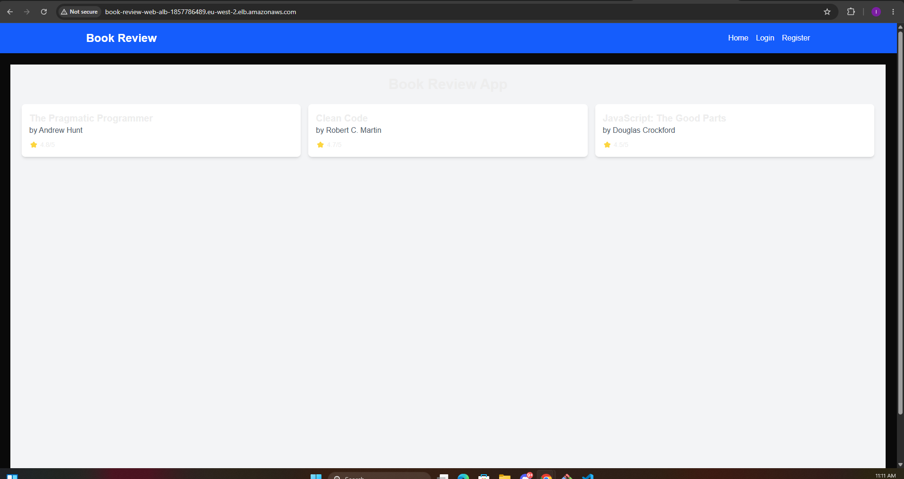
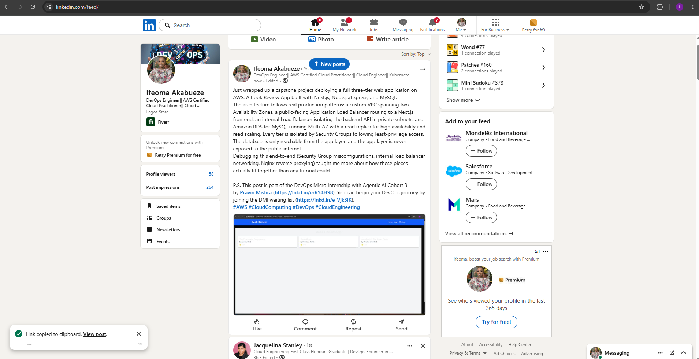

# Assignment 6 — Capstone Assignment — Deploy Book Review App (Three-Tier Architecture) on AWS

Part of the DevOps Micro Internship (DMI) Cohort 3 with Agentic AI

---

## Purpose

This is the most important assignment of the course. You will deploy the Book Review App in a fully production-style three-tier architecture on AWS: a Next.js Web Tier behind Nginx and a public ALB, a private Node.js/Express App Tier behind an internal ALB, and a private Multi-AZ MySQL RDS database with a read replica. You are expected to design, deploy, isolate, debug, and document the result independently.

---

# Task 1 — Architecture Diagram

## Goal

Create an architecture diagram showing the custom VPC (10.0.0.0/16), the six subnets across two Availability Zones (two public Web Tier, two private App Tier, two private Database Tier), the public ALB, Web Tier EC2/Nginx, internal ALB, private App Tier EC2, private Multi-AZ RDS with its read replica, and the permitted traffic flow.

### Evidence

#### Diagram image or link

---

# Task 2 — AWS Region & Services Used

## Goal

Record the AWS Region used and list every AWS service used across networking, compute, load balancing, security, and the database.

### Notes

**Region:**

Europe (London) — eu-west-2

---

**Services:**

Services Used:

Networking	Amazon VPC, Subnets (6 total across 2 AZs), Route Tables, Internet Gateway, NAT Gateway, Security Groups
Compute	Amazon EC2 (Ubuntu — Web tier + App tier instances)
Load balancing	Application Load Balancer ×2 (Book-Review-Web-ALB public, and your internal ALB), Target Groups
Security	Security Groups (Web tier, App tier, DB tier), AWS KMS (for RDS encryption), IAM (if you used an instance role — check if you did)
Database	Amazon RDS for MySQL — Multi-AZ (book-review-db) + Read Replica (book-review-db-replica)

---

# Task 3 — Public Entry Point

## Goal

Confirm the Book Review App loads through the public ALB DNS name.

### Evidence

#### Public ALB DNS
Book-Review-Web-ALB-1857786489.eu-west-2.elb.amazonaws.com

http://Book-Review-Web-ALB-1857786489.eu-west-2.elb.amazonaws.com

---

# Task 4 — Evidence Screenshots

## Goal

Capture visual proof of every tier and load balancer.

### Evidence

#### Web EC2

---

#### App EC2

---

#### Public ALB

---

#### Internal ALB

---

#### RDS + Replica

---

#### App UI proof

---

# Task 5 — Summary

## Goal

Summarize what worked in the final deployment, the issues encountered and how each was fixed, and the tools or sources used to research and debug.

### Notes

**What worked:**

What Worked in the Final Deployment

The Book Review App was successfully deployed across a full three-tier architecture on AWS:

Networking: Custom VPC (10.0.0.0/16) with 6 subnets across 2 Availability Zones — 2 public (Web tier), 2 private (App tier), 2 private (DB tier) — with correctly scoped route tables and security groups isolating each tier.
Web tier: Next.js frontend running behind Nginx on an Ubuntu EC2 instance in a public subnet, registered and healthy behind a public Application Load Balancer.
App tier: Node.js/Express backend on port 3001, running on an Ubuntu EC2 instance in a private subnet with no public IP, registered and healthy behind an internal Application Load Balancer.
Database tier: Amazon RDS for MySQL configured for Multi-AZ (primary + standby) with a separate read replica, both in private subnets, reachable only from the App tier.
End-to-end verification: The application, accessed via the public ALB's DNS name, successfully renders live book and review data sourced from RDS through the full request chain (browser → public ALB → Web tier → internal ALB → App tier → RDS).

---

**Issues + fixes:**

Issues Encountered and Fixes

SSH to the Web tier timed out. The Security Group's port 22 rule was locked to a specific IP address, but that IP had since changed due to dynamic addressing on my end. I updated the Security Group's source to match the current IP, and later widened the rule further since the IP kept changing frequently during the session.

SSH from the Web tier to the App tier timed out. The App tier's Security Group had no inbound rule allowing SSH traffic at all, since it was only scoped for application traffic. I added a rule allowing port 22 from the Web tier's Security Group, then used the Web tier instance as a jump host to reach the private App tier instance.

RDS defaulted to Single-AZ under the Free Tier template. AWS Free Tier eligibility only covers Single-AZ deployments, so selecting Multi-AZ silently falls outside Free Tier pricing. I switched to a template that allowed Multi-AZ to be selected, then reduced the instance class and storage size to keep costs reasonable, since the production defaults were oversized for this project.

The backend couldn't connect to RDS, failing with a connection timeout. The database's Security Group had a rule for port 3306, but the source was incorrectly set to the Web tier's Security Group instead of the App tier's. I corrected the source to point to the App tier Security Group, which resolved the connection immediately.

The internal ALB's target group showed the App tier instance as unhealthy. The App tier Security Group didn't have a rule allowing inbound traffic on port 3001 from the internal ALB itself. I added the internal ALB's Security Group as an allowed source on that port, and the target group turned healthy shortly after.

The frontend showed "No books available" even though the backend and database were confirmed working. The frontend was configured to call the internal ALB directly, but an internal ALB has no public route and can't be reached from a browser outside the VPC — it only worked when tested via SSH from inside the VPC. I fixed this by adding an Nginx reverse proxy route on the Web tier that forwards API requests server-side to the internal ALB, then updated the frontend to call its own public origin instead of the internal ALB directly. This kept the internal ALB genuinely private while still allowing the browser to reach it indirectly.

Manual Nginx configuration edits introduced small syntax errors, such as missing semicolons and misplaced directives. I used nginx -t to validate the configuration before every reload, and inspected specific lines directly when the error output pointed to a line number, which made it easy to spot and correct the exact issue.

---

**Tools/sources used:**

Tools and Sources Used

AWS Management Console — provisioning VPC, subnets, EC2, RDS, ALBs, Target Groups, and Security Groups
SSH (via Git Bash) — remote administration of EC2 instances, including jump-host access to the private App tier through the Web tier
PM2 — process management for keeping the Node.js frontend and backend running persistently and restarting automatically on reboot
Nginx — reverse proxy on the Web tier, both for serving the Next.js app and for proxying API traffic to the internal ALB
AWS documentation — referenced for RDS Multi-AZ behavior, Free Tier eligibility limits, Security Group rules, and ALB target group health checks
Claude — used for architecture planning, step-by-step configuration guidance, and debugging Security Group misconfigurations, Nginx syntax errors, and the internal ALB browser-reachability issue

---

# LinkedIn Post (Required)

## Goal

Publish a LinkedIn post sharing the capstone deployment, including the public ALB DNS (or a redacted screenshot), three to five lines on what you built and why it is production-style, and one proof screenshot.

## Evidence

#### LinkedIn Post URL

https://lnkd.in/p/e4_gJU_Z

---

#### Screenshot of LinkedIn post

---

# Submission Instructions

- Add all required screenshots and links in your submission
- Do not expose passwords, RDS credentials, connection strings, private keys, or account IDs

---

# Completion Checklist

- [ ] Task 1: Architecture diagram completed
- [ ] Task 2: AWS Region and services documented
- [ ] Task 3: Public ALB DNS confirmed working
- [ ] Task 4: All six evidence screenshots captured (Web Tier, App Tier, both ALBs, RDS + replica, app UI)
- [ ] Task 5: Deployment summary completed (what worked, issues/fixes, tools/sources)
- [ ] LinkedIn post published and URL submitted
- [ ] App Tier and Database Tier confirmed not publicly accessible
- [ ] No sensitive data exposed

---

## 📌 About DMI & CloudAdvisory

DevOps Micro Internship (DMI) is a project-based DevOps program run by Pravin Mishra (The CloudAdvisory) focused on real-world execution, systems thinking, and career readiness.

It helps learners build strong DevOps foundations with hands-on experience.

---

## 📌 Resources

- 🌐 DMI Official Website: https://dmi.pravinmishra.com?utm_source=github&utm_medium=readme  
- 🎓 University: https://university.pravinmishra.com?utm_source=github&utm_medium=readme  
- 💬 Discord Community: https://discord.pravinmishra.com?utm_source=github&utm_medium=readme  
- 📝 Blog: https://dmi.pravinmishra.com/blog?utm_source=github&utm_medium=readme  
- ▶️ YouTube Playlist: https://www.youtube.com/playlist?list=PLFeSNDtI4Cho  
- 🔗 Pravin Mishra (LinkedIn): https://www.linkedin.com/in/pravin-mishra-aws-trainer/  
- 🏢 CloudAdvisory (LinkedIn): https://www.linkedin.com/company/thecloudadvisory/

---

*This submission is part of DevOps Micro Internship (DMI) Cohort 3 — Agentic AI Track.*