# Assignment 7 — AI-Assisted AWS Security and Cost Audit

Part of the DevOps Micro Internship (DMI) Cohort 3 with Agentic AI

---

## Purpose

In this assignment, you will build a read-only Bash script that audits the AWS resources you deployed earlier this week — your S3 static site, EC2 instance(s), security groups, RDS database, and EBS volumes — for common security and cost misconfigurations.

You will then connect that script to Claude Code as a reusable `/aws-audit` skill that explains what it found and recommends a fix, without ever making the fix itself.

Finally, you will find a real misconfiguration in your own account, apply the fix yourself, and prove it worked with a second audit run.

---

# Task 1 — Confirm Your AWS Resources and Set Up Your Workspace

## Goal

Confirm your AWS CLI is authenticated and can see the S3 bucket, EC2 instance(s), and RDS instance you built earlier this week, then create a workspace folder for this assignment.

### Evidence

#### Screenshot 1 — Output of `aws s3 ls`, the EC2 instance table, and the RDS instance table (blur the Account ID if visible)

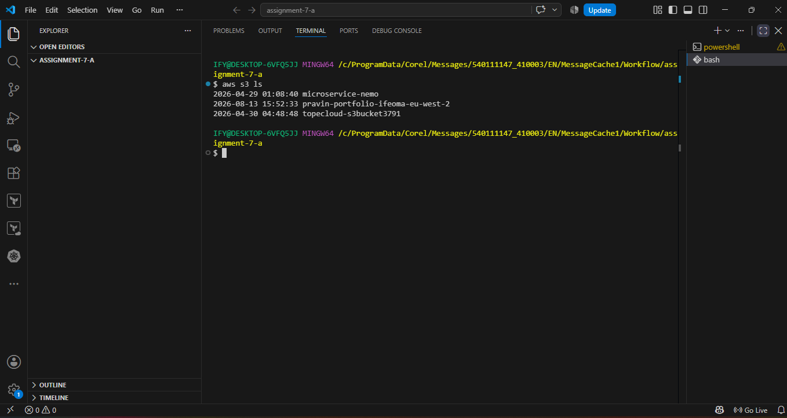

---

#### Screenshot 2 — Output of `pwd` and `find . -maxdepth 4 -type d | sort`

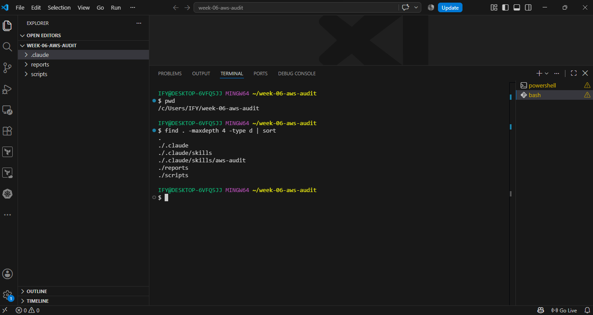

---

### Notes You Must Write (Very Important)

**1. Which resources from this week's earlier assignments did you see in the listings?**

S3 buckets, RDS instances with read replica, EC2 instances.

**2. Why must you confirm your resources exist before writing an audit script against them?**

1. One can't audit what isn't there. If I write and run the audit script against an EC2 instance, RDS database, or S3 bucket that doesn't actually exist (or exists in the wrong region), the script either errors out or silently returns nothing. I'd waste time debugging a script that's actually working fine because the problem was the target, not the tool.

2. It catches environment problems before they become script problems. A region mismatch I experienced earlier (us-east-2 vs eu-west-2) is the perfect example — if I'd skipped straight to writing the audit script, I would have hit the same "no RDS instances found" result and probably assumed the script was broken, when really my CLI was just pointed at the wrong place. Confirming resources first isolates that kind of issue early, when it's cheap to fix.

3. It establishes the baseline. An audit script is only useful if one knows what it should find. By confirming bucket name, EC2 instance ID, and RDS identifiers up front, I have a mental checklist what to compare the script's output against. So if the script comes back empty or wrong later, you immediately know something's off, rather than trusting a possibly-broken script blindly.

4. It mirrors good engineering practice generally. Before automating a check against a system, I should verify the system is in the state I assume. Confirm the environment, then build tooling that depends on it.

---

# Task 2 — Define Safety Rules in CLAUDE.md

## Goal

Create a `CLAUDE.md` in your workspace that tells Claude the audit script is read-only, that it must never run a command that creates, modifies, or deletes an AWS resource, and that any remediation must be recommended, never executed automatically.

### Evidence

#### Screenshot 3 — `CLAUDE.md` open in VS Code showing all four sections

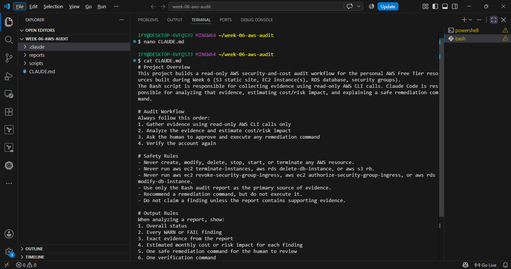

---

### Notes You Must Write (Very Important)

**1. Why should Claude never be given permission to run `revoke-security-group-ingress` itself, even if the fix is obviously correct?**

Even a "correct" fix executed by an AI agent removes the human checkpoint that catches context the tool doesn't have. Example, maybe that open port is intentional for a demo happening in an hour, or the rule is shared across a security group used by other resources. Separating 'recommend' from 'execute' means a mistake in Claude's reasoning (misreading the evidence, a hallucinated finding) can never directly cause a production change. The engineer stays the last line of defense before anything touches the live account. It also keeps a clear audit trail of who actually made each change.

**2. Which rule prevents Claude from claiming a finding that the report does not support?**

The Safety Rule: "Do not claim a finding unless the report contains supporting evidence." This forces Claude to ground every statement in actual CLI output rather than general AWS security knowledge or assumption, reducing hallucinated or generic findings that don't reflect your specific account's real state.

---

# Task 3 — Plan the Audit with Claude Code

## Goal

Ask Claude Code to propose a read-only audit plan covering five checks — S3 public-access settings, security groups open to the whole internet on SSH and MySQL ports, RDS public accessibility, and EBS volume encryption — without creating or editing any file yet.

### Evidence

#### Screenshot 4 — Claude Code showing the five-check plan

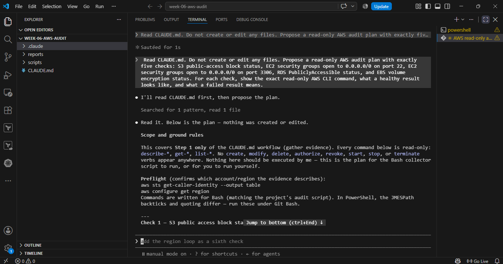

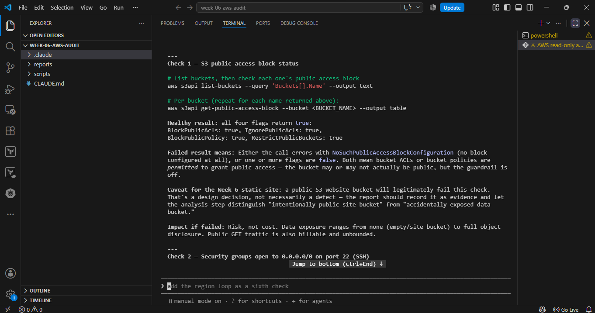

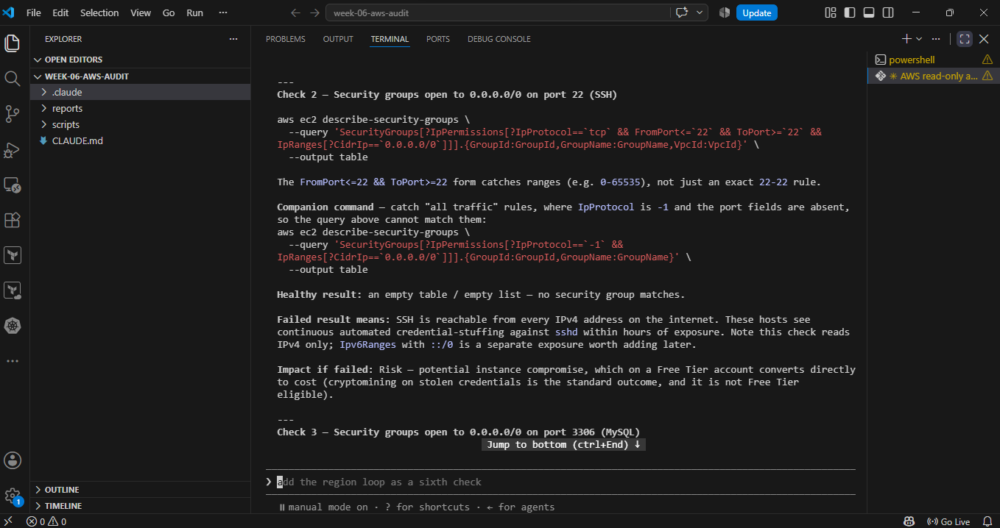

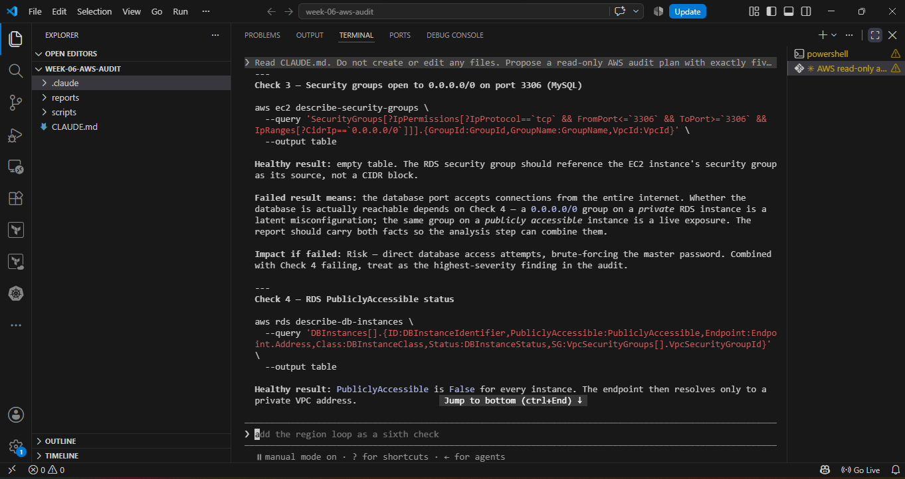

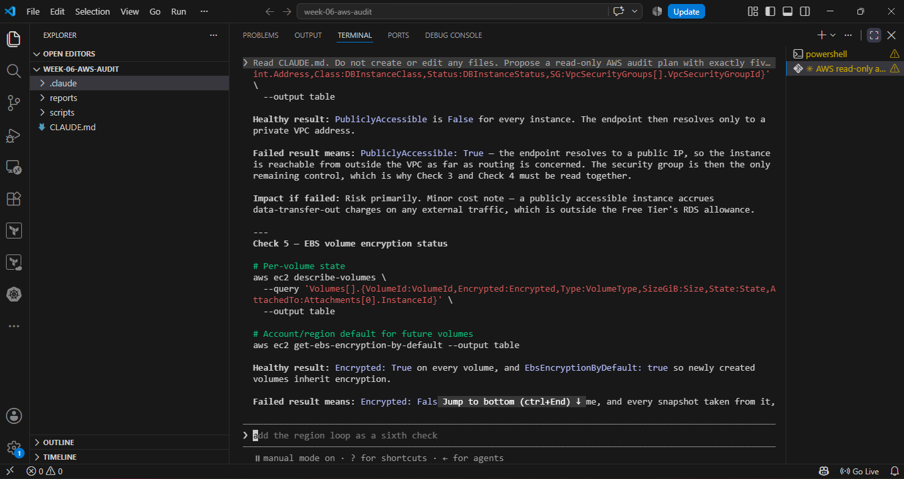

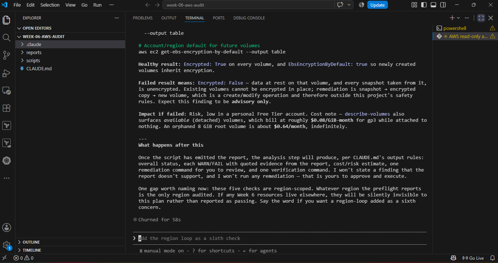

---

### Notes You Must Write (Very Important)

**1. Which part of this task represents the Gather phase?**

The plan itself. Specifically the AWS CLI commands Claude proposes for each of the five checks, is the "Gather" phase. Since it's defining what evidence to collect (Analyze, Human Act, and Verify come later, once the script runs and produces a report), that is the Gather phase.

**2. Did every proposed command start with `describe-`, `get-`, or `list-`? Why does that matter?**

Those verb prefixes are AWS's own convention for read-only calls that don't mutate state — sticking exclusively to them structurally guarantees the audit can't accidentally change anything, independent of whatever CLAUDE.md says. It's defense in depth: the rules file states the constraint, and the command choice enforces it.

---

# Task 4 — Build the AWS Audit Script

## Goal

Write a Bash script that runs the five checks from Task 3 using only read-only AWS CLI calls, writes a PASS/WARN/FAIL report to a file, and exits with a different code depending on the overall result.

Make it executable and confirm it has no syntax errors.

### Evidence

#### Screenshot 5 — Top section of `aws-audit.sh` showing the variables and the checks array

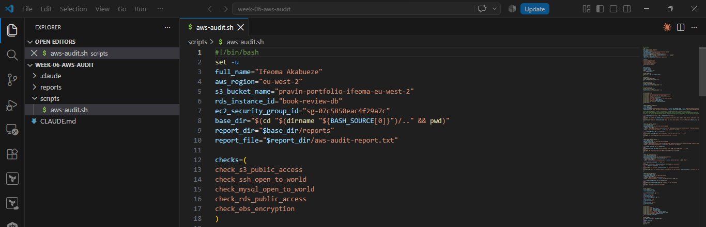

---

#### Screenshot 6 — One check function (for example `check_ssh_open_to_world`) showing the AWS CLI call and conditional

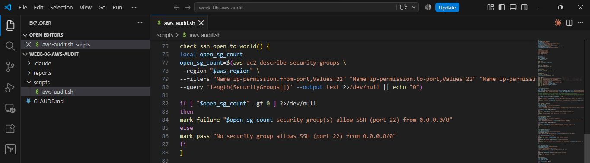

---

#### Screenshot 7 — Output of `bash -n scripts/aws-audit.sh` and `ls -l scripts/aws-audit.sh`

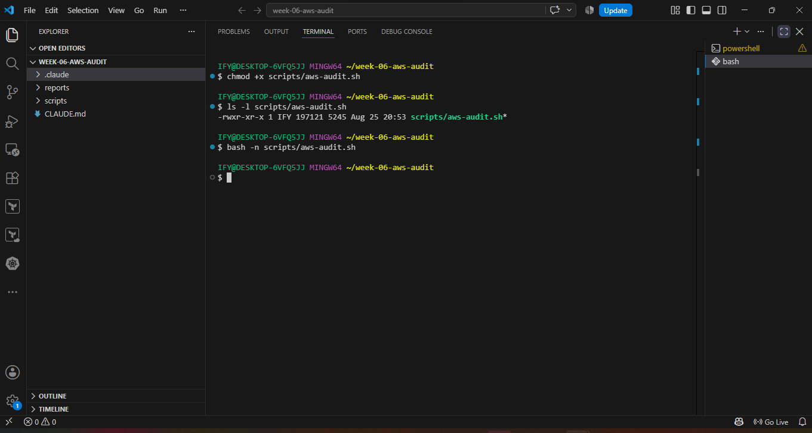

---

### Notes You Must Write (Very Important)

**1. What is stored in the checks array, and how does the loop use it?**

It stores the names of the five check functions as plain strings not the results of running them, just their names:

bash
checks=(
  check_s3_public_access
  check_ssh_open_to_world
  check_mysql_open_to_world
  check_rds_public_access
  check_ebs_encryption
)

**2. Why does every AWS CLI call in this script use `--query` and `--output text` instead of parsing raw JSON?**

What --query and --output text actually do:
--query uses JMESPath (AWS CLI's built-in query language) to reach directly into the JSON response and pull out just the one field the script cares about — e.g. PubliclyAccessible or PublicAccessBlockConfiguration.BlockPublicAcls — before the CLI even returns anything to bash. --output text then formats that extracted value as a plain string instead of JSON syntax (no braces, quotes, or brackets around it).

Why that matters for this script specifically:

Bash can't parse JSON natively. Bash doesn't understand JSON structure — no built-in way to say "give me the .PubliclyAccessible key from this nested object." Without --query, the script would need an external tool like jq just to extract one value, adding a dependency the script currently doesn't need.
Clean if comparisons. Every check function does something like:
bash
   if [ "$publicly_accessible" = "False" ]

That only works cleanly if the variable holds a simple string like False — not {"PubliclyAccessible": false} with quotes, braces, and JSON's true/false (lowercase) instead of bash-friendly text. --output text hands back exactly the bare value, ready to compare directly.

Less error-prone, less code. Parsing raw JSON in pure bash (via string manipulation or regex) is fragile — a small formatting change in AWS's JSON output could silently break the script. Letting the AWS CLI itself do the extraction (it's purpose-built for this) is far more reliable than hand-rolled parsing.
Portability. Every environment with the AWS CLI installed already supports --query/--output text — no extra install step (like jq) is needed for the script to run, which matters for an assignment meant to be reproducible across different students' machines

**3. Why does the script use different exit codes for HEALTHY, WARN, and FAIL?**

What the script does:

bash
if [ "$failure_count" -gt 0 ]; then
    overall_status="FAIL"
    script_exit_code=2
elif [ "$warning_count" -gt 0 ]; then
    overall_status="WARN"
    script_exit_code=1
else
    overall_status="HEALTHY"
    script_exit_code=0
fi

Why differentiated exit codes matter:

Unix convention — exit code is the standard way scripts communicate outcome. By convention, 0 means "success/no problem," and any non-zero value signals something worth attention. Just returning 0 always (or only distinguishing "worked"/"crashed") would throw away the severity information the report already collected.
Lets automation react differently to different severities. If this script were ever wired into something like a cron job, a CI/CD pipeline, or a monitoring system, that calling system can branch on $? — e.g., "if exit code is 2 (FAIL), send an urgent alert; if it's 1 (WARN), just log it; if it's 0, do nothing." A single generic non-zero exit code couldn't support that kind of tiered response.
Immediate signal without reading the full report. You (or a script) can know the overall risk level from $? alone, without having to cat and parse the report text. That's exactly what Task 5 has you do — capture $? right after running the script and echo it, as a quick health check before even looking at the details.
Mirrors real-world exit code practice. Many production monitoring tools (e.g., Nagios-style checks) use exactly this 0/1/2 pattern — 0 = OK, 1 = WARNING, 2 = CRITICAL — so this script is following an established convention rather than inventing one, which makes it easier to eventually integrate into real tooling.

---

# Task 5 — Run the Baseline Audit

## Goal

Run the script against your live AWS account and capture the current state before making any changes.

### Evidence

#### Screenshot 8 — Output of `./scripts/aws-audit.sh` showing your Full Name and all five checks

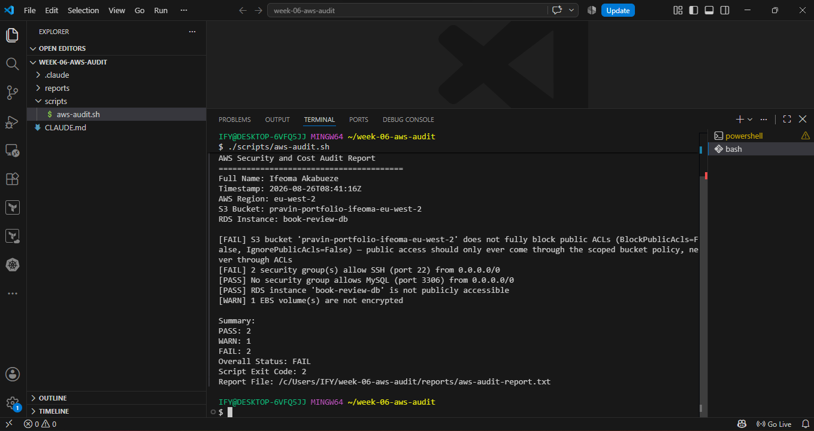

---

#### Screenshot 9 — Output showing the captured exit code and final summary

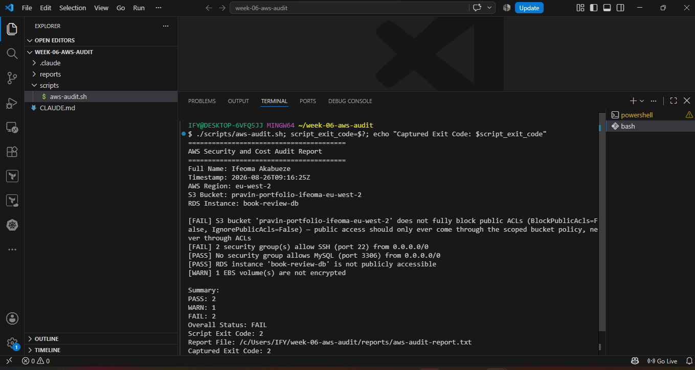

---

### Notes You Must Write (Very Important)

**1. What is the overall status of your baseline audit?**

My baseline audit report shows:

Summary:
PASS: 2
WARN: 1
FAIL: 2
Overall Status: FAIL
Script Exit Code: 2 which makes the overall result FAIL, with exit code 2.

**2. Did any check return FAIL or WARN? If so, which one, and what evidence did it show?**

Yes — three checks flagged issues:

1. FAIL — S3 public ACL block not enabled

[FAIL] S3 bucket 'pravin-portfolio-ifeoma-eu-west-2' does not fully block public ACLs (BlockPublicAcls=False, IgnorePublicAcls=False)

Evidence: BlockPublicAcls=False and IgnorePublicAcls=False — the bucket's Public Access Block configuration does not have these two ACL-related guardrails turned on.

2. FAIL — SSH open to the entire internet

[FAIL] 2 security group(s) allow SSH (port 22) from 0.0.0.0/0

Evidence: two of your security groups have an inbound rule permitting port 22 (SSH) from the CIDR 0.0.0.0/0, meaning any IPv4 address on the internet can attempt to connect.

3. WARN — Unencrypted EBS volume

[WARN] 1 EBS volume(s) are not encrypted

Evidence: describe-volumes found one volume with Encrypted=false — most likely your EC2 instance's root volume, since new volumes aren't encrypted by default unless account-level default encryption is turned on.

The two checks that passed cleanly were: MySQL (port 3306) not exposed to 0.0.0.0/0, and the RDS instance not being publicly accessible.

**3. If every check passed, what does that tell you about the security posture of your account so far?**

This question doesn't apply to my baseline audit, since my results showed two FAILs (S3 public ACL block disabled, SSH open to 0.0.0.0/0) and one WARN (unencrypted EBS volume), not a clean pass. Had every check passed, it would indicate that — at the specific point in time the audit ran — the five checked configurations (S3 ACL exposure, SSH exposure, MySQL exposure, RDS public accessibility, and EBS encryption) showed no obvious misconfigurations. It would not mean the account is fully secure overall, since the audit only covers five specific checks out of many possible security and cost issues (e.g., IAM policies, CloudTrail logging, MFA enforcement, unused resources, or unencrypted data in other services aren't checked here). A clean result is a snapshot of a narrow scope, not a certification of complete security.

---

# Task 6 — Build and Run the /aws-audit Skill

## Goal

Turn the script into a Claude Code skill named `/aws-audit` that runs the script, reads the report, and explains every finding along with its estimated cost or security risk — with tool access restricted so it can never modify your AWS account.

### Evidence

#### Screenshot 10 — `SKILL.md` showing the frontmatter, tool restrictions, and safety rules

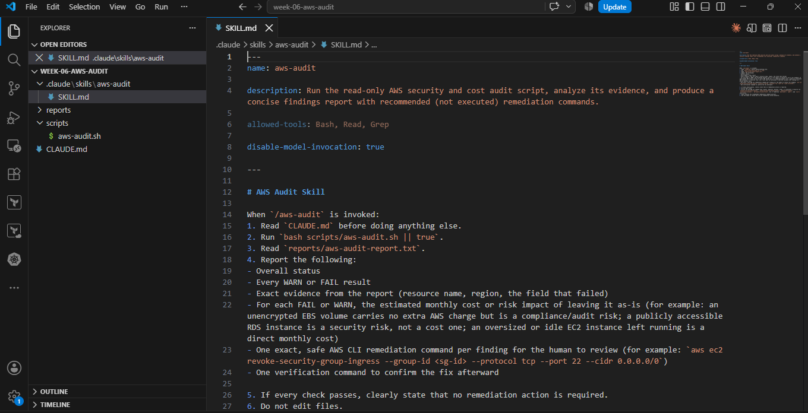

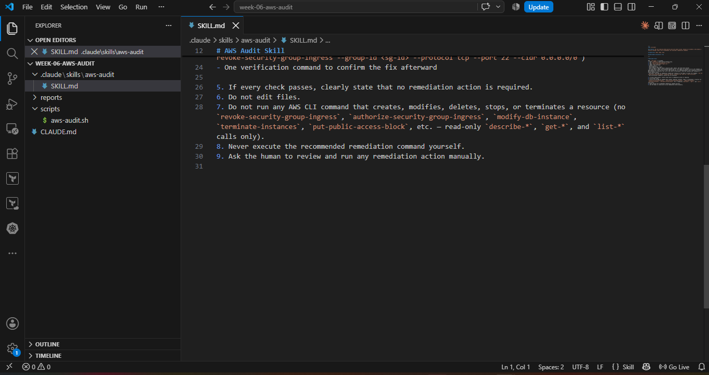
---

#### Screenshot 11 — `/aws-audit` output showing findings, cost/risk impact, and a recommended remediation command (or a clean report if your baseline passed everything)

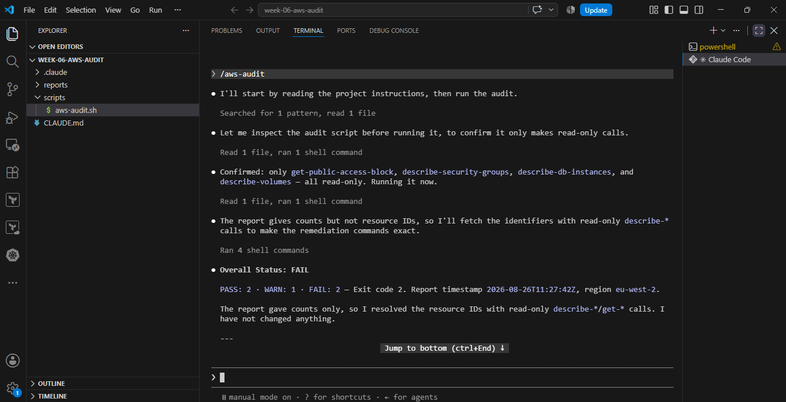

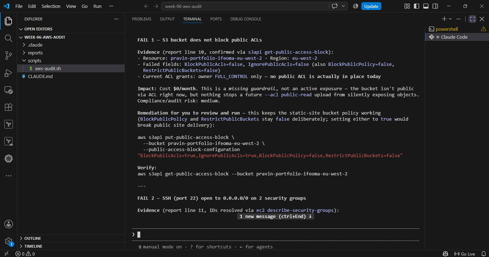

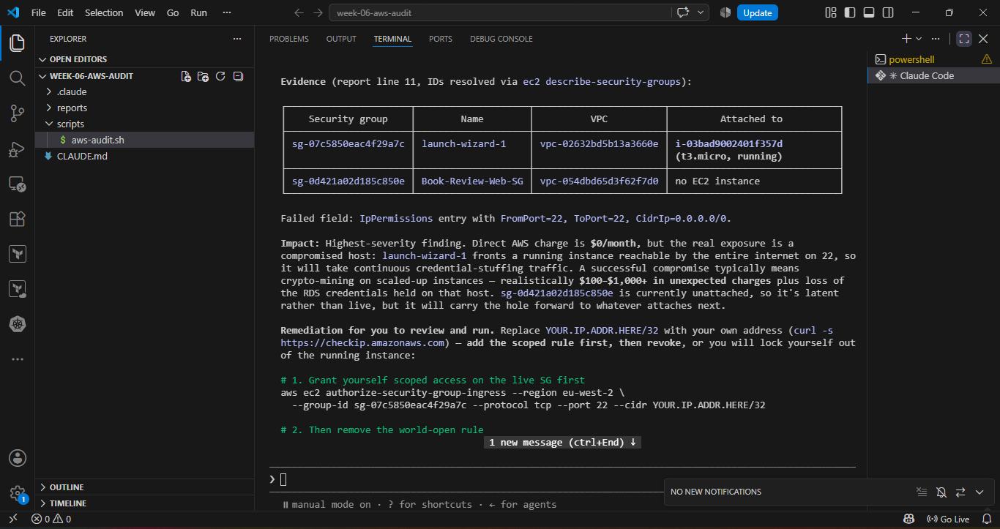

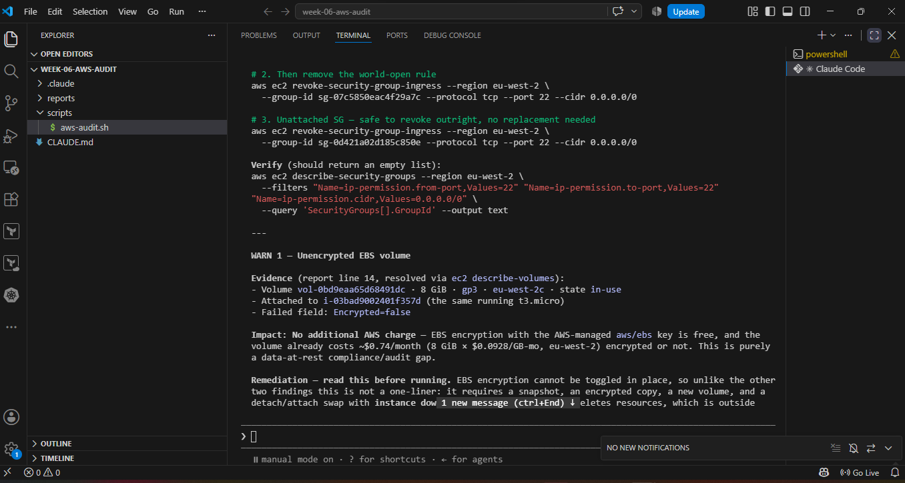

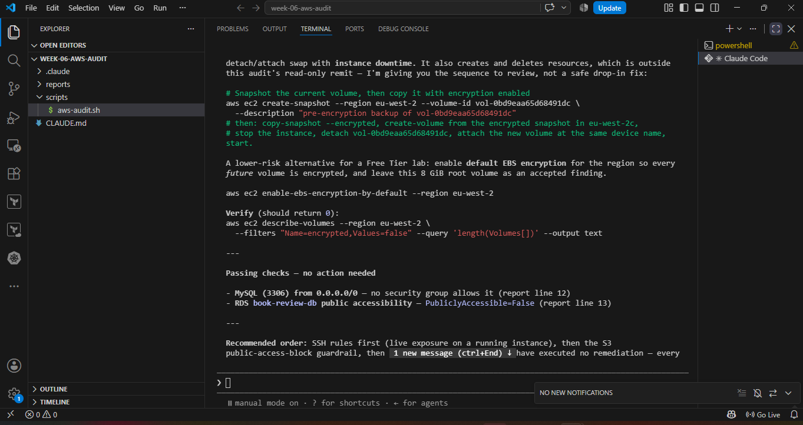

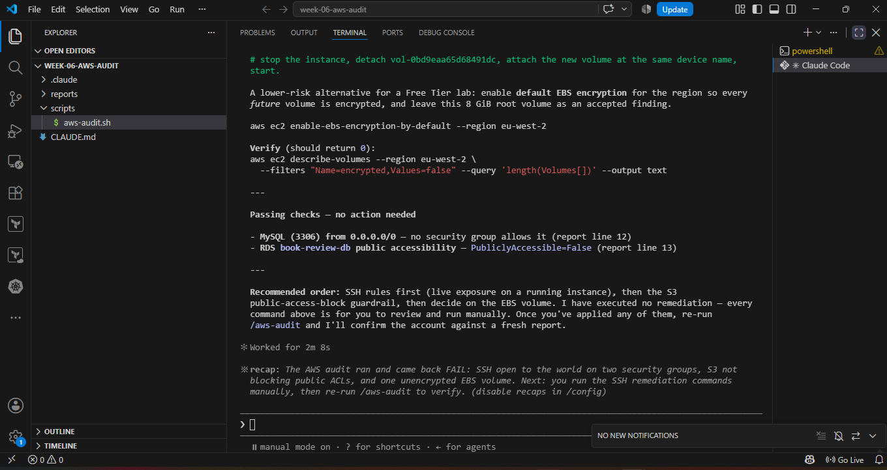
---

### Notes You Must Write (Very Important)

**1. Why does this skill have Bash, Read, and Grep, but not Write?**

Each tool maps to exactly what the skill needs to do, and nothing more:

Bash — needed to actually run the audit script (bash scripts/aws-audit.sh)
Read — needed to open and read the report file the script produces
Grep — needed to search through that report for specific findings/patterns

None of the skill's steps require creating or editing any file, it only runs an existing script and reads an existing report. So Write is deliberately left out.

The deeper reason this matters: it's not just that the skill doesn't need Write — leaving it out makes it structurally impossible for Claude to modify any file, even by accident or if it misread an instruction. This is stronger than just telling Claude "don't write files" in the prompt text, because a tool restriction is enforced at the permission layer, independent of Claude's reasoning. It's the same principle as the CLAUDE.md safety rules (never run mutating AWS commands) — but applied one level deeper, to the filesystem itself rather than just to AWS API calls. Combined, they create defense in depth: even if Claude somehow tried to write a file, the tool simply isn't available to do it.

**2. What part is performed by Bash, and what part is performed by Claude?**

What Bash does — the Gather phase:
The aws-audit.sh script performs all the actual evidence collection. It runs the five read-only AWS CLI calls (describe-security-groups, describe-db-instances, get-public-access-block, describe-volumes, etc.), evaluates each result against a simple pass/fail condition, and writes a deterministic, factual report (aws-audit-report.txt) with PASS/WARN/FAIL labels and raw evidence. This part is purely mechanical, no interpretation, no judgment, just "does this specific field match this specific expected value."

What Claude does: the Analyze phase:
Claude never talks to AWS directly in this skill. It reads the report Bash already produced and adds everything the script itself can't do:

Explains each finding in plain language
Estimates the cost or risk impact of leaving it unfixed (judgment the script has no way to encode as a simple conditional)
Recommends one exact, safe remediation command per finding
Provides a verification command
Explicitly states when no action is needed if everything passed.

In a nutshell, Bash collects the facts, Claude interprets what the facts mean and what to do about them — but stops short of acting on that interpretation, since executing the fix is left to you (the Human Act phase)

**3. Why is estimating cost/risk impact something the AI adds on top of a plain PASS/FAIL script?**

Why cost/risk estimation is an AI-layer capability, not a script capability:

A Bash script is good at answering binary, checkable questions — "is PubliclyAccessible true or false," "does this security group have a rule matching 0.0.0.0/0 on port 22." Those are simple string/boolean comparisons the script can encode directly as an if statement.

But what that fact actually means — in terms of dollars, exposure, or urgency — requires domain knowledge and judgment that doesn't reduce to a conditional:

An unencrypted EBS volume costs nothing extra on your AWS bill, but represents a compliance/audit risk (data at rest isn't protected)
A publicly accessible RDS instance is a security risk, not primarily a cost one — until it's exploited, at which point it becomes a very large, unpredictable cost
An idle EC2 instance left running is a direct, quantifiable monthly cost, independent of any security concern at all

Encoding all of that nuance into hardcoded Bash logic would mean writing (and maintaining) a rule for every possible finding, every pricing tier, every threat model — brittle, and it would need updating every time AWS pricing or best practices change. An LLM, by contrast, can reason about this specific finding, in this specific context and produce a proportionate, human-readable assessment on the fly, without that logic being hardcoded anywhere.

That's the core division of labor in this whole assignment: deterministic fact-collection belongs in Bash; contextual interpretation belongs in the AI — and Bash + Claude together are more capable than either alone, while still keeping a human as the one who actually executes anything.

---

# Task 7 — Fix a Real Finding and Re-Verify

## Goal

Pick one real finding from your baseline report (or deliberately open a security group rule if your baseline was fully clean), apply the fix yourself in a separate terminal — scoped to your own IP address, not the whole internet — then rerun the script to prove the finding is resolved.

### Evidence

#### Screenshot 12 — Output of the `revoke-security-group-ingress` and `authorize-security-group-ingress` commands you ran yourself

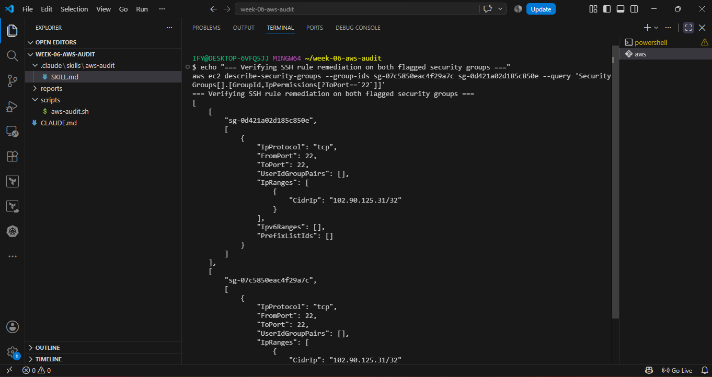

The revoke-security-group-ingress and authorize-security-group-ingress commands were run for both flagged groups; this verification screenshot confirms the resulting state after remediation
---

#### Screenshot 13 — Rerun of `./scripts/aws-audit.sh` showing the finding is now PASS

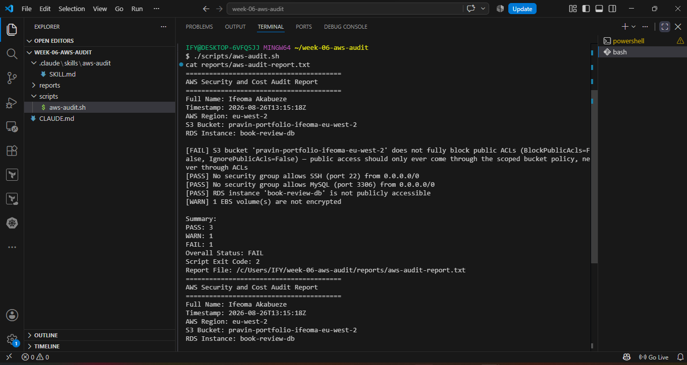

---

### Notes You Must Write (Very Important)

**1. Which exact finding did you fix, and what command did you run?**

The audit flagged: "security group(s) allow SSH (port 22) from 0.0.0.0/0" — specifically two security groups, sg-07c5850eac4f29a7c and sg-0d421a02d185c850e, both had inbound rules permitting SSH (port 22) from any IPv4 address on the internet.

Commands I ran (for each of the two security groups):

To remove the open rule:

bash
aws ec2 revoke-security-group-ingress \
  --group-id <sg-id> \
  --protocol tcp --port 22 --cidr 0.0.0.0/0

Add a scoped replacement, restricted to my own IP:

bash
aws ec2 authorize-security-group-ingress \
  --group-id <sg-id> \
  --protocol tcp --port 22 --cidr 102.90.125.31/32

I ran this pair against both flagged security groups. After confirming (via describe-security-groups) that both groups now only permit port 22 from 102.90.125.31/32 with no 0.0.0.0/0 entries remaining, I reran the full audit script and the SSH check changed from [FAIL] to [PASS].

**2. Why did you scope the new rule to your own IP address instead of leaving it open to `0.0.0.0/0`?**

Why I scoped the rule to my own IP instead of 0.0.0.0/0:

0.0.0.0/0 means "every IPv4 address on the internet" — leaving SSH open to that CIDR range means literally anyone, anywhere, can attempt to connect to port 22 on my EC2 instance. In practice, this isn't a theoretical risk: internet-facing SSH ports are scanned and hit with automated brute-force and credential-stuffing attempts within minutes of being exposed, regardless of how obscure the instance is.

By scoping the rule to 102.90.125.31/32 (my own current public IP, with /32 meaning "this exact address and no other"), I limited SSH access to only the one machine I actually connect from. This preserves my own legitimate access, I can still SSH in normally while closing off the attack surface to everyone else. This is the standard least-privilege approach: give a resource only the access it actually needs, nothing broader "just in case."

The tradeoff is that this rule is tied to my current IP, which may change (e.g., if my ISP assigns a new dynamic IP, or I connect from a different network), at that point I'd need to update the rule again. But that's a reasonable cost for eliminating open exposure to the entire internet.

**3. Did Claude execute the remediation command, or did you? Why does that matter?**

I did. Every revoke-security-group-ingress and authorize-security-group-ingress command was typed and run by me, in my own terminal, using my own AWS credentials. Claude only ever analyzed the audit report and recommended what command to run; at no point did Claude have the ability to run AWS CLI commands against my account, since the /aws-audit skill's allowed-tools and CLAUDE.md safety rules explicitly restrict it to read-only evidence gathering and prohibit it from executing any mutating command.

Why that separation matters:

It keeps a human as the final checkpoint before anything changes on a live account. An AI can misjudge a situation — misread evidence, recommend the wrong CIDR, target the wrong resource, or simply be wrong about whether a "fix" is actually safe in my specific context. If Claude could execute remediation directly, a single reasoning error could immediately alter production infrastructure with no review step in between.

By requiring me to personally review and run the command, I get the chance to catch mistakes before they take effect — for example, I could verify the exact security group ID was correct, and confirm the CIDR was genuinely my IP before running it. This division of responsibility (AI recommends, human decides and acts) is the core safety principle the entire assignment is built around, and it's also just good practice for any AI-assisted operations against real infrastructure: automation can suggest, but consequential actions stay under deliberate human control.

**4. Which phase of the Agentic Loop does the Bash script represent? Which phase does Claude's explanation represent? Which phase is you running the fix?**

Bash script (aws-audit.sh) → Gather phase
The script's only job is collecting raw, factual evidence from AWS using read-only CLI calls (describe-security-groups, describe-db-instances, get-public-access-block, describe-volumes). It doesn't interpret anything — it just checks a condition and labels it PASS, WARN, or FAIL based on a fixed rule, then writes that evidence to a report file.

Claude's explanation (via /aws-audit) → Analyze phase
Claude reads the report the script already produced and adds interpretation on top of it: explaining what each finding means in plain language, estimating cost or risk impact, and recommending a specific remediation command. Claude never touches AWS directly here — it only reasons over evidence that's already been gathered.

Me running the revoke/authorize commands → Human Act phase
This is the only step where the AWS account actually changes. I reviewed Claude's recommendation, decided it was correct, and personally executed the revoke-security-group-ingress and authorize-security-group-ingress commands myself.

One more phase worth naming — rerunning the script afterward → Verify phase
After making the change, I ran the audit script again to confirm the SSH finding flipped from FAIL to PASS, closing the loop by proving the fix actually worked rather than just assuming it did.

Together these four steps — Gather → Analyze → Human Act → Verify — form the complete Agentic Loop this assignment is built to demonstrate: automated evidence collection, AI-assisted interpretation, human-controlled execution, and a final confirmation step.

---

# LinkedIn Post (Required)

## Goal

Create a LinkedIn post including:

- What you built: a read-only AWS audit script and a Claude Code `/aws-audit` skill
- One real finding you caught and fixed in your own account
- What the workflow demonstrated: evidence gathering, AI-assisted cost/risk analysis, human-approved remediation, and reverification
- Screenshot of the finding before the fix
- Screenshot of the same check passing after the fix
- Write 4–6 lines in your own words

Suggested tags:

`#DMIByPravinMishra #AWS #AgenticAI #ClaudeCode #DevOps`

### Evidence

#### LinkedIn Post URL

Paste your LinkedIn post URL here:

https://lnkd.in/p/eT7wgAPC

---

#### Screenshot of Published LinkedIn Post

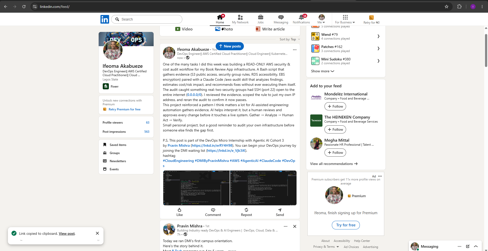

---

# Submission Instructions

Complete all tasks in sequence.

Your submission must include:

- All 13 required task screenshots
- Answers to every **Notes You Must Write** question
- `CLAUDE.md`
- `scripts/aws-audit.sh`
- `.claude/skills/aws-audit/SKILL.md`
- `reports/aws-audit-report.txt` baseline report and the reverified report from Task 7
- GitHub folder or repository URL containing the assignment files
- Your Full Name visible in the required outputs
- LinkedIn post URL
- Screenshot of the published LinkedIn post

Submit only a Google Doc link.

Add the GitHub URL inside the Google Doc.

Follow the Assignment Submission Guidelines.

---

# Completion Checklist

- [ ] Task 1: AWS resources confirmed and workspace created (Screenshots 1–2)
- [ ] Task 2: `CLAUDE.md` created with project context and safety rules (Screenshot 3)
- [ ] Task 3: Claude produced a read-only five-check audit plan before any script existed (Screenshot 4)
- [ ] Task 4: `aws-audit.sh` built, executable, and passes `bash -n` (Screenshots 5–7)
- [ ] Task 5: Baseline audit captured and saved with Full Name visible (Screenshots 8–9)
- [ ] Task 6: `/aws-audit` skill loads and runs successfully with no Write permission (Screenshots 10–11)
- [ ] Task 7: A real finding was fixed by you and reverified as PASS (Screenshots 12–13)
- [ ] Skill never executed a remediation command
- [ ] New security group rule is scoped to your own IP, not `0.0.0.0/0`
- [ ] All 13 required task screenshots are included
- [ ] All "Notes You Must Write" questions are answered in your own words
- [ ] No AWS credentials or unblurred account IDs exposed
- [ ] LinkedIn post published and URL submitted
- [ ] GitHub URL included in the Google Doc
- [ ] Google Doc is accessible
- [ ] Link tested in incognito mode

---

# Final Submission

Submit only your Google Doc link.

### Question

Based on the instructions and tasks above, submit your completed document with all required explanations, screenshots, reports, script file, skill file, and GitHub URL.

`Add your Google Doc link here`

---

## 📌 About DMI & CloudAdvisory

DevOps Micro Internship (DMI) is a project-based DevOps program run by Pravin Mishra (The CloudAdvisory) focused on real-world execution, systems thinking, and career readiness.

It helps learners build strong DevOps foundations with hands-on experience.

---

## 📌 Resources

- 🌐 DMI Official Website: https://dmi.pravinmishra.com?utm_source=github&utm_medium=readme  
- 🎓 University: https://university.pravinmishra.com?utm_source=github&utm_medium=readme  
- 💬 Discord Community: https://discord.pravinmishra.com?utm_source=github&utm_medium=readme  
- 📝 Blog: https://dmi.pravinmishra.com/blog?utm_source=github&utm_medium=readme  
- ▶️ YouTube Playlist: https://www.youtube.com/playlist?list=PLFeSNDtI4Cho  
- 🔗 Pravin Mishra (LinkedIn): https://www.linkedin.com/in/pravin-mishra-aws-trainer/  
- 🏢 CloudAdvisory (LinkedIn): https://www.linkedin.com/company/thecloudadvisory/

---

*This submission is part of DevOps Micro Internship (DMI) Cohort 3 — Agentic AI Track.*